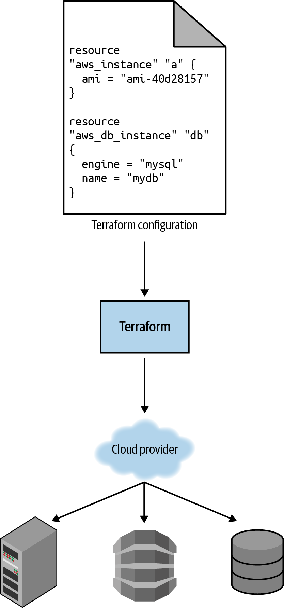
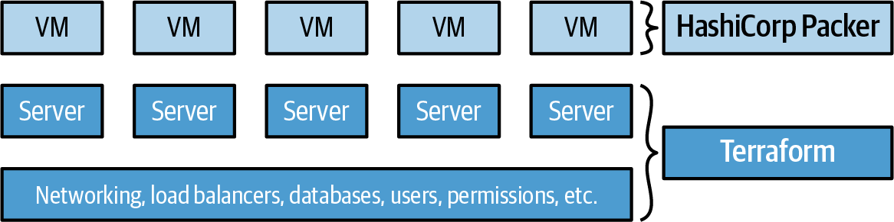
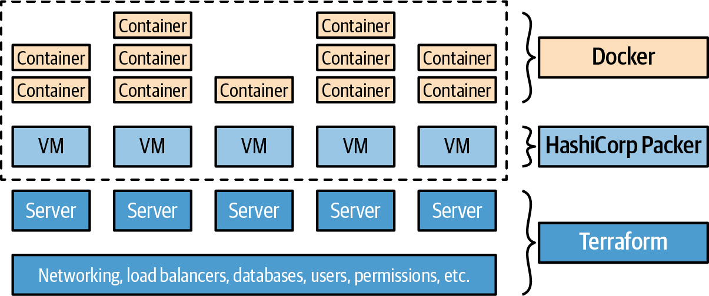

# Why Terraform	

# What is DevOps

과거에는 소프트웨어 회사를 만들려면 아주 많은 하드웨어를 다뤄야 했다.  

소프트웨어를 작성하는 developers, 하드웨어 관리를 전담하는 operations 두 가지로 나뉘게 된다.


Dev 팀은 app을 만들어 ops 팀에게 전달한다. 
Ops 팀은 이것을 어떻게 배포하고 app을 실행할지 궁리한다. 
- 보통 이건 수동으로 진행됐다.  
- 이건 불가피했다. 왜냐하면 거의 모든 작업이 물리 장비에 업로드 하는 것이기 때문이다.
- 소프트웨어에서 수행하는 작업도 서버에서 수동으로 명령을 실행하는 경우가 많았다.

기업이 커지면서 이러한 작업은 문제가 발생했다.
- 서버에 수동으로 배포한다고 하면 서버가 늘어나면 이 작업은 점점 느려지고 고통스럽고 예측 불가능해진다.
- 이러면서 실수가 발생하고 snowflake server가 된다.
  - 미묘하게 다른 구성들


결국 많은 버그가 발생하고 장애는 더 자주 발생한다.
릴리즈하고 발생하는 문제에 피로를 느껴 릴리즈 주기를 점점 늘리게 된다.
모든 프로젝트를 머지할 때 아주 많고 엉망이된 conflict를 해결해야 한다.
누구도 release 브랜치를 안정화할 수 없다.

요즘엔, 큰변화가 일어나고 있다.
그들 소유의 데이터 센터를 관리하는 대신 많은 기업들이 cloud로 이동한다. 
- AWS, Azure, GCP와 같은 서비스의 이점을 챙기기 위해
hardware에 투자하는 대신 많은 ops 팀은 모든 시간을 소프트웨어에서 일하는데 보낸다.
- rack서버나 네트워크 케이블을 다루는 대신 많은 시스템 관리자들이 코드를 작성한다.

결과적으로 Dev, Ops팀은 거의 모든 시간을 소프트웨어에서 일을하고 두 팀의 차이가 흐릿해진다.  
아직 두 팀의 역할을 나누는것이 의미는 있지만, 두 팀이 더욱 함께 일해야 하는건 확실하다.
이것이 DevOps의 시작이다.

DevOps는 프로세스, 아이디어, 테크닉이다.
조금씩 차이는 있지만 이 책에서는 아래의 뜻으로 DevOps의 뜻을 통일한다.  

**The goal of DevOps is to make software delivery vastly more efficient.**

- merge 지옥에서 벗어나 코드를 지속적으로 통합하고 배포 가능한 상태로 유지해야 한다.
- 월 1회 배포에서 벗어나 매일, 1 commit 마다 배포가 가능해야 한다.
- 지속적인 outage와 downtime 대신 복원력, 자가 복구 시스템, 모니터링, alerting을 구성하여 해결하지 못한 문제를 파악해야 한다.

DevOps의 4가지의 주요 행동이 있다.
- culture
- automation
- measurement
- sharing

그 중 이 책은 automation 에 집중한다.
여기서 automation은 인프라 관리를 웹 페이지에서 몇 가지 클릭해서 하거나 수동으로 커멘드를 쉘에서 실행하는 것이 아닌 코드를 통해 하는 것이다.

이것을 Infrastructure as Code라고 한다.


# What is Infrastructure as Code

IaC의 기본적인 아이디어는 인프라를 정의, 배포, 수정, 삭제를 위해 코드를 작성하고 실행한다는 것이다.  

- 이것은 운영의 모든 측면을 소프트웨어로 취급하는 사고 방식의 중요한 변화이다.

DevOps의 중요한 점은 거의 모든 걸 코드로 관리할 수 있다는 것이다.  


5개의 IaC tool category에 대해 알아보자  
- Ad hoc scripts
- Configuration management tools
- Server templating tools
- Orchestration tools
- Provisioning tools


## Ad Hoc Scripts
예를 들어 `setup-web-server.sh` 라는 스크립트로 웹 서버를 구성할 수 있다.  

```sh
# Update the apt-get cache
sudo apt-get update

# Install PHP and Apache
sudo apt-get install -y php apache2

# Copy the code from the repository
sudo git clone https://github.com/brikis98/php-app.git /var/www/html/app

# Start Apache
sudo service apache2 start

```

ad hoc 스크립트의 장점은 유명하고 널리 사용되는 프로그래밍 언어를 사용해 코드를 작성할 수 있다는 점이다.  
- 단점 또한 같다 

IaC 도구는 간결한 API를 제공하지만 범용 프로그래밍 언어는 완전히 사용자 전용 코드를 작성해야 한다.  
- 커스텀 코드를 많이 작성해야 한다.
- 개발자가 고유한 스타일을 사용하고 다른 작업을 수행한다.

이러한 대량의 스크립트를 관리한다면 스파게티 코드를 계속해서 유지할 수 없다.

ad hoc script는 작은 작업에는 좋지만 모든 인프라를 코드로 관리하게 된다면 IaC 도구를 찾게 될 것이다.  


## Configuration Management Tools
Chef, Puppet, Ansible은 configuration management 도구들이다.
이들은 이미 존재하는 서버에 소프트웨어를 설치하고, 관리하는 용도로 디자인되었다.

예를 들어 web-server.yml 이라는 Ansible role이 있다.
```
- name: Update the apt-get cache
  apt:
    update_cache: yes

- name: Install PHP
  apt:
    name: php

- name: Install Apache
  apt:
    name: apache2

- name: Copy the code from the repository
  git: repo=https://github.com/brikis98/php-app.git dest=/var/www/html/app

- name: Start Apache
  service: name=apache2 state=started enabled=yes

```
bash script와 비슷하지만 ansible과 같은 도구만의 장점이 있다.  

- Coding conventions
    - Ansible은 문서, 파일 레이아웃, 명확하게 명명된 매개변수, 암호 관리 등을 포함하여 일관되고 예측 가능한 구조를 적용한다.
    - 모든 개발자들이 그들의 ad hoc script를 다른 방법으로 관리한다.
    - 대부분의 configuration management tool은 컨벤션을 통해 더 쉽게 코드를 관리할 수 있도록 한다
- Idempotence
    - ad hoc script를 한 번 실행하는건 쉽다.
    - ad hoc script를 여러번 실행해도 정확하게 동작하게 하는건 어렵다.
    - 몇 번을 수행해도 문제가 없는 코드를 멱등한 코드라고 한다.
    - bash script를 멱등하게 작성하려면 정말 많은 코드를 추가해야 한다.
    - Ansible은 이것을 보장한다.
- Distribution
    - Ad hoc scripts는 한 머신에서 실행되도록 디자인 되었다.
    - CM tools는 많은 서버에서 돌 수 있도록 디자인 되었다.


## Server Templating Tools

CM tool의 대안은 최근 인기가 높아지고 있는 Docker, Packer, Vagrant와 같은 서버 템플릿 도구이다.  

서버 탬플릿 도구는 OS의 software, file, 관련된 모든것의 완벽한 캡쳐본에 대한 이미지를 만든다.  
- 다른 IaC 도구를 이용해서 이런 이미지를 다른 서버에 설치할 수 있다.

image를 사용하는 도구는 크게 두 가지가 있다.
### Virtual machine
- vm은 컴퓨터 시스템 전체를 모방한다.
    - 하드웨어 포함
- hypervisor를 사용하여 CPU, memory, hd, network를 가상화한다.
    - VMware, VirtualBox, Parallels
- VM의 image는 hypervisor 위에서 가상화된 하드웨어만을 바라보므로
    - host 머신과 완전ㅇ히 독립시킬 수 있다.
    - 모든 환경에서 정확히 동일한 방식으로 실행된다.
- 다만, 모든 하드웨어와 OS를 가상화 해야 하므로 오버헤드가 크다.
    - cpu 사용량, memory 사용량, startup time
### Container
- OS의 user space를 모방한다.
    - 독립된 process, memory, mount point, network
- container engine위에서 어떤 container든 user space를 바라보도록 실행할 수 있다
    - host machine과 다른 container들로부터 완전히 독립시킬 수 있다.
- 모든 환경에서 똑같이 동작할 수 있다.
- 단점으로는 모든 container는 한 OS kernel과 hardware에서 동작하므로 VM 수준의 독립 수준과 보안을 달성하기 어렵다
- 다만, 커널과 하드웨어는 공유하므로 컨테이너는 더 빠르게 시작될 수 있고 CPU, Memory 사용량에도 오버헤드가 없다.  


서버 템플릿 도구는 인프라의 불변성을 달성하기 위한 핵심 구성 요소이다.  
- 이 아이디어는 변수 값을 다시 변경할 수 없는 functional programming에서 영감을 받았다.  
- 무언가 업데이트 되어야 하는 경우 변수를 새로 만든다.
- 변수는 절대 변경되지 않으므로 코드에 대해 추론하기가 쉽다.

인프라 불변성의 아이디어도 비슷하다.
- 한 번 서버를 배포하고 나면 변화가 없도록 해야한다.
- 만약 업데이트해야한다면 새로 만든다.
- 그래야 어떤걸 왜 배포했는지 이해하기가 쉽다.


## Orchestration Tools
서버 템플릿 도구는 유용하지만 실제로는 아래 상황들을 따라야 한다.
- 하드웨어를 효율적으로 사용하도록 VM or container 배포
- 존재하는 fleet를 몇 가지 전략을 통해 배포해야 한다.
    - rolling deployment, blue-green deployment, canary deployment
- VM과 container의 상태를 모니터링 하고 비정상적인 것은 자동으로 교체해야 한다.
- 부하에 따라 VM or container의 수를 늘리거나 줄인다.
- 트래픽 분배
- VM and container간 통신  

이것들이 모두 orchestration tool의 영역이다.
- such as K8S, Marathon/Mesos, ECS, Swarm, Nomad


## Provisioning Tools
위에서 언급한 도구들은 서버에서 동작하는 코드를 정의하지만 provisioning tool은 서버 그 자체를 만든다.
- Terraform, CloudFormation, OpenStack Heat, Pulumi

사실 provisioning tool은 서버 뿐만 아니라 db, cache, lb, queeue, monitoring 등 대부분의 인프라를 구성할 수 있다.  

```
resource "aws_instance" "app" {
  instance_type     = "t2.micro"
  availability_zone = "us-east-2a"
  ami               = "ami-0fb653ca2d3203ac1"

  user_data = <<-EOF
              #!/bin/bash
              sudo service apache2 start
              EOF
}

```
위와 같은 terraform 코드는 provisioning과 server templating까지 수행한다.



# What Are the Benefits of Infrastructure as Code?

왜 새로운 언어들과 도구를 배우고 관리할 많은 코드들을 가져와서 귀찮게 하는걸까?

이는 코드는 매우 강력하기 때문이다.

수동 작업을 코드로 변환하는 투자는, 소프트웨어를 배포하는 능력을 드라마틱하게 향상시킨다.

실제로 IaC와 같은 DevOps를 적용하여 200배는 더 주기적으로 배포하고 복원력은 24배 빨라졌다. 
- lead time은 2,555배 짧아졌다.


인프라를 코드로 정의하면 넓고 다양한 소프트웨어 엔지니어링 practice를 통해 소프트웨어 배포 프로세스를 개선할 수 있다.

### Self-service
- 대부분의 팀에서는 소수의 sysadmin이 코드를 배포한다
    - SPOF
- 이는 기업의 성장에 bottleneck이 된다.
- IaC를 도입하면 모든 배포 과정을 자동화 할 수 있다.
### Speed and safety
- 만약 배포 프로세스가 자동화되면 아주 빨라질 것이다.
- 자동화된 배포 프로세스는 한결같고, 반복할 수 있고 에러를 발생시킬 일이 거의 없다.
### Documentation
- 만약 인프라가 코드로 정의된다면 인프라의 상태는 소스 파일로 존재하기 때문에 읽을 수 있다.
- 즉, IaC가 문서 역할을 수행하는 것이다.
### Version control
- IaC 파일은 버전 관리가 가능하다.
- 인프라의 모든 기록을 관리가 가능하다는 것이다.
- 만약 어떤 문제가 발생하면 문제를 확인하기도 쉽고 되돌리기도 쉽다.
### Validation
- 인프라의 상태가 코드로 정의되면, 매번 코드 리뷰와 자동화된 테스트를 통해 유효한 인프라인지 파악할 수 있다.
### Reuse
- 재사용 가능한 모듈로 인프라를 구성하여 이후에 다시 사용할 수 있다.
### Happiness
- 재미없게 반복되는 수동 작업은 작업자를 불행하게 만든다.
- IaC를 통해 지루한 수동 작업에서 벗어날 수 있다.

# How Does Terraform Work?

terraform은 HashiCorp가 오픈소스로 개발하였고 go로 작성되었다.  
terraform으로 작성된 코드를 수행할 때 별도의 인프라나 다른걸 실행할 필요가 없는데, 이는 terraform binary가 하나 이상의 provider의 API를 호출하기 때문이다.  

```tf
resource "aws_instance" "example" {
  ami           = "ami-0fb653ca2d3203ac1"
  instance_type = "t2.micro"
}

resource "google_dns_record_set" "a" {
  name         = "demo.google-example.com"
  managed_zone = "example-zone"
  type         = "A"
  ttl          = 300
  rrdatas      = [aws_instance.example.public_ip]
}
```

위와 같은 코드를 통해 AWS의 인스턴스를 gcp dns에서 연결하는 등 multiple cloud provider를 사용할 수 있다.  

terraform이 당신의 코드를 binary parse하여 코드에 명시된 cloud provide의 API call의 연결로 변환한다.  
- 그리고 이러한 호출을 사용자를 대신하여 최대한 효율적으로 만든다.  

만약 인프라에 업데이트가 필요하면 직접 서버에 수동으로 작업하는 것이 아니라, terraform 코드를 수정하고 테스트와 코드 리뷰를 통해 유효한지 체크하고 `terrafrom apply`를 수행하면 된다.  

> terraform이 다양한 cloud platform의 provider를 지원하기 때문에 한 코드로 다양한 서버에 배포가 가능한지 궁금해하지만 완벽히 똑같은 구성을 배포하는건 할 수 없다.  
> 다른 클라우드 플랫폼은 같은 형태의 인프라를 제공하지 않기 때문이다.

# How Does Terraform Compare to Other IaC Tools?


IaC 도구들은 모두 크게 다르지 않고 어떤 도구를 써도 같은 목표를 달성할 수 있을 것 처럼 보인다.  


아래 항목을 비교해보면서 적절한 도구를 찾아보자  

- Configuration management versus provisioning
- Mutable infrastructure versus immutable infrastructure
- Procedural language versus declarative language
- General-purpose language versus domain-specific language
- Master versus masterless
- Agent versus agentless
- Paid versus free offering
- Large community versus small community
- Mature versus cutting-edge
- Use of multiple tools together

---

## Configuration management versus provisioning
configuration management 도구가 어느정도 provisioning을 수행할 수 있고 반대도 그렇다.  

서버 탬플릿 도구를 사용하는 경우 대부분의 구성 관리 요구사항은 충족된다.  
그러므로 서버 템플릿 도구를 사용하지 않는다면 configuration management도구와 provisioning 도구를 함께 사용하는게 좋다.  

자주 사용되는 조합으로는 Terraform을 provisioning tool로 Ansible을 configuration management tool로 사용한다.  

# Mutable Infrastructure Versus Immutable Infrastructure
Configuration management tool은 기본적으로 mutable infrastructure이다.
- 이미 존재하는 서버를 업데이트

이 경우 업데이트를 반복할 수록 서버들은 조금씩 달라지고 문제가 발생했을 때 되돌리기 어렵다.  

provisioning tool은 변화에 대한 배포를 완전히 새로운 서버에 수행한다.
- 기존 서버를 제거하고 새로운 서버 생성

이러한 접근법은 버그를 줄이고 소프트웨어가 무엇을 하는지 이해하기 쉽게 한다.  


## Procedural language versus declarative language
Chef나 Ansible은 절차형 언어로 표현된다.
- 명확하게, 단계별로 최종 상태를 어떻게 달성하는지

Terraform, CloudFormation 등은 선언형 언어로 표현된다.
- 상태에 대해 작성하면 IaC tool은 스스로 이 상태를 만들지 구성한다.

### example

#### 1. 10개의 서버를 구성하라
**Ansible**
```
- ec2:
    count: 10
    image: ami-0fb653ca2d3203ac1
    instance_type: t2.micro

```
**Terraform**
```
resource "aws_instance" "example" {
  count         = 10
  ami           = "ami-0fb653ca2d3203ac1"
  instance_type = "t2.micro"
}

```

아주 비슷한 형태를 보인다.

#### 2. 트래픽 증가로 서버를 15개로 scale out
**Ansible**

```
- ec2:
    count: 5
    image: ami-0fb653ca2d3203ac1
    instance_type: t2.micro

```

**Terraform**
```
resource "aws_instance" "example" {
  count         = 15
  ami           = "ami-0fb653ca2d3203ac1"
  instance_type = "t2.micro"
}

```
절차형 언어는 그 다음 행동을 지정해줘야 하지만 선언형 언어는 단순히 상태를 변화시키면 된다.

#### 3. 서버 이미지 업데이트 후 배포
**Ansible**
이전에 배포한 10개의 서버와 5개의 서버를 새로 작성한 뒤 배포해야 한다.
**Terraform**
동일한 구성 파일의 상태만 변경하면 된다.

결과적으로 절차형 언어는 아래 두 가지 이유의 문제가 있다.
- 인프라의 상태를 완벽하게 나타내지 못한다
- 재사용에 한계가 있다.


## General-Purpose Language Versus Domain-Specific Language

GPL과 DSL의 차이를 명확히 나누기 어렵다.
- 별도로 분류하기 보다는 mental model에 가깝다고 생각하는게 좋다

기본적으로는 DSL은 하나의 특정 도메인에서 동작하도록 설계되었고 GP은 광범위하게 사용될 수 있다는 것이다.

DSL은 GPL에 비해 몇 가지 장점이 있다.
- Easier to learn
  - 특정 도메인에만 사용되기 때문에 간결해서 배우기 쉬움
- Clearer and more concise
  - 특정 목적을 위해 설계되었기 때문에 명확하고 간결해서 이해하기 쉬움
- More uniform
  - 수행할 수 있는 작업에 제한이 있어 균일하고 예측 가능함
    - 따라서 이해하기 쉬움

GPL은 DLS에 비해 몇 가지 장점이 있다.
- Possibly no need to learn anything new
  - 이미 알고 있는 언어가 지원된다면 바로 해볼 수 있음
- Bigger ecosystem and more mature tooling
  - 큰 커뮤니티와 더 성숙한 도구를 가지고 있음
- More power
  - 강력한 기능을 더 많이 제공함
    - 테스트, 코드재사용, 추상화

## Master Versus Masterless
마스터 서버는 몇 가지 장점이 있다.
1. 인프라 상태를 확인할 수 있음
2. 백그라운드에서 계속 실행되며 구성을 적용하여 우발적인 서버 변경을 막을 수 있음

그러나 몇 가지 단점이 있다.
- Extra infrastructure
- Maintenance
- Security

즉, 관리 요소가 하나 더 생긴다는 것이다.  

masterless는 마스터 서버가 없거나 이미 존재하는 인프라의 일부를 사용한다.

## Agent Versus Agentless
Agent는 각 서버의 백그라운드에서 실행되며 최신 구성 관리 업데이트 설치를 담당한다.

아래의 단점이 있다.
- Bootstrapping
  - 일부 도구를 제외하고는 서버에 agent를 설치하는 특수한 절차가 있음
- Maintenance
  - Agent update
  - Synchronized with master server
  - Monitoring
- Security

Ansible, CloudFormation, Terraform 등은 agent를 설치할 필요가 없거나, 필요하지만 이미 설치되어 있다.
- Terraform은 필요한 agent를 cloud platform에서 제공해준다.


## Paid Versus Free Offering

무료 버전이 너무 제한적이어서 실제 프로덕션 사용에 영향이 있다면 유료 제품을 고려해야할 수 있다.

유료제품은 그만한 가치가 있지만, 사용자의 통제하에 있지 않으며 폐업하거나 인수되어 가격에 변동이 생길 수 있다.

Terraform은 글쓴이 경험상 유료 버전 없이도 프로덕션에서 문제 없이 사용할 수 있었다.


## Large Community Versus Small Community
Terraform과 Ansible은 폭팔적인 성장을 경험하고 있으며 대규모의 활동적인 커뮤니티를 보유하고 있다.

## Mature Versus Cutting Edge

release된 시간이나 version 만으로 성숙도를 판단할 수 없지만 몇 가지 추세는 파악할 수 있다.  
그런 점에서 Terraform은 아직 완전 성숙한 기술은 아니지만 이 책을 포함한 학습 리소스가 많이 나왔으며 계속 성숙해지고 있다.

## Use of Multiple Tools Together
### Provisioning plus configuration management
Ansible과 Terraform을 함께 구성하여 사용할 수 있다.
- 단점으로는 Ansible을 사용하기 때문에 많은 절차적 코드를 작성하므로 코드베이스, 인프라 및 팀이 성장함에 따라 유지관리가 더 어려워질 수 있다.  


### Provisioning plus server templating
Terraform과 packer를 사용하여 앱을 VM으로 배포할 수 있다.
- VM을 구축하는데 시간이 더 소모된다.
- 복잡한 배포 전략을 구현하기가 힘들다.  


### Provisioning plus server templating plus orchestration

Terraform과 Docker 및 kubernetes를 사용한다.
- docker image가 빠르게 빌드 및 배포 가능한 장점
- 실행할 추가 인프라가 많아지므로 복잡성이 추가된다.  

