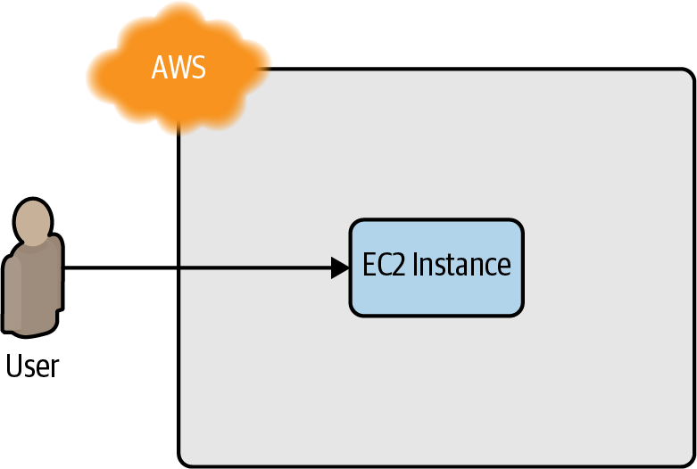

# Getting Started With Terraform
이 장에서 다룰 내용

- AWS 계정 설정
- 테라폼 설치
- 단일 서버 배포
- 단일 웹 서버 배포
- 구성 가능한 웹 서버 배포
- 웹 서버 클러스터 배포
- 로드 밸런서 배포
- 정리

# 1: AWS 계정 설정

AWS (*[https://aws.amazon.com](https://aws.amazon.com/))* 에서 계정 생성 후 제한된 권한을 가진 다른 사용자 계정을 만든다.

다른 사용자 만들기

1. IAM 콘솔 → 사용자 → 사용자추가
2. AWS 액세스 유형 선택 : ‘프로그래밍 방식 엑세스’ 체크
3. 권한 설정 : ‘기존 정책 직접 연결’
    1. [AmazonEC2FullAccess](https://us-east-1.console.aws.amazon.com/iam/home#/policies/arn%3Aaws%3Aiam%3A%3Aaws%3Apolicy%2FAmazonEC2FullAccess)
    2. [AmazonS3FullAccess](https://us-east-1.console.aws.amazon.com/iam/home#/policies/arn%3Aaws%3Aiam%3A%3Aaws%3Apolicy%2FAmazonS3FullAccess)
    3. [AmazonDynamoDBFullAccess](https://us-east-1.console.aws.amazon.com/iam/home#/policies/arn%3Aaws%3Aiam%3A%3Aaws%3Apolicy%2FAmazonDynamoDBFullAccess)
    4. [AmazonRDSFullAccess](https://us-east-1.console.aws.amazon.com/iam/home#/policies/arn%3Aaws%3Aiam%3A%3Aaws%3Apolicy%2FAmazonRDSFullAccess)
    5. [CloudWatchFullAccess](https://us-east-1.console.aws.amazon.com/iam/home#/policies/arn%3Aaws%3Aiam%3A%3Aaws%3Apolicy%2FCloudWatchFullAccess)
    6. [IAMFullAccess](https://us-east-1.console.aws.amazon.com/iam/home#/policies/arn%3Aaws%3Aiam%3A%3Aaws%3Apolicy%2FIAMFullAccess)
    7. [AutoScalingFullAccess](https://us-east-1.console.aws.amazon.com/iam/home#/policies/arn%3Aaws%3Aiam%3A%3Aaws%3Apolicy%2FAutoScalingFullAccess)
    8.  or AdministratorAccess
4. 키 보관
    1. 액세스키 
    2. 비밀 액세스 키 

# 2: 테라폼 설치

## 테라폼 바이너리 설치

```bash
brew install terraform
```

## 자격증명

- 환경변수

```bash
$ export AWS_ACCESS_KEY_ID=(액세스 키 ID)
$ export AWS_SECRET_ACCESS_KEY=(비밀 액세스 키)
```

- 자격증명 파일 사용 *$HOME/.aws/credentials*

```bash
[default]
aws_access_key_id=(액세스 키 ID)
aws_secret_access_key=(비밀 액세스 키)
```

# 3: 단일 서버 배포

빈 디렉토리에 [main.tf](terraform/main.tf) 파일을 생성하고 공급자 구성 및 리소스 정의 후 `terraform init` 

- 공급자 구성

```
provider "aws" {
  region = "us-east-2"
}
```

- 리소스 정의

```
resource "<PROVIDER>_<TYPE>" "<NAME>" {
  [CONFIG ...]
}
```

- main.tf

```
provider "aws" {
  region = "us-east-2"
}
resource "aws_instance" "example" {
  ami           = "ami-0fb653ca2d3203ac1"
  instance_type = "t2.micro"
}
```

- terraform init

```bash
ui-MacBook-Pro:terraform aa$ terraform init

Initializing the backend...

Initializing provider plugins...
- Finding latest version of hashicorp/aws...
- Installing hashicorp/aws v4.45.0...
- Installed hashicorp/aws v4.45.0 (signed by HashiCorp)
...
```

- terraform plan

```
ui-MacBook-Pro:terraform aa$ terraform plan

Terraform used the selected providers to generate the following execution plan. Resource actions are indicated with the following symbols:
  + create

Terraform will perform the following actions:

  # aws_instance.example will be created
  + resource "aws_instance" "example" {
      + ami                                  = "ami-0fb653ca2d3203ac1"
      + arn                                  = (known after apply)
      + associate_public_ip_address          = (known after apply)
      + availability_zone                    = (known after apply)
      + cpu_core_count                       = (known after apply)
      + cpu_threads_per_core                 = (known after apply)
      + disable_api_stop                     = (known after apply)
      + disable_api_termination              = (known after apply)
      + ebs_optimized                        = (known after apply)
      + get_password_data                    = false
      + host_id                              = (known after apply)
      + host_resource_group_arn              = (known after apply)
      + iam_instance_profile                 = (known after apply)
      + id                                   = (known after apply)
      + instance_initiated_shutdown_behavior = (known after apply)
      + instance_state                       = (known after apply)
      + instance_type                        = "t2.micro"
      + ipv6_address_count                   = (known after apply)
      ...
```

- terraform apply

```
ui-MacBook-Pro:terraform aa$ terraform apply

Terraform used the selected providers to generate the following execution plan. Resource actions are indicated with the following symbols:
  + create

Terraform will perform the following actions:

  # aws_instance.example will be created
  + resource "aws_instance" "example" {
      + ami                                  = "ami-0fb653ca2d3203ac1"
      + arn                                  = (known after apply)
      + associate_public_ip_address          = (known after apply)
      + availability_zone                    = (known after apply)
      + cpu_core_count                       = (known after apply)
    ...
    }

Plan: 1 to add, 0 to change, 0 to destroy.

Do you want to perform these actions?
  Terraform will perform the actions described above.
  Only 'yes' will be accepted to approve.

  Enter a value: yes

aws_instance.example: Creating...
aws_instance.example: Still creating... [10s elapsed]
aws_instance.example: Still creating... [20s elapsed]
aws_instance.example: Creation complete after 25s [id=i-026032b2636d4d398]

Apply complete! Resources: 1 added, 0 changed, 0 destroyed.
```



# 4: 단일 웹서버 배포

HTTP 요청에 응답할 수 있는 단일 웹 서버 배포


- 기본 우분투 18.04 AMI 에 user_data 인수를 설정하여 busybox 실행한다

```
resource "aws_instance" "example" {
  ami                    = "ami-0fb653ca2d3203ac1"
  instance_type          = "t2.micro"

  user_data = <<-EOF
              #!/bin/bash
              echo "Hello, World" > index.html
              nohup busybox httpd -f -p 8080 &
              EOF

  user_data_replace_on_change = true

  tags = {
    Name = "terraform-example"
  }
}
```

- 보안 그룹 생성

이 때, 8080포트에 대해 인바운드 트래픽을 허용시키기 위한 보안 그룹을 생성 하고 보안 그룹 리소스 속성값을 ec2 인스턴스에서 참조한다.

```bash
resource "aws_security_group" "instance" {
  name = "terraform-example-instance"

  ingress {
    from_port   = 8080
    to_port     = 8080
    protocol    = "tcp"
    cidr_blocks = ["0.0.0.0/0"]
  }
}
```

- ec2 인스턴스에 vpc id 참조 적용

리소스 참조를 위한 표현식은 `<PROVIDER>_<TYPE>.<NAME>.<ATTRIBUTE>` 이고 위에서 생성한 보안 그룹 인스턴스의 id는 `aws_security_group.instance.id` 와 같이 표현할 수 있다.

```bash
resource "aws_instance" "example" {
  ami                    = "ami-0fb653ca2d3203ac1"
  instance_type          = "t2.micro"
  vpc_security_group_ids = [aws_security_group.instance.id]

  user_data = <<-EOF
              #!/bin/bash
              echo "Hello, World" > index.html
              nohup busybox httpd -f -p 8080 &
              EOF

  user_data_replace_on_change = true

  tags = {
    Name = "terraform-example"
  }
}
```

- 실행

```bash
terraform apply
```

### 1) instance replace

user_data 는 인스턴스 실행시 최초 1번만 실행되므로 user_data 를 변경할 경우 기존 인스턴스를 새로운 인스턴스로 대체한다 → 멱등성

테라폼 apply 로그에서 `aws_instance.example must be replaced`  를 확인할 수 있다

```bash
# aws_instance.example must be replaced
-/+ resource "aws_instance" "example" {
      ~ arn                                  = "arn:aws:ec2:us-east-2:861532850823:instance/i-026032b2636d4d398" -> (known after apply)
      ~ associate_public_ip_address          = true -> (known after apply)
```

### 2) 종속성

하나의 리소스에서 다른 리소스를 참조로 추가하면 내재된 종속성이 작성된다. 위의 예에서 ec2 인스턴스는 보안그룹 id를 참조하므로 보안그룹 생성 이후 ec2를 생성해야 한다. 테라폼은 선언형 언어이므로 코드 작성 순서와 관계 없이 테라폼이 알아서 종속성 그래프를 작성하여 가장 효율적인 형태로 리소스를 생성한다. 


테라폼 종속성은 `terraform graph` 명령어를 통해 확인할 수 있다. 

```bash
ui-MacBook-Pro:terraform aa$ terraform graph
digraph {
        compound = "true"
        newrank = "true"
        subgraph "root" {
                "[root] aws_instance.example (expand)" [label = "aws_instance.example", shape = "box"]
                "[root] aws_security_group.instance (expand)" [label = "aws_security_group.instance", shape = "box"]
                "[root] provider[\"registry.terraform.io/hashicorp/aws\"]" [label = "provider[\"registry.terraform.io/hashicorp/aws\"]", shape = "diamond"]
                "[root] aws_instance.example (expand)" -> "[root] provider[\"registry.terraform.io/hashicorp/aws\"]"
                "[root] aws_security_group.instance (expand)" -> "[root] provider[\"registry.terraform.io/hashicorp/aws\"]"
                "[root] provider[\"registry.terraform.io/hashicorp/aws\"] (close)" -> "[root] aws_instance.example (expand)"
                "[root] provider[\"registry.terraform.io/hashicorp/aws\"] (close)" -> "[root] aws_security_group.instance (expand)"
                "[root] root" -> "[root] provider[\"registry.terraform.io/hashicorp/aws\"] (close)"
        }
}
```

# 5: 구성 가능한 웹서버 배포

- 입력 변수 선언

```bash
variable "name" {
  description = "설명"
  type        = <데이터 타입: number, string, list, bool, map, object>
  default     = <변수에 값을 전달하지 않았을때 기본 값>
}
```

```bash
variable "server_port" {
  description = "The port the server will use for HTTP requests"
  type        = number
  default     = 8080
}
```

- 변수 값 전달 방법
    - 환경 변수
        - `export TF_VAR_<variable_name> = <value>`
    - 명령 줄
        - -var 옵션 사용
        - `terraform plan -var “<variable_name>=<value>”`
- 변수 참조 `var.<VARIABLE_NAME>`
    - user_data 와 같은 스크립트에서 변수 참조시 `"${...}"` 중괄호 안에서 참조

```bash
resource "aws_security_group" "instance" {
  name = "terraform-example-instance"

  ingress {
    from_port   = var.server_port
    to_port     = var.server_port
    protocol    = "tcp"
    cidr_blocks = ["0.0.0.0/0"]
  }
}
```

- 출력 변수 정의

```bash
output "<NAME>" {
  value = <VALUE>
  [CONFIG ...]
}
```

- 인스턴스 퍼블릭 ip 출력

```bash
output "public_ip" {
  value       = aws_instance.example.public_ip
  description = "The public IP address of the web server"
}
```

```bash
terraform apply
...
Apply complete! Resources: 0 added, 0 changed, 0 destroyed.

Outputs:

public_ip = "18.221.24.208"
```

# 5) ASG 생성하기

어차피 뒷부분에서 모두 Load Balancer를 붙이면서 많이 변경되므로 가장 중요한 data에 대한 항목만 다룸. data로 시작하는 정의는 Provider에서 제공하는 API에 대한 값을 조회하는 기능을 가진다. 

예를 들면 현재 지정한 region의 기본 VPC에서 가용한 subnet들의 id에 배포되도록 하고 싶은데 이를 코드에 하드코딩하기 보다는 apply하는 시점에 AWS API를 호출해서 자동으로 삽입되도록 하는 것이 좋다. 

```bash
data "aws_vpc" "default" {
  default = true
}

data "aws_subnet_ids" "default" {
  vpc_id = data.aws_vpc.default.id
}
```

### Q. data.aws_subnet_ids.default.ids 에는 어떤 값이 있을까?

output에 변수를 연결해서 실제로 어떤 값이 나오는지 확인해보자

```bash
output "subnet_ids" {
  value       = data.aws_subnet_ids.default.ids
  description = "The IDs of the subnets used by the load balancer"
}
```

toset 이라는 집합으로 subnet id들이 조회되는 것을 볼 수 있다. (흥미롭군..!)

```bash
$ terraform apply
subnet_ids = toset([
  "subnet-00f9fb4a",
  "subnet-079a757c",
  "subnet-48c11f21",
])
```

### Q. data의 값은 dynamic하게 연동되는 값일까?

아니다. `terraform.tfstate` 파일 안에 instance 리소스 내에 위의 값이 똑같이 하드코딩되어 있는 것을 볼 수 있다. 즉, apply가 실행되는 시점에 한정해서 값이 자동으로 삽입되는 구조를 띈다.

# 6) 로드 밸런서 붙이기

프로덕션 환경에서 가장 일반적인 구성을 위해서는 로드 밸런서에 ASG를 붙이고, 트래픽에 따라서 ASG 내의 인스턴스가 자동으로 조절된다. 

이때 AWS의 로드 밸런스는 크게 3가지로 구성된다. 

- ALB : HTTP, HTTPS 에 대한 요청을 다루는데 사용되고, Layer 7 계층에서 실행된다. 장점으로는 path 패턴 매칭을 활용할 수 있기 때문에 path에 따라 다른 서비스로 연결시킬 수 있다. (쿠버네티스의 ingress 리소스와 쿵짝이 잘 맞는 느낌)
- NLB : Layer 4 계층에서 작동하며 더 넓은 범위의 로드밸런싱 상황에 적합하다.
- CLB : 클래식이라 신경 안씀

이 예제에서는 간단한 웹 서버이기 때문에 ALB를 사용함


```bash
resource "aws_lb" "example" {

  name               = var.alb_name

  load_balancer_type = "application"
  subnets            = data.aws_subnet_ids.default.ids # LB 서버들이 작동할 서브넷을 지정
  security_groups    = [aws_security_group.alb.id]
}

resource "aws_lb_listener" "http" {
  load_balancer_arn = aws_lb.example.arn # 리스너가 붙을 로드 밸런서 지정
  port              = 80
  protocol          = "HTTP"

  # By default, return a simple 404 page
  default_action {
    type = "fixed-response"

    fixed_response {
      content_type = "text/plain"
      message_body = "404: page not found"
      status_code  = 404
    }
  }
}

resource "aws_lb_target_group" "asg" {

  name = var.alb_name

  port     = var.server_port
  protocol = "HTTP"
  vpc_id   = data.aws_vpc.default.id

  health_check {
    path                = "/"
    protocol            = "HTTP"
    matcher             = "200"
    interval            = 15
    timeout             = 3
    healthy_threshold   = 2
    unhealthy_threshold = 2
  }
}

resource "aws_lb_listener_rule" "asg" {
  listener_arn = aws_lb_listener.http.arn
  priority     = 100

  condition {
    path_pattern {
      values = ["*"]
    }
  }

  action {
    type             = "forward" # 모든 패턴에 대해서 아래 target gorup으로 forward 시킴
    target_group_arn = aws_lb_target_group.asg.arn
  }
}

resource "aws_security_group" "alb" {

  name = var.alb_security_group_name

  # Allow inbound HTTP requests
  ingress {
    from_port   = 80
    to_port     = 80
    protocol    = "tcp"
    cidr_blocks = ["0.0.0.0/0"]
  }

  # Allow all outbound requests
  egress {
    from_port   = 0
    to_port     = 0
    protocol    = "-1"
    cidr_blocks = ["0.0.0.0/0"]
  }
}
```

`[http://dns_name](http://dns_name)` 을 입력하면 Hello Word가 잘 뜸. `http//dns_name/hi` 를 입력하니까 404 뜸 


> 이때 terraform destroy는 프로덕션 환경에서 가능한 절대 쓰지 말라는 당부의 말씀이 있었음


# Q

### **Q. AWS 태그는 어떤 식으로 활용해 볼 수 있을까?**

 회사에서는 `[main.tf](http://main.tf)` 에서 확인해보니 다음과 같이 AWS region과 태그 기본 세팅을 하는 것을 확인했다. 조금 더 고도화가 된다면 각 팀 혹은 코스트 센터 별로 태그를 붙이는 베스트 프랙티스를 얼핏 들었던 것 같다. 그래야 비용 모니터링 할 때 어떤 팀, 어떤 프로덕트에서 얼마나 쓰는지 그룹핑 하기가 쉽다고 함

```json
provider "aws" {
  region = var.aws_config.region_name

  default_tags {
    tags = {
      Environment = var.environment
      Owner       = "terraform"
    }
  }
}
```

### **Q. Terraform은 기존에 배포했던 것들을 어떻게 알고 있을까?**

위에서 `terraform apply` 명령어를 실행해보니 아래와 같은 아티팩트가 생겼다. 

```bash
.
├── .terraform
│   └── providers
│       └── registry.terraform.io
│           └── hashicorp
│               └── aws
│                   └── 4.45.0
│                       └── darwin_arm64
│                           └── terraform-provider-aws_v4.45.0_x5
├── .terraform.lock.hcl
├── main.tf
├── terraform.tfstate
└── terraform.tfstate.backup
```

이때 terraform.tfstate 파일에 들어가보니까 생성한 각종 리소스들의 arn 정보가 추가되어 있는 것을 볼 수 있다.  그리고 `terraform.tfstate.backup` 파일에는 바로 직전 상태의 파일이 저장되어 있는 것을 볼 수 있었다. 


### **Q. 회사에서는 어디까지 git에 등록해야 할까**

책에 의하면 `.terraform` , `*.tfstate*` 두가지는 `.gitignore`에 등록하고 `.terraform.lock.hcl` 은 commit을 남기라 되어 있다. 자세한 이유는 챕터 3에서 나온다고 함

회사에서 사용 중인 `.gitignore` 세팅

```bash
# Local .terraform directories
**/.terraform/*
**/.terraform

# .tfstate files
*.tfstate
*.tfstate.*

# Crash log files
crash.log

# Exclude all .tfvars files, which are likely to contain sentitive data, such as
# password, private keys, and other secrets. These should not be part of version
# control as they are data points which are potentially sensitive and subject
# to change depending on the environment.
#
*.tfvars

# Ignore override files as they are usually used to override resources locally and so
# are not checked in
override.tf
override.tf.json
*_override.tf
*_override.tf.json

# Include override files you do wish to add to version control using negated pattern
#
# !example_override.tf

# Include tfplan files to ignore the plan output of command: terraform plan -out=tfplan
# example: *tfplan*

# Ignore CLI configuration files
.terraformrc
terraform.rc
```

### **Q. `terraform.tfstate` 파일을 삭제하고 다시 `terraform apply` 를 실행하면 어떻게 될까?**

파일을 삭제하고 terraform plan, apply를 해보니 기존에 자기가 만들어놨던 것을 인식하지 못하고 새로 만들어버린다. 즉, .tfstate 파일이 terraform이 만들었던 리소스와 현재 코드와의 변경점을 찾는데 핵심적인 파일임. 이거 잃어버리거나 삭제되면 중복 리소스가 생성될 수 있음


**Q. 기존에 만들었던 리소스를 콘솔에서 직접 수정하고 다시 apply를 하면 원래 코드대로 되돌려 놓을까?**

자동으로 만들어졌던 태그와 함께 콘솔 상에서 새로운 태그를 추가해봄


terraform plan을 해보니 .tfstate 파일에 의해 기존에 만들었던 리소스의 상태를 대조하더니, update가 필요한 부분이 있음을 보여줌

```bash
aws_instance.example: Refreshing state... [id=i-02860732c066283d7]

Terraform used the selected providers to generate the following execution plan. Resource actions are indicated with the following symbols:
  ~ update in-place

Terraform will perform the following actions:

  # aws_instance.example will be updated in-place
  ~ resource "aws_instance" "example" {
        id                                   = "i-02860732c066283d7"
      ~ tags                                 = {
          - "manual" = "hi" -> null
            # (1 unchanged element hidden)
        }
      ~ tags_all                             = {
          - "manual" = "hi" -> null
            # (1 unchanged element hidden)
        }
        # (29 unchanged attributes hidden)

        # (7 unchanged blocks hidden)
    }

Plan: 0 to add, 1 to change, 0 to destroy.
```

apply까지 하니 다시 원래 태그로 돌아옴. 챕터1에서 Terraform은 변경사항이 생겼을 때 삭제하고 다시 만든다고 되어 있지만, 변경 사항의 종류에 따라서 기존 리소스를 update하는 것도 존재함을 알게됨.

따라서 terraform으로 만든 리소스는 콘솔 상에서 수동으로 변경해봤자 다음 apply에 모두 원복되므로 한번 코드로 관리를 시작하면 계속 코드로 관리해야 됨을 알 수 있음