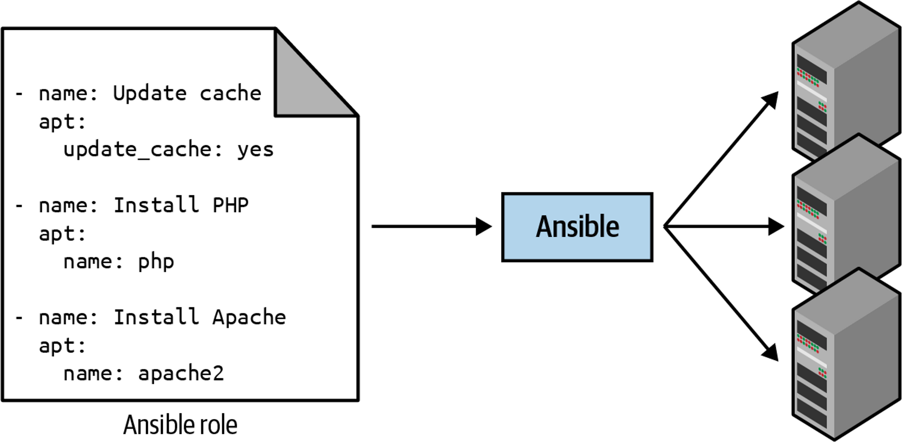
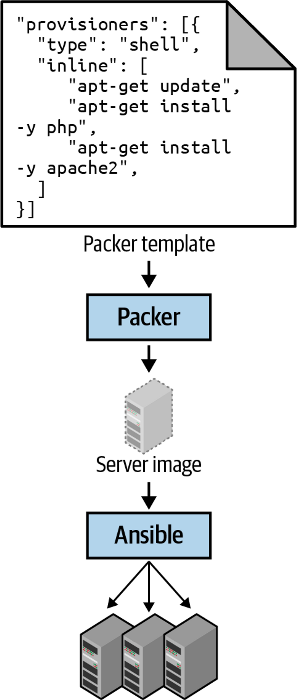
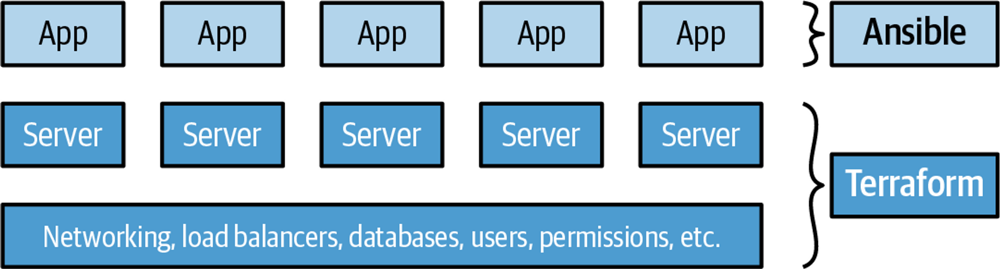
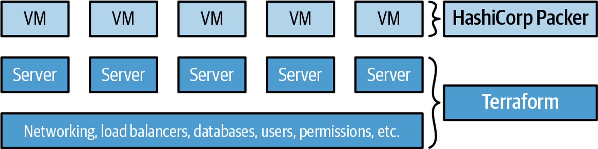
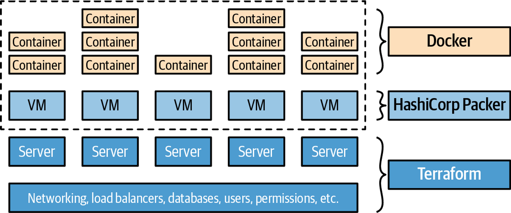

# Why Terraform	
이 장에서 다룰 주제

- 데브옵스와 배포 자동화
- 코드형 인프라
- 테라폼 작동 방식
- 테라폼과 다른 코드형 인프라 도구 비교

## 데브옵스와 배포 자동화
데브옵스(DevOps)는 팀이나 직책 또는 특정 기술이 아니다. 소프트웨어를 효율적으로 전달하기 위한 프로세스, 아이디어, 테크닉이다. 

- 지속적으로 코드를 통합하고 항상 배포 가능한 상태로 유지
- 탄력적이고 자가 치유적인 시스템 구축
- 모니터링 및 알림 기능을 사용하여 자동으로 해결할 수 없는 문제에 대비

클라우드 서비스가 대중화 되며 직접 데이터센터를 운영하는 대신 소프트웨어 작업을 통해 인프라를 구성할 수 있게 되었다. 코드를 통해 인프라를 관리하는 것을 ‘***코드형 인프라***’라고 한다. 

## 코드형 인프라

코드형 인프라(Infrastructure as Code, IaC)란 코드를 작성 및 실행하여 인프라를 생성, 배포, 수정, 정리하는 것을 말한다 → 하드웨어를 포함한 운영의 모든 측면을 소프트웨어적으로 사고

### 코드형 인프라 도구의 범주

- 애드혹 스크립트
    - 배시, 루비, 파이썬 등 선호하는 언어를 사용하여 작성된 스크립트를 서버에서 수동으로 실행
    - 예: *setup-webserver.sh*
    
    ```bash
    # Update the apt-get cache
    sudo apt-get update
    
    # Install PHP and Apache
    sudo apt-get install -y php apache2
    
    # Copy the code from the repository
    sudo git clone https://github.com/brikis98/php-app.git /var/www/html/app
    
    # Start Apache
    sudo service apache2 start
    ```
    
    - 장점 : 가장 간단함. 소규모 일회성 작업에 적합
    - 단점 :
        - 사용자가 수동으로 맞춤 코드를 작성해야 한다
        - 범용 프로그래밍 언어는 사용자마다 고유한 스타일이 있음
- 구성 관리 도구: 셰프, 퍼핏, 앤서블, 솔트스택
    - 예: 앤서블 web-server.yml
    
    ```yaml
    - name: Update the apt-get cache
      apt:
        update_cache: yes
    
    - name: Install PHP
      apt:
        name: php
    
    - name: Install Apache
      apt:
        name: apache2
    
    - name: Copy the code from the repository
      git: repo=https://github.com/brikis98/php-app.git dest=/var/www/html/app
    
    - name: Start Apache
      service: name=apache2 state=started enabled=yes
    ```
    - 코딩 규칙
        - 일관되고 예측 가능한 구조가 제공되며 코딩 규칙이 포함되어 있어 코드를 쉽게 탐색할 수 있게 해준다
    - 멱등성
        - 실행 횟수에 관계없이 올바르게 동작하는 성질
        - 예를 들어 앤서블 롤은 설정 파일(예: web-server.yml)을 사용하여 아파치가 설치되지 않았을 경우에만 설치하고 아파치 웹 서버가 동작하지 않는 경우에만 동작하도록 함
    - 분산형 구조
        - 애드혹 스크립트는 단일 로컬 머신에서만 실행되도록 설계되어 있는 반면 구성 관리 도구는 원격 서버를 관리하기 위해 설계됨
        
        
        
        - 매개변수를 설정하여 롤링 배포를 수행하거나 병렬 수행 카운트를 지정할 수도 있다
- 서버 템플릿 도구: 도커, 패커, 베이그런트(Vagrant)
    - 각각의 서버에 동일한 코드를 실행하여 구성하는 기존 방식과 다르게
    - OS, 소프트웨어, 파일 등 필요한 모든 내용을 포함하고 있는 스냅샷 이미지를 생성하고 모든 서버에 이미지를 설치한다
    
    
    
    - 서버 템플릿 도구는 각각의 목적이 약간씩 다르다
        - 패커 : AMI처럼 프로덕션 서버에서 직접 실행하는 이미지를 생성하는 데 사용
        - 베이그런트: macOS 나 windows 랩톱과 같은 개발 컴퓨터에서 실행되는 이미지를 만드는데 사용
        - 도커 : 개별 응용 프로그램의 이미지를 만드는데 사용
    - 서버 템플릿은 불변 인프라로 전환하는 데 있어 핵심적인 구성 요소
    - 한번 배포된 서버는 다시 변경되지 않는다. 새 버전의 코드를 배포하는 것과 같이 서버를 변경해야 하는 경우 새 이미지를 만들어 배포해야 한다.
- 오케스트레이션 도구: 쿠버네티스, 마라톤/메소스, Aws ECS, 도커스웜, 노마드
    - 다양한 배포 전략 지원
    - VM과 컨테이너를 하드웨어 효율적 배포
    - 상태 모니터링, 자동 복구
    - 오토 스케일링
    - 로드 밸런싱
    - 서비스 디스커버리
    - 예: k8s deployment.yml
    
    ```yaml
    apiVersion: apps/v1
    
    # Use a Deployment to deploy multiple replicas of your Docker
    # container(s) and to declaratively roll out updates to them
    kind: Deployment
    
    # Metadata about this Deployment, including its name
    metadata:
      name: example-app
    
    # The specification that configures this Deployment
    spec:
      # This tells the Deployment how to find your container(s)
      selector:
        matchLabels:
          app: example-app
    
      # This tells the Deployment to run three replicas of your
      # Docker container(s)
      replicas: 3
    
      # Specifies how to update the Deployment. Here, we
      # configure a rolling update.
      strategy:
        rollingUpdate:
          maxSurge: 3
          maxUnavailable: 0
        type: RollingUpdate
    
      # This is the template for what container(s) to deploy
      template:
    
        # The metadata for these container(s), including labels
        metadata:
          labels:
            app: example-app
    
        # The specification for your container(s)
        spec:
          containers:
    
            # Run Apache listening on port 80
            - name: example-app
              image: httpd:2.4.39
              ports:
                - containerPort: 80
    ```
    
- 프로비저닝 도구: 테라폼, 클라우드포메이션, 오픈스택 히트
    - 구성관리, 서버 템플릿 및 오케스트레이션 도구가 각 서버에서 실행되는 코드를 정의한다면, 프로비저닝 도구는 서버 자체 생성한다
    - 또한 캐시, 로드밸런서, 모니터링, 큐, 네트워크 설정, 보안, 인증서 등 인프라에 관한 거의 모든 부분을 프로비저닝할 수 있다
    
    ```bash
    resource "aws_instance" "app" {
      instance_type     = "t2.micro"
      availability_zone = "us-east-2a"
      ami               = "ami-0fb653ca2d3203ac1"
    
      user_data = <<-EOF
                  #!/bin/bash
                  sudo service apache2 start
                  EOF
    }
    ```
    

### 코드형 인프라의 이점

- 셀프 서비스
- 속도와 안정성
    - 자동화된 프로세스는 일관되고 반복 가능하며 수동보다 오류가 적게 발생한다
- 문서화
- 버전 관리
    - 변경 내역이 남아 있으므로 문제가 발생한 지점을 찾기 수월하며 롤백도 쉬움
- 유효성 검증
    - 자동화된 테스트를 실행할 수 있음
- 재사용성
- 지루하고 반복적인 업무 제거

## 테라폼의 작동 방식

테라폼은 HashiCorp에서 만든 Go 언어로 작성된 오픈소스 도구로 `terraform` 이라는 명령어로 실행한다.

테라폼 바이너리는 AWS, GCP 등 클라우드 공급자 API를 호출하여 리소스를 생성한다. 

```bash
resource "aws_instance" "example" {
  ami           = "ami-0fb653ca2d3203ac1"
  instance_type = "t2.micro"
}

resource "google_dns_record_set" "a" {
  name         = "demo.google-example.com"
  managed_zone = "example-zone"
  type         = "A"
  ttl          = 300
  rrdatas      = [aws_instance.example.public_ip]
}
```

위의 테라폼 코드는 "t2.micro" 타입의 aws 인스턴스를 생성하고 생성한 aws 인스턴스의 IP주소를 구글 클라우드의 DNS 정보로 지정한다.

테라폼 구성 파일에 서버, DB, 로드밸런서, 네트워크토폴로지 등 전체 인프라를 정의하고 명령어를 사용하여 인프라를 배포할 수 있다. 테라폼 바이너리는 사용자가 구성한 코드를 파싱하고 코드에 지정된 클라우드 공급자에 대한 일련의 API 호출로 변환한다. 


> 💡 클라우드 공급자 간 투명한 이식성
> : 테라폼은 여러 클라우드 공급자를 지원하지만 각 클라우드 공급자는 동일한 유형의 인프라를 제공하지 않기 때문에 정확히 동일한 인프라를 배포할 수 없다. 한 클라우드 공급자의 기능이 다른 클라우드에는 존재하지 않을 수 있다.


## 테라폼과 다른 코드형 인프라 비교
많은 코드형 인프라 도구의 기능은 서로 겹친다 어떤 도구를 선택해야 할까?

### 구성관리 vs 프로비저닝
서버 템플릿 도구를 사용하는 경우 대부분의 구성 관리 요구 사항을 포함한다. 
반면 프로비저닝은 프로비저닝 도구가 최선의 선택이다.
서버 템플릿 도구를 사용하지 않는 경우 구성 관리 및 프로비저닝 도구를 함께 사용하는 것이 좋다. 예를 들어 테라폼과 셰프를 실행하여 서버를 구성할 수 있다

### 가변 인프라 vs 불변 인프라

#### 가변 인프라
구성 관리 도구는 일반적으로 가변 인프라 패러다임을 사용한다. 가변 인프라 패러다임은 시간이 지나면서 구성 드리프트가 발생할 수 있고 이러한 버그를 파악하기 어렵다. 

#### 불변 인프라
프로비전 도구를 사용하여 서버 템플릿 도구로 생성한 이미지를 배포하는 경우 변경은 완전히 새로운 서버를 배포하는 것과 같다. 사소한 변경에도 새로운 서버이미지를 재배포해야 하므로 시간이 오래 걸림

### 절차적 언어 vs 선언적 언어
앤서블 등 구성 관리 도구는 최종 상태에 달성하는 방법을 단계별로 지정하는 절차적 스타일의 코드를 권장한다.

테라폼 등 프로비저닝 도구는 최종 상태를 지정하는 선언적 방식의 코드를 권장한다.
 예를 들어 이미 10대의 서버가 배포되어 있고 15대로 스케일 아웃을 수행하기 위한 앤서블(절차)과 테라폼(선언)의 접근 방식에는 차이가 있다.

> 테라폼 구성 파일
> 
> 
> ```bash
> resource "aws_instance" "example" {
>   count         = 15
>   ami           = "ami-0fb653ca2d3203ac1"
>   instance_type = "t2.micro"
> }
> ```
> 

> 앤서블 구성 파일
> 
> 
> ```yaml
> - ec2:
>     count: 5
>     image: ami-0fb653ca2d3203ac1
>     instance_type: t2.micro
> ```
> 

테라폼은 구성파일에 최종 상태를 명시하므로 count 를 15로 지정하면 이전 배포 기록을 갖고 있어 5개의 추가 서버를 생성하는 반면 앤서블은 절차지향이므로 10개 이후 추가 5개의 서버를 생성하도록 명령해야 한다 따라서 count 를 5로 하여 배포한다.

물론 앤서블에서도 새 인스턴스를 배포하기 전 태그를 사용하여 ec2 인스턴스를 검색하고 최종 상태 수 15와 비교하여 인스턴스를 증감할 수 있지만 이러한 종류의 로직을 수동으로 파악하여 지정해야 한다. 

즉 위의 예는 아래의 주요한 문제를 함의한다

- 절차적 코드는 인프라의 마지막 상태 정보를 기록하지 않는다
- 절차적 코드는 재사용 가능성을 제한한다

## 마스터 서버 유무

셰프, 퍼핏, 솔트 스택은 인프라 상태를 저장하고 업데이트를 배포하기 위해 마스터 서버를 실행한다. 

**마스터 서버의 장점**

- 인프라의 구성 진행 상태를 중앙에서 쉽게 확인 가능
- 백그라운드에서 구성을 지속적으로 적용 가능. 수동으로 서버를 변경해도 마스터가 해당 변경 사항을 되돌려 구성 드리프트 방지

**마스터 서버의 단점**

- 마스터를 실행하기 위한 추가 인프라 필요
- 마스터 서버를 유지 관리 해야 함
- 클라이언트가 마스터와 통신하는 방법, 마스터가 다른 서버와 통신할 방법을 제공하야 하며 이는 추가 포트를 열고 추가 인증 시스템을 구성하는 것을 의미하므로 보안에 취약할 수 있음

### 에이전트 유무

셰프, 퍼핏은 구성하련느 서버에 에이전트를 설치하도록 요구한다. 

**단점**

- 부트스트래핑: 에이전트를 설치하기 위해 외부 프로세스에 의존한다. 예를 들어 에이전트가 이미 설치된 서버 이미지를 배포해야 함
- 유지: 주기적으로 에이전트를 업데이트 해야 하고 마스터가 있는 경우 마스터와 동기화를 유지하도록 주의해야 함
- 보안: 마스터로 부터 구성을 풀다운/푸시하기 위해 아웃바운드/인바운드 포트를 열어야 함. 중앙서버에 대해 에이전트를 인증하는 방법을 파악해야 함

### 커뮤니티 규모
앤서블과 테라폼은 폭발적으로 성장하고 있으며 두 도구 모두 앞으로 더 커질 가능성이 높다.

### 여러 도구를 함께 사용

- 프로비저닝과 구성 관리
    - 테라폼과 앤서블
    -  
    - 시작하기 쉬운 접근 방식이나 앤서블을 사용하면 가변적 서버를 사용하므로 규모가 커질 수록 유지관리가 어려워질 수 있음
- 프로비저닝과 서버 템플릿
    - 테라폼과 패커
    - 앱을 VM 이미지로 패킹하고 인프라 구성을 테라폼으로 프로비저닝
    - 
    - 불변적 서버로 유지 관리가 쉽다.
    - 다만 VM을 구축하고 배포하는데 시간이 오래 걸림. 배포 전략(블루-그린 불가)이 제한되어 있음
- 프로비저닝 + 서버 템플릿 + 오케스트레이션
    - 테라폼, 패커, 쿠버네티스
    - 패커를 사용하여 k8s 에이전트가 설치된 VM 이미지를 만들고 테라폼을 사용하여 인프라 구성을 프로비저닝
    - 
    - 배포전략, 자동 복구, 확장 등 다양한 k8s 내장기능을 사용가능
    - 단 k8s 계층이 추가됨으로써 복잡성 증대

### 결론
코드형 인프라 도구는 다른 구성에 사용할 수 있을 만큼 유연하다. 따라서 사용자의 요구사항과 기준에 맞춰 코드형 인프라 도구를 선택할 수 있다.

저자는 불변 인프라와 선언적 언어, 마스터와 에이전트가 없고 대교모 커뮤니티와 성숙한 코드베이스를 갖추었으며 클라우드에 종속되지 않는 오픈 소스 프로비저닝 도구를 원했기 때문에 테라폼을 선택함