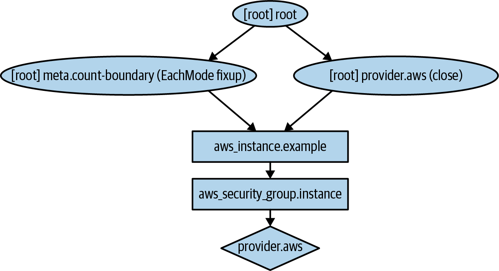
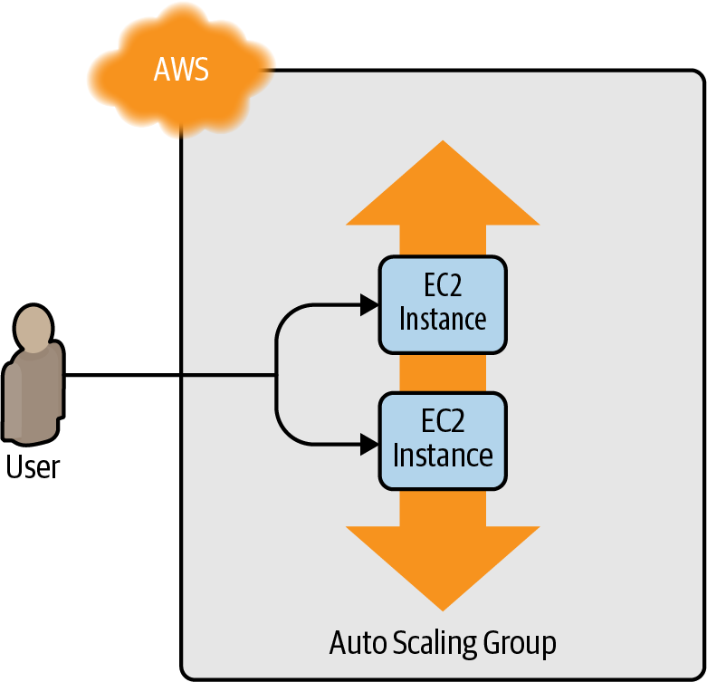
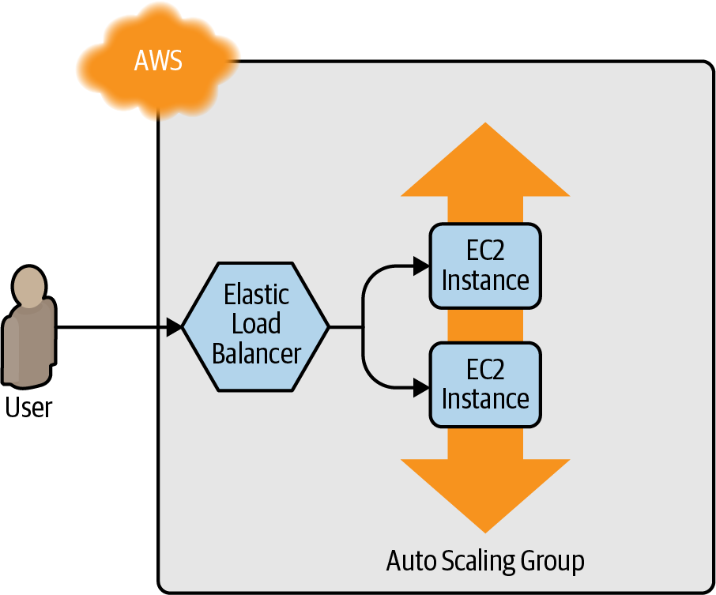
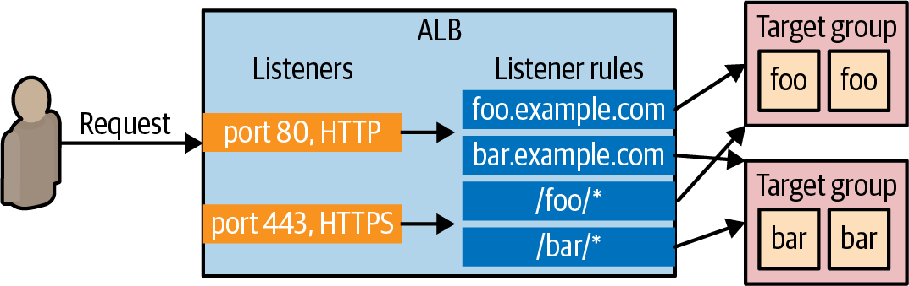

# Getting Started With Terraform
이 장에서 다룰 내용

- AWS 계정 설정
- 테라폼 설치
- 단일 서버 배포
- 단일 웹 서버 배포
- 구성 가능한 웹 서버 배포
- 웹 서버 클러스터 배포
- 로드 밸런서 배포
- 정리

# 1: AWS 계정 설정

AWS (*[https://aws.amazon.com](https://aws.amazon.com/))* 에서 계정 생성 후 제한된 권한을 가진 다른 사용자 계정을 만든다.

다른 사용자 만들기

1. IAM 콘솔 → 사용자 → 사용자추가
2. AWS 액세스 유형 선택 : ‘프로그래밍 방식 엑세스’ 체크
3. 권한 설정 : ‘기존 정책 직접 연결’
    1. [AmazonEC2FullAccess](https://us-east-1.console.aws.amazon.com/iam/home#/policies/arn%3Aaws%3Aiam%3A%3Aaws%3Apolicy%2FAmazonEC2FullAccess)
    2. [AmazonS3FullAccess](https://us-east-1.console.aws.amazon.com/iam/home#/policies/arn%3Aaws%3Aiam%3A%3Aaws%3Apolicy%2FAmazonS3FullAccess)
    3. [AmazonDynamoDBFullAccess](https://us-east-1.console.aws.amazon.com/iam/home#/policies/arn%3Aaws%3Aiam%3A%3Aaws%3Apolicy%2FAmazonDynamoDBFullAccess)
    4. [AmazonRDSFullAccess](https://us-east-1.console.aws.amazon.com/iam/home#/policies/arn%3Aaws%3Aiam%3A%3Aaws%3Apolicy%2FAmazonRDSFullAccess)
    5. [CloudWatchFullAccess](https://us-east-1.console.aws.amazon.com/iam/home#/policies/arn%3Aaws%3Aiam%3A%3Aaws%3Apolicy%2FCloudWatchFullAccess)
    6. [IAMFullAccess](https://us-east-1.console.aws.amazon.com/iam/home#/policies/arn%3Aaws%3Aiam%3A%3Aaws%3Apolicy%2FIAMFullAccess)
    7. [AutoScalingFullAccess](https://us-east-1.console.aws.amazon.com/iam/home#/policies/arn%3Aaws%3Aiam%3A%3Aaws%3Apolicy%2FAutoScalingFullAccess)
    8.  or AdministratorAccess
4. 키 보관
    1. 액세스키 
    2. 비밀 액세스 키 

# 2: 테라폼 설치

## 테라폼 바이너리 설치

```bash
brew install terraform
```

## 자격증명

- 환경변수

```bash
$ export AWS_ACCESS_KEY_ID=(액세스 키 ID)
$ export AWS_SECRET_ACCESS_KEY=(비밀 액세스 키)
```

- 자격증명 파일 사용 *$HOME/.aws/credentials*

```bash
[default]
aws_access_key_id=(액세스 키 ID)
aws_secret_access_key=(비밀 액세스 키)
```

# 3: 단일 서버 배포

빈 디렉토리에 [main.tf](terraform/main.tf) 파일을 생성하고 공급자 구성 및 리소스 정의 후 `terraform init` 

- 공급자 구성

```
provider "aws" {
  region = "us-east-2"
}
```

- 리소스 정의

```
resource "<PROVIDER>_<TYPE>" "<NAME>" {
  [CONFIG ...]
}
```

- main.tf

```
provider "aws" {
  region = "us-east-2"
}
resource "aws_instance" "example" {
  ami           = "ami-0fb653ca2d3203ac1"
  instance_type = "t2.micro"
}
```

- terraform init

```bash
ui-MacBook-Pro:terraform aa$ terraform init

Initializing the backend...

Initializing provider plugins...
- Finding latest version of hashicorp/aws...
- Installing hashicorp/aws v4.45.0...
- Installed hashicorp/aws v4.45.0 (signed by HashiCorp)
...
```

- terraform plan

```
ui-MacBook-Pro:terraform aa$ terraform plan

Terraform used the selected providers to generate the following execution plan. Resource actions are indicated with the following symbols:
  + create

Terraform will perform the following actions:

  # aws_instance.example will be created
  + resource "aws_instance" "example" {
      + ami                                  = "ami-0fb653ca2d3203ac1"
      + arn                                  = (known after apply)
      + associate_public_ip_address          = (known after apply)
      + availability_zone                    = (known after apply)
      + cpu_core_count                       = (known after apply)
      + cpu_threads_per_core                 = (known after apply)
      + disable_api_stop                     = (known after apply)
      + disable_api_termination              = (known after apply)
      + ebs_optimized                        = (known after apply)
      + get_password_data                    = false
      + host_id                              = (known after apply)
      + host_resource_group_arn              = (known after apply)
      + iam_instance_profile                 = (known after apply)
      + id                                   = (known after apply)
      + instance_initiated_shutdown_behavior = (known after apply)
      + instance_state                       = (known after apply)
      + instance_type                        = "t2.micro"
      + ipv6_address_count                   = (known after apply)
      ...
```

- terraform apply

```
ui-MacBook-Pro:terraform aa$ terraform apply

Terraform used the selected providers to generate the following execution plan. Resource actions are indicated with the following symbols:
  + create

Terraform will perform the following actions:

  # aws_instance.example will be created
  + resource "aws_instance" "example" {
      + ami                                  = "ami-0fb653ca2d3203ac1"
      + arn                                  = (known after apply)
      + associate_public_ip_address          = (known after apply)
      + availability_zone                    = (known after apply)
      + cpu_core_count                       = (known after apply)
    ...
    }

Plan: 1 to add, 0 to change, 0 to destroy.

Do you want to perform these actions?
  Terraform will perform the actions described above.
  Only 'yes' will be accepted to approve.

  Enter a value: yes

aws_instance.example: Creating...
aws_instance.example: Still creating... [10s elapsed]
aws_instance.example: Still creating... [20s elapsed]
aws_instance.example: Creation complete after 25s [id=i-026032b2636d4d398]

Apply complete! Resources: 1 added, 0 changed, 0 destroyed.
```


# 4: 단일 웹서버 배포

HTTP 요청에 응답할 수 있는 단일 웹 서버 배포


- 기본 우분투 18.04 AMI 에 user_data 인수를 설정하여 busybox 실행한다

```
resource "aws_instance" "example" {
  ami                    = "ami-0fb653ca2d3203ac1"
  instance_type          = "t2.micro"

  user_data = <<-EOF
              #!/bin/bash
              echo "Hello, World" > index.html
              nohup busybox httpd -f -p 8080 &
              EOF

  user_data_replace_on_change = true

  tags = {
    Name = "terraform-example"
  }
}
```

- 보안 그룹 생성

이 때, 8080포트에 대해 인바운드 트래픽을 허용시키기 위한 보안 그룹을 생성 하고 보안 그룹 리소스 속성값을 ec2 인스턴스에서 참조한다.

```bash
resource "aws_security_group" "instance" {
  name = "terraform-example-instance"

  ingress {
    from_port   = 8080
    to_port     = 8080
    protocol    = "tcp"
    cidr_blocks = ["0.0.0.0/0"]
  }
}
```

- ec2 인스턴스에 vpc id 참조 적용

리소스 참조를 위한 표현식은 `<PROVIDER>_<TYPE>.<NAME>.<ATTRIBUTE>` 이고 위에서 생성한 보안 그룹 인스턴스의 id는 `aws_security_group.instance.id` 와 같이 표현할 수 있다.

```bash
resource "aws_instance" "example" {
  ami                    = "ami-0fb653ca2d3203ac1"
  instance_type          = "t2.micro"
  vpc_security_group_ids = [aws_security_group.instance.id]

  user_data = <<-EOF
              #!/bin/bash
              echo "Hello, World" > index.html
              nohup busybox httpd -f -p 8080 &
              EOF

  user_data_replace_on_change = true

  tags = {
    Name = "terraform-example"
  }
}
```

- 실행

```bash
terraform apply
```

### 1) instance replace

user_data 는 인스턴스 실행시 최초 1번만 실행되므로 user_data 를 변경할 경우 기존 인스턴스를 새로운 인스턴스로 대체한다 → 멱등성

테라폼 apply 로그에서 `aws_instance.example must be replaced`  를 확인할 수 있다

```bash
# aws_instance.example must be replaced
-/+ resource "aws_instance" "example" {
      ~ arn                                  = "arn:aws:ec2:us-east-2:861532850823:instance/i-026032b2636d4d398" -> (known after apply)
      ~ associate_public_ip_address          = true -> (known after apply)
```

### 2) 종속성

하나의 리소스에서 다른 리소스를 참조로 추가하면 내재된 종속성이 작성된다. 위의 예에서 ec2 인스턴스는 보안그룹 id를 참조하므로 보안그룹 생성 이후 ec2를 생성해야 한다. 테라폼은 선언형 언어이므로 코드 작성 순서와 관계 없이 테라폼이 알아서 종속성 그래프를 작성하여 가장 효율적인 형태로 리소스를 생성한다. 



테라폼 종속성은 `terraform graph` 명령어를 통해 확인할 수 있다. 

```bash
ui-MacBook-Pro:terraform aa$ terraform graph
digraph {
        compound = "true"
        newrank = "true"
        subgraph "root" {
                "[root] aws_instance.example (expand)" [label = "aws_instance.example", shape = "box"]
                "[root] aws_security_group.instance (expand)" [label = "aws_security_group.instance", shape = "box"]
                "[root] provider[\"registry.terraform.io/hashicorp/aws\"]" [label = "provider[\"registry.terraform.io/hashicorp/aws\"]", shape = "diamond"]
                "[root] aws_instance.example (expand)" -> "[root] provider[\"registry.terraform.io/hashicorp/aws\"]"
                "[root] aws_security_group.instance (expand)" -> "[root] provider[\"registry.terraform.io/hashicorp/aws\"]"
                "[root] provider[\"registry.terraform.io/hashicorp/aws\"] (close)" -> "[root] aws_instance.example (expand)"
                "[root] provider[\"registry.terraform.io/hashicorp/aws\"] (close)" -> "[root] aws_security_group.instance (expand)"
                "[root] root" -> "[root] provider[\"registry.terraform.io/hashicorp/aws\"] (close)"
        }
}
```

# 5: 구성 가능한 웹서버 배포

- 입력 변수 선언

```bash
variable "name" {
  description = "설명"
  type        = <데이터 타입: number, string, list, bool, map, object>
  default     = <변수에 값을 전달하지 않았을때 기본 값>
}
```

```bash
variable "server_port" {
  description = "The port the server will use for HTTP requests"
  type        = number
  default     = 8080
}
```

- 변수 값 전달 방법
    - 환경 변수
        - `export TF_VAR_<variable_name> = <value>`
    - 명령 줄
        - -var 옵션 사용
        - `terraform plan -var “<variable_name>=<value>”`
- 변수 참조 `var.<VARIABLE_NAME>`
    - user_data 와 같은 스크립트에서 변수 참조시 `"${...}"` 중괄호 안에서 참조

```bash
resource "aws_security_group" "instance" {
  name = "terraform-example-instance"

  ingress {
    from_port   = var.server_port
    to_port     = var.server_port
    protocol    = "tcp"
    cidr_blocks = ["0.0.0.0/0"]
  }
}
```

- 출력 변수 정의

```bash
output "<NAME>" {
  value = <VALUE>
  [CONFIG ...]
}
```

- 인스턴스 퍼블릭 ip 출력

```bash
output "public_ip" {
  value       = aws_instance.example.public_ip
  description = "The public IP address of the web server"
}
```

```bash
terraform apply
...
Apply complete! Resources: 0 added, 0 changed, 0 destroyed.

Outputs:

public_ip = "18.221.24.208"
```

# 6: 웹서버 클러스터 배포

여러대의 서버를 쓰레숄드에 따라 자동으로 증감시키기 위해 오토스케일링 그룹을 사용한다.



## 1) 스케일링할 인스턴스 정의

```bash
resource "aws_launch_configuration" "example" {
  image_id        = "ami-0fb653ca2d3203ac1"
  instance_type   = "t2.micro"
  security_groups = [aws_security_group.instance.id]

  user_data = <<-EOF
              #!/bin/bash
              echo "Hello, World" > index.html
              nohup busybox httpd -f -p ${var.server_port} &
              EOF
}
```

## 2) 오토스케일링 그룹 정의

```bash
resource "aws_autoscaling_group" "example" {
  launch_configuration = aws_launch_configuration.example.name

  min_size = 2
  max_size = 10

  tag {
    key                 = "Name"
    value               = "terraform-asg-example"
    propagate_at_launch = true
  }
}
```

### (1) lifecycle

테라폼은 리소스를 교체할 때 이전 리소스를 삭제하고 다음 대체 리소스를 생성하는데 오토스케일링 그룹에 이전에 생성한 리소스에 대한 참조가 있으므로 테라폼이 이를 삭제 후 생성할 수 없다.  이 문제를 해결하기 위해 lifecycle 을 설정한다. 

```bash
resource "aws_launch_configuration" "example" {
  image_id        = "ami-0fb653ca2d3203ac1"
  instance_type   = "t2.micro"
  security_groups = [aws_security_group.instance.id]

  user_data = <<-EOF
              #!/bin/bash
              echo "Hello, World" > index.html
              nohup busybox httpd -f -p ${var.server_port} &
              EOF

  # Required when using a launch configuration with an auto scaling group.
  lifecycle {
    create_before_destroy = true
  }
}
```

수명주기를 `create_before_destroy` 로 설정하면 교체 리소스를 먼저 생성한 다음 이전 리소스를 가리키고 있던 모든 참조가 교체 리소스를 가리키도록 업데이트하고 이전 리소스를 삭제한다.

### (2) subnet_id

오토스케일링 그룹에 의해 생성된 ec2를 어느 서브넷에 배포할지 저장하는 매개변수 이다. 각 서브넷은 분리된 데이터센터(AZ)에 있으므로 인스턴스를 여러 서브넷에 배포하면 데이터센터가 중단된 경우에도 서비스를 계속 실행할 수 있다. 이 때 서브넷 아이디를 하드코딩 하기 보단 데이터소스를 사용하여 AWS 계정에서 서브넷 목록을 얻어 구성하는 것이 좋다. 

데이터 소스를 사용 구문

```bash
data "<PROVIDER>_<TYPE>" "<NAME>" {
  [CONFIG ...]
}
```

서브넷은 vpc 하위에 있으므로 vpc id를 얻어 해당 vpc에 존재하는 서브넷 목록을 받아 올 수 있다.

```bash
data "aws_vpc" "default" {
  default = true
}

data "aws_subnets" "default" {
  filter {
    name   = "vpc-id"
    values = [data.aws_vpc.default.id]
  }
}
```

오토스케일링 그룹에 서브넷 아이디 목록을 지정한다

```bash
resource "aws_autoscaling_group" "example" {
  launch_configuration = aws_launch_configuration.example.name
  vpc_zone_identifier  = data.aws_subnets.default.ids

  min_size = 2
  max_size = 10

  tag {
    key                 = "Name"
    value               = "terraform-asg-example"
    propagate_at_launch = true
  }
}
```

# 7: 로드밸런서 배포

오토스케일링 그룹에 의해 생성된 인스턴스를 묶어 최종 사용자에게는 단일 DNS만 제공하고 서버 전체에 트래픽을 분산한다.



AWS 는 세 가지 유형(ALB, NLB, CLB)의 로드 밸런서를 제공한다. 

- ALB : 특정 경로 또는 호스트 이름과 일치하는 요청을 특정 대상 그룹으로 라우팅
- NLB : TCP, UDP 및 TLS 트래픽 로드 밸런싱.
- CLB : 레거시 로드 밸런서.

이 예제에선 ALB를 사용한다



### ALB 생성

```bash
resource "aws_lb" "example" {
  name               = "terraform-asg-example"
  load_balancer_type = "application"
  subnets            = data.aws_subnets.default.ids
  security_groups    = [aws_security_group.alb.id]
}
```

### ALB 리스너 기본 응답 액션 정의

```bash
resource "aws_lb_listener" "http" {
  load_balancer_arn = aws_lb.example.arn
  port              = 80
  protocol          = "HTTP"

  # By default, return a simple 404 page
  default_action {
    type = "fixed-response"

    fixed_response {
      content_type = "text/plain"
      message_body = "404: page not found"
      status_code  = 404
    }
  }
}
```

### ALB에 부여할 보안 그룹 생성

```bash
resource "aws_security_group" "alb" {
  name = "terraform-example-alb"

  # Allow inbound HTTP requests
  ingress {
    from_port   = 80
    to_port     = 80
    protocol    = "tcp"
    cidr_blocks = ["0.0.0.0/0"]
  }

  # Allow all outbound requests
  egress {
    from_port   = 0
    to_port     = 0
    protocol    = "-1"
    cidr_blocks = ["0.0.0.0/0"]
  }
}
```

ALB 타겟 그룹 리소스를 사용하는 대상 그룹 지정 

```bash
resource "aws_lb_target_group" "asg" {
  name     = "terraform-asg-example"
  port     = var.server_port
  protocol = "HTTP"
  vpc_id   = data.aws_vpc.default.id

  health_check {
    path                = "/"
    protocol            = "HTTP"
    matcher             = "200"
    interval            = 15
    timeout             = 3
    healthy_threshold   = 2
    unhealthy_threshold = 2
  }
}
```

주기적으로 각 인스턴스에 HTTP 요청을 전송해 인스턴스 상태를 확인하고 구성된 응답과 일치하는 응답을 반환하는 경우에만 인스턴스를 정상으로 간주한다. 위 예의 경우 `/` 패스로 질의하여 http code 200 응답시 정상으로 판단한다. 인스턴스가 비정상으로 판단될 경우 해당 인스턴스로 트래픽 전송을 중지한다. 

### ALB와 타겟 그룹의 매핑

오토스케일링 그룹에 ALB 타겟 그룹 리소스를 정의한다.

```bash
resource "aws_autoscaling_group" "example" {
  launch_configuration = aws_launch_configuration.example.name
  vpc_zone_identifier  = data.aws_subnets.default.ids

  target_group_arns = [aws_lb_target_group.asg.arn]
  health_check_type = "ELB"

  min_size = 2
  max_size = 10

  tag {
    key                 = "Name"
    value               = "terraform-asg-example"
    propagate_at_launch = true
  }
}
```

### ALB 타겟그룹 매핑 룰

패스 패턴 조건에 따라 `aws_lb_listener` 의 타겟 그룹 지정

```bash
resource "aws_lb_listener_rule" "asg" {
  listener_arn = aws_lb_listener.http.arn
  priority     = 100

  condition {
    path_pattern {
      values = ["*"]
    }
  }

  action {
    type             = "forward"
    target_group_arn = aws_lb_target_group.asg.arn
  }
}
```

### 리소스 정리

```bash
terraform destroy
```