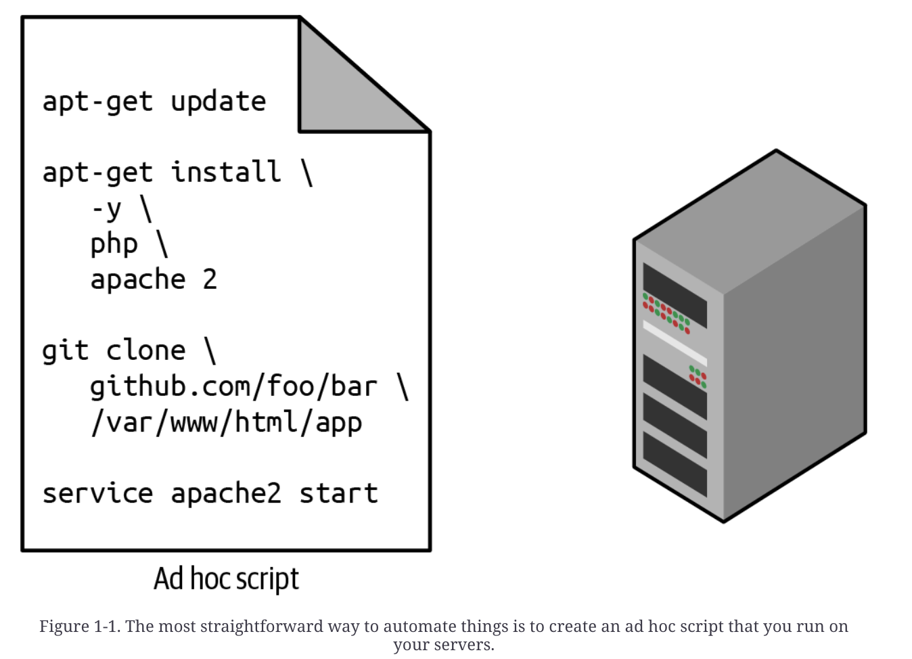
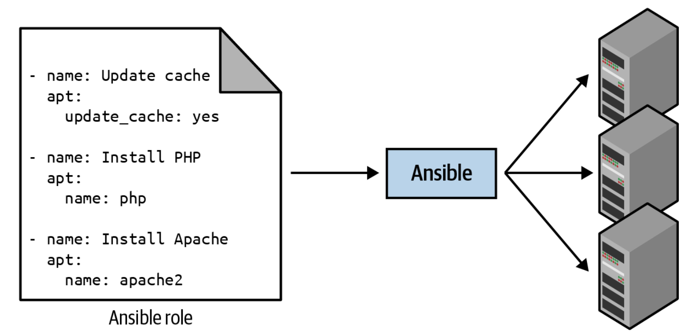
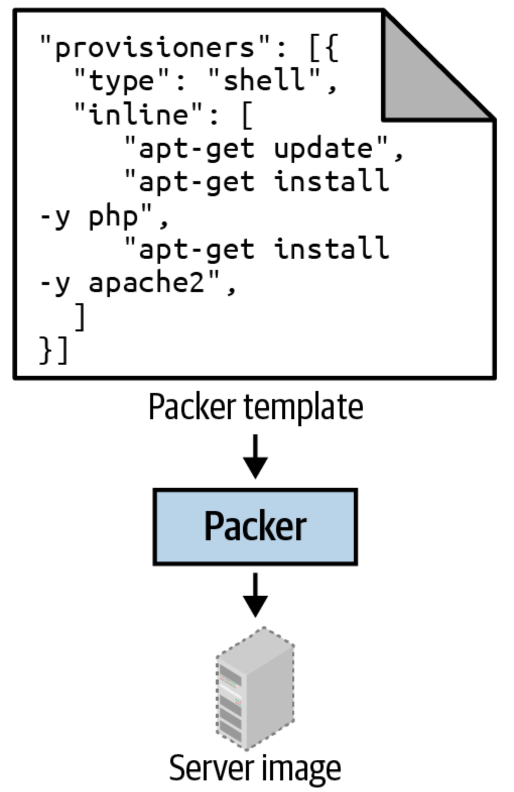
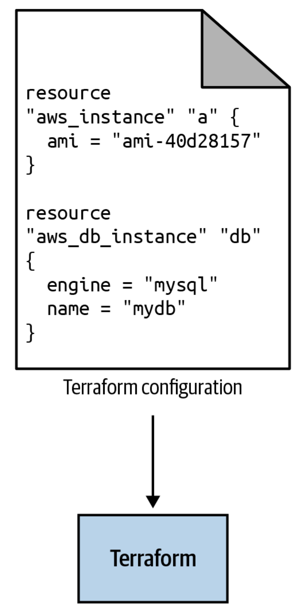
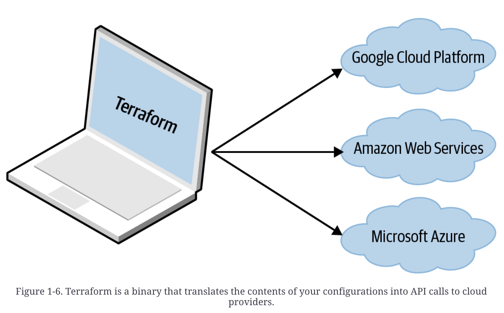
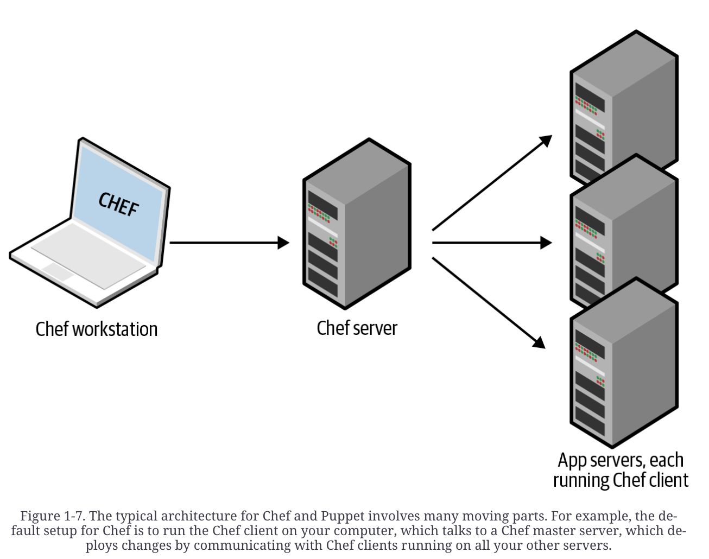
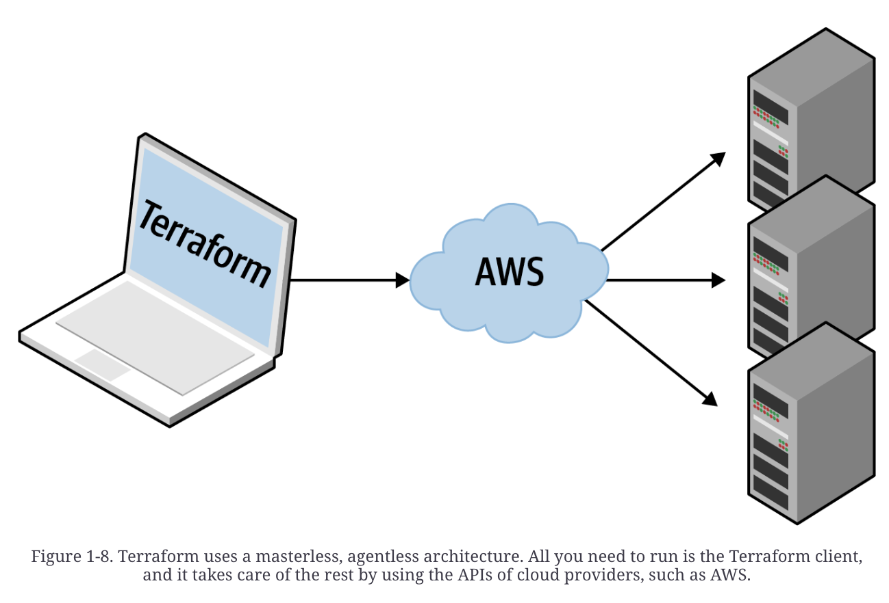
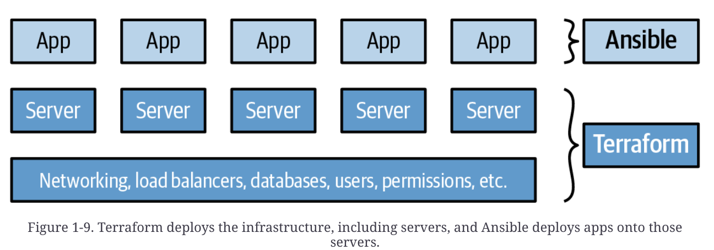

# Why Terraform?

## What is DevOps?
The goal of DevOps is to make software delivery vastly more efficient.
There are four core values in the DevOps movement: culture, automation, measurement, and sharing(focusing on automation).
The goal is to automate as much of the software delivery process as possible.
It allows the management of infrastructure through code, which is called infrastructure as code.

## What is Infrastructure as Code?
The idea behind infrastructure as code (IaC) is that you write and execute code to define, deploy, update, and destroy your infrastructure.
Five categories of IaC tools:
* Adhoc scripts
* Configuration management tools
* Server templating tools
* Orchestration tools
* Provisioning tools

### Ad Hoc Scripts
The most straightforward approach to automating anything is to write an ad hoc script.
You take whatever task you were doing manually, break it down into discrete steps, and use your favorite scripting language to automate and execute it on your server.

Ad hoc scripts are great for small, one-off tasks, but if you are going to be managing all of your infrastructures as code, then you should use an IaC tool that is purpose-built for the job.

### Configuration management tools
Configure management tools are designed to install and manage software on existing servers. An example Ansible role is available below(web-server.yml).
<pre>- name: Update the apt-get cache 
  apt: 
    update_cache: yes 
 
- name: Install PHP 
  apt: 
    name: php 
 
- name: Install Apache 
  apt: 
    name: apache2 
 
- name: Copy the code from the repository 
  git: repo=https://github.com/brikis98/php-app.git dest=/var/www/html/app 
 
- name: Start Apache 
  service: name=apache2 state=started enabled=yes</pre>
The code above looks similar to the bash script but using a configure management tool offers a number of advantages.
*Coding conventions*
It enforces a consistent and predictable structure, including documentation, file layout, clearly named parameters, secrets management, and so on.
*Idempotence*
Code that works correctly no matter how many times you run it is called idempotent code, which is much harder to write an ad hoc script that runs over and over again.
*Distribution*
Configuration management tools are designed specifically for managing large numbers of remote servers.

For example, you create a file called hosts that contains the IP addresses of the servers:
<pre>[webservers] 
11.11.11.11 
11.11.11.12 
11.11.11.13 
11.11.11.14 
11.11.11.15</pre>
Next, you define the following Ansible playbook:
<pre>- hosts: webservers 
  roles; 
  - webserver</pre>
Finally, execute it:
`ansible-playbook playbook.tml`
This instructs Ansible to configure all five servers in parallel.

### Server Templating Tools
An alternative to configuration management that has been growing in popularity recently are server templating tools such as Docker, Packer, and Vagrant by creating an image.

### Orchestration Tools
Below is a list of ways to manage server templating tools:
* Deploy VMs and Containers, making efficient use of your hardware
* Roll out updates using strategies such as rolling deployment, blue-green deployment, and canary deployment
* Monitor the health of your VMs and containers and automatically replace unhealthy ones (auto healing).
* Scale the number of VMs and containers up or down
* Distribute traffic across VMs and containers (load balancing)
* Allow your VMs and containers to find and talk to one another
Handling these tasks is the realm of orchestration tools such as Kubernetes, which allows you to define how to manage your Docker containers as code.
You firstly deploy a Kubernetes cluster, which is a group of servers that Kubernetes will manage and use to run your Docker containers. 
Pod: One or more Docker containers to run together.

### Provisioning Tools
Provisioning tools such as Terraform and CloudFormation are responsible for creating the servers themselves.

## What are the Benefits of Infrastructure as Code?
In exchange for the upfront investment of converting your manual practices to code, you get dramatic improvements in your ability to deliver software.
When your infrastructure is defined as code, you are able to use a wide variety of software engineering practices to dramatically improve your software delivery process, including the following:
*Self-service*
The entire deployment process can be automated and developers can kick off their own deployments whenever necessary.
*Speed and safety*
If automated, it will be faster. Given that an automated process will be more consistent and more repeatable, it will be safer as well.
*Documentation*
IaC acts as documentation, allowing everyone in the organization to understand how things work, even if the sysadmin goes on vacation.
*Version control*
You can store your IaC source files in version control, which means that the entire history of your infrastructure is now captured in the commit log.
*Validation*
If the state of your infrastructure is defined in code, you can perform a code review, run tests, and analyze, reducing the chance of defects.
*Reuse*
You can package your infrastructure into reusable modules.
*Happiness*
Developers can focus on coding since IaC can automate the deployment and management of infrastructure.

## How Does Terraform Work?
Terraform is an open-source tool written in the Go programming language. The go code compiles down into one binary for each of the supported operating systems, called terraform.
You can use this binary to deploy infrastructure from any other servers or computers. 
Terraform binary makes API calls to one or more providers, such as AWS, Azure, and GCP.
Terraform configuration files make API calls and specify what infrastructure you want to create. Below is an example:
<pre>resource "aws_instance" "example" { 
  ami           = "ami-0fb653ca2d3203ac1" 
  instance_type = "t2.micro" 
} 
 
resource "google_dns_record_set" "a" { 
  name         = "demo.google-example.com" 
  managed_zone = "example-zone" 
  type         = "A" 
  ttl          = 300 
  rrdatas      = [aws_instance.example.public_ip] 
}</pre>
Terraform allows you to deploy interconnected resources across multiple cloud providers.

## How Does Terraform Compare to Other IaC Tools?
**Configuration Management Versus Provisioning**
Terraform is a better choice when you have an image created from a Dockerfile. Otherwise, a combination of a provisioning tool (Terraform) and a configuration tool is a great choice.
**Mutable Infrastructure Versus Immutable Infrastructure**
Terraform is immutable which results in fewer configuration bugs.
**Procedural Language Versus Declarative Language**
Terraform encourages a declarative style, in which you write code that specifies your desired end state, and the IaC tool itself is responsible for figuring out how to achieve that state. The comparison below when deploying 10 servers to 15 servers:
Procedural:
<pre>// deploying 10 servers 
- ec2: 
    count: 10 
    image: ami-0fb653ca2d3203ac1 
    instance_type: t2.micro 
     
// and then deploying 15 servers 
// you need to be aware of what is already deployed and write for the additions 
- ec2: 
    count: 5 
    image: ami-0fb653ca2d3203ac1 
    instance_type: t2.micro</pre>
Declarative:
<pre>// deploying 10 servers 
resource "aws_instance" "example" { 
  count         = 10 
  ami           = "ami-0fb653ca2d3203ac1" 
  instance_type = "t2.micro" 
} 
 
// and then deploying 15 servers 
// you don't need to be aware of what's already deploayed, 
// just replace the number of servers to deploy 
resource "aws_instance" "example" { 
  count         = 15 
  ami           = "ami-0fb653ca2d3203ac1" 
  instance_type = "t2.micro" 
}</pre>

Procedural code does not fully capture the state of the infrastructure.
Procedural code limits reusability.
Declarative code always represents the latest state of your infrastructure.
**General-Purpose Language (GPL) Versus Domain-Specific Language (DSL)**
Terraform uses a domain-specific language to manage infrastructure as code.
DSLs are designed for use in one specific domain, whereas GPLs can be used across a broad range of domains.
DSLs have several advantages over GPLs:
* Easier to learn
* Cleaner and more concise
* More uniform
**Master Versus Masterless**
Having a master server has some drawbacks:
* Extra Infrastructure
* Maintainance
* Security
Terraform is masterless by default, which doesn’t require managing the components above.
**Agent Versus Agentless**
Having agent software has a few drawbacks:
* Bootstrapping
* Maintenance
* Security
Terraform does not require you to install any extra agents. In facts, there is an agent but it gets managed by the cloud providers.

**Use of Multiple Tools Together**
* Provisioning plus configuration management
Terraform and Ansible. You use Terraform to deploy all the underlying infrastructure, including the network topology (i.e., virtual private clouds [VPCs], subnets, route tables), data stores (e.g., MySQL, Redis), load balancers, and servers. You then use Ansible to deploy your apps on top of those servers

* Provisioning plus server templating
Terraform and Packer. You use Packer to package your apps as VM images. You then use Terraform to deploy servers with these VM images and the rest of your infrastructure

* Provisioning plus server templating plus orchestration
Terraform, Packer, Docker, and Kubernetes. You use Packer to create a VM image that has Docker and Kubernetes agents installed. You then use Terraform to deploy a cluster of servers, each of which runs this VM image, and the rest of your infrastructure

## Conclusion
What we wanted was an open-source, cloud-agnostic provisioning tool with a large community, a mature codebase, and support for immutable infrastructure, a declarative language, a masterless and agentless architecture, and an optional paid service. Terraform, although not perfect, comes the closest to meeting all of our criteria.