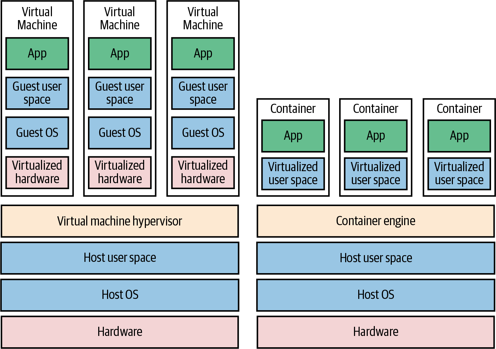
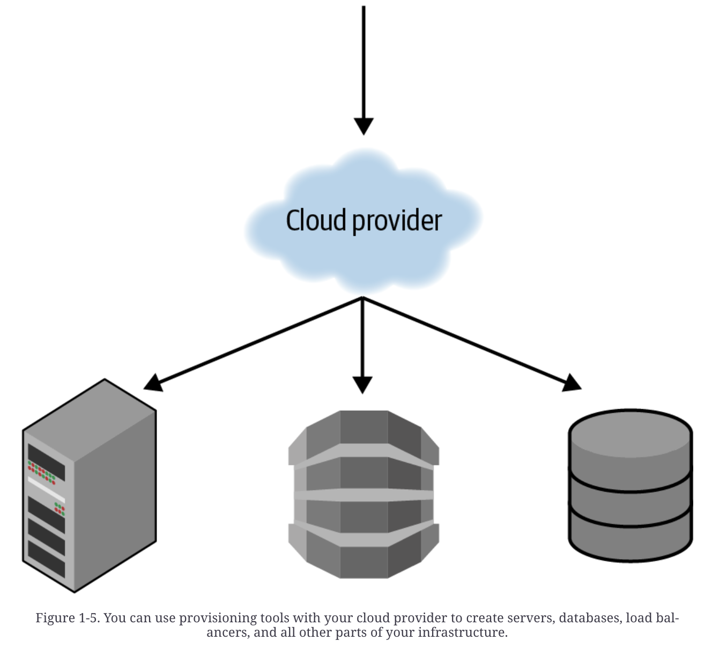

# 왜 테라폼을 사용해야하는지 이해하기
테라폼에 대해서 배우려면 먼저 테라폼을 왜 사용해야하는지 이해해야 합니다. 본 문서에서는 이를 이해하는 것을 돕기 위해서 밑 항목을 살펴보겠습니다.
- 데브옵스란?
- Infrastructure as Code (IaC)란?
- IaC 도구를 사용할 때 장점은?
- 테라폼은 어떻게 작동하나요?
- 테라폼을 다른 IaC 도구들과 비교

## 데브옵스란 무엇인가요?
과거에는 소프트웨어 구축을 위해선 많은 하드웨어를 관리해야 했습니다.
이를 위해서 회사는 소프트웨어를 개발하는 developers, 그리고 하드웨어를 전담하는 operation 두 팀으로 나뉘었습니다. 
Dev 팀은 소프트웨어를 만들고 Ops 팀은 이를 배포하고 실행하는 것을 담당하였습니다. 
모든 작업들이 물리 장비에 업로드가 되고 서버에서 수동으로 명령을 실행하는 경우가 많아 이 과정들이 수동으로 진행되었습니다. 
하지만 기업이 커지면서 이러한 작업들은 문제가 발생하기 시작하였습니다.
* 서버가 늘어나면서 이 작업들은 점점 느려지고 복잡해지기 시작하였습니다
* 이러면서 미묘한 실수들이 발생하기 시작하였습니다
클라우드 서비스가 활성화 되면서 많은 기업들이 하드웨어에 투자하는 대신에 클라우드로 이동하기 시작하였으며 이로 인하여 operation 관리하는 ops 팀도 소프트웨어를 개발하는 데에 시간을 투자할 수 있기 시작하였습니다. 
결과적으로 두 팀의 차이는 불분명해지기 시작하고 두 팀이 협업하기 시작하면서 데브옵스의 개념이 나오기 시작하였습니다.
데브옵스의 목적은 소프트웨어 전달을 효과적으로 하는데에 있습니다. 
데브옵스에는 4가지의 주요 행동이 있습니다: 문화, 자동화, 측정, 공유.
여기서 자동화는 인프라 관리를 수동으로 실행하는 것이 아닌 코드를 통해 하는데 이 것을 Infrastructure as Code (IaC)라고 합니다. 이 부분에 대해 집중적으로 알아봅시다.

## Infrastructure as Code (IaC) 란 무엇인가요?
코드를 실행하여 인프라를 정의, 배포, 업데이트, 그리고 없애는 것을 IaC라고 합니다.
IaC 툴에는 5가지의 카테고리가 있습니다:
* Adhoc scripts
* Configuration management tools
* Server templating tools
* Orchestration tools
* Provisioning tools

### Ad hoc Scripts
자동화 하기에 제일 직관적인 방법은 Ad hoc 스크립트를 작성하는 것입니다. 수동으로 했던 작업들을 가지고 제일 좋아하는 개발언어를 활용하여 자동화 스크립트를 작성하고 이를 서버에 실행시킵니다. 예를들어 웹 서버를 구성하는 스크립트를 아래 처럼 작성한다고 합시다.

이와 같은 Ad hoc 스크립트들은 다양한 프로그래밍 언어를 활용하여 작성될 수 있지만 이는 일관적이지 않은 코드들이 많이 작성되는 단점이 있습니다. 이러한 스크립트를 많이 작성하게 되면 관리하는 데에 어려움을 겪을 수 있습니다. IaC 툴들은 목적에 맞는 API들을 제공하는데 이를 잘 활용하면 일관적인 스크립트를 작성할 수 있게되어 깨끗한 코드로 스크립트들을 관리할 수 있는 장점이 있습니다. 

### Configuration Management Tools
Chef, Puppet, Ansible 은 구성관리 툴들입니다. 이들은 소프트웨어를 실제 서버에 설치하고 관리하기 위해 설계되었습니다. 하단은 Ansible (IaC 툴) 의 예시입니다
<pre>- name: Update the apt-get cache 
  apt: 
    update_cache: yes 
 
- name: Install PHP 
  apt: 
    name: php 
 
- name: Install Apache 
  apt: 
    name: apache2 
 
- name: Copy the code from the repository 
  git: repo=https://github.com/brikis98/php-app.git dest=/var/www/html/app 
 
- name: Start Apache 
  service: name=apache2 state=started enabled=yes</pre>
이 코드는 위 ad hoc 예제로 나왔던 코드와 비슷하지만 Ansible 이란 IaC 로 작성되어 하단과 같은 장점들이 돋보입니다.
*코드 협약*:
일정하고 예상 가능한 코드 구조를 갖고 있습니다.
*멱등성*:
코드 실행이 여러변 되어도 결과값이 같습니다.
*분산성*:
구성관리 툴들은 다수의 서버를 관리할 수 있도록 설계되었습니다.

예를 들어 서버들의 IP 주소들을 포함하는 host라는 파일을 만듭니다.
<pre>[webservers] 
11.11.11.11 
11.11.11.12 
11.11.11.13 
11.11.11.14 
11.11.11.15</pre>
다음으로, Ansible playbook을 정의합니다.
<pre>- hosts: webservers 
  roles; 
  - webserver</pre>
마지막으로 실행시킵니다.
`ansible-playbook playbook.tml`
이는 Ansible이 5개의 서버를 구성하는 것을 지시합니다.

### Server Templating Tools
Docker, Packer, and Vagrant 와 같이 이미지를 생성하여 서버 템플릿 툴들이 많이 사용되고 있으며 이는 구성관리 툴들을 대체할 수 있습니다. 이는 운영체제의 소프트웨어, 파일 관련된 모든 것들의 캡처본에 대한 이미지를 만들 수 있으며 IaC 도구를 이용하여 이미지들을 서버에 설치할 수 있습니다.

이미지를 사용하는 도구는 크게 두 가지가 있습니다.
Virtual Machine:
* VM은 컴퓨터 시스템 전체를 모방합니다
* hypervisor를 사용하여 CPU, memory, hard drive, and networking을 가상화 합니다
* VM의 imagesms hypervisor 위에서 가상화된 하드웨어만을 바라보므로 호스트 머신과 완전히 독립시킬 수 있으며, 모든 환경에서 정확히 동일한 방식으로 실행됩니다
* 단점으로 모든 하드웨어와 운영체제를 가상화해야 함으로 오버헤드가 큽니다 (cpu 사용량, memory 사용량, startup time)
Container:
* 운영체제의 사용자 공간을 모방합니다 (독립된 process, memory, mount point, network)
* Container engine 위에서 어떤 container든 user space를 바라보도록 실행할 수 있습니다
* 모든 환경에서 똑같이 동작할 수 있습니다
* 단점으로 모든 container는 한 OS kernel과 hardware 에서 동작하므로 VM 수준의 독립 수준과 보단성을 갖추긴 어렵습니다
* 다만 kernel과 하드웨어는 공유하므로 container는 더 빠르게 시작될 수 있고 CPU, memory 사용량에도 오버헤드가 없습니다

서버 템플리팅은 인프라 불변성을 달성하기 위한 중요 컴포넌트입니다. 변수를 한번 생성하면 다시 바꿀 수 없기 때문에 변경을 하고 싶으면 다시 생성해야하는 특징을 가진 함수형 프로그래밍에서 영감을 받았으며 이는 코드들을 추리하기 더 쉽게 만들어줍니다.
인프라 불변성에 대한 아이디어는 이와 비슷합니다. 한번 배포된 서버는 변경하지 않습니다. 만약 변경이나 업데이트가 필요하면 서버 템플릿 툴을 활용하여 새로운 이미지를 만들고 새로운 서버에 배포합니다. 이와 같이 서버는 변경되지 않기 때문에 배포가 어떻게 되었는지 추론하기 더 쉬워집니다.

### Orchestration Tools
서버 템플릿 툴들은 VM/container들을 만다는데에 용이하다. 하지만 어떻게 관리를 할까? 하단을 참조해보자.
* 하드웨어들을 효율적으로 사용하도록 VM들과 container들을 배포한다
* Rolling deplyoment, blue-green deployment, and canary deployment 등 전략적으로 배포한다
* VM과 container들의 상태를 모니터링하고 상태가 좋지 않은 것들은 자동으로 대체한다 (auto-healing)
* 부하에 따라 VM/container 수들을 늘리고 줄인다 (auto-scaling)
* 트래픽을 VM/container들에 분배시킨다 (load-balancing)
* VM/Container 들을 통신하게 한다
이 처럼 도커 컨테이너들을 코드로 관리하고 정의하는 작업들을 할 수 있는 게 orchestration 툴들이다. 대표적인 예로 Kubernetes가 있다. Kubernetes 클러스터를 배포한다. 이 클러스터는 다양한 서버들을 관리하고 도커 컨테이너들을 실행시킨다. 

### Provisioning Tools
위에서 언급한 도구들을 서버에서 동작하는 코드를 정의하지만 테라폼이나 클라우드포메이션과 같이 provisioning 툴들은 서버 그 자체를 만든다. 서버 뿐만 아니라 데이터베이스, 캐시, 로드발란서, 큐, 모니터링등 대부분의 인프라를 구성할 수 있다. 하단과 같은 테라폼 코드는 provisioning과 서버 템플리팅까지 수행한다
<pre>resource "aws_instance" "app" { 
  instance_type     = "t2.micro" 
  availability_zone = "us-east-2a" 
  ami               = "ami-0fb653ca2d3203ac1" 
 
  user_data = <<-EOF 
              #!/bin/bash 
              sudo service apache2 start 
              EOF 
}</pre>

## IaC 도구를 사용하면 어떤 장점이 있나요?
수동적인 작업들을 코드로 작업하는 데에 투자를 하면 소프트웨어를 전달할 때 굉장한 향상을 가져올 수 있다.
인프라가 코드로 정의 되었을 때 소프트웨어 전달 프로세스를 향상 시킬 수 있도록 하단과 같은 이점을 가져올 수 있다.
*Self-Service*
전체 배포 과정을 자동화할 수 있으며 개발자들이 자신들만의 배포를 진행할 수 있다.
*Speed and Safety*
배포과정이 자동화되면 개발 속도가 향상됩니다. 과정이 일관성을 갖게되며 이로 인하여 안전성을 향상시킨다.
*Documentation*
IaC는 프로세스가 코드로 남아있어 이 자체로도 문서가 될 수 있다. 팀 내에서 지식이 공유되지 않아 한 사람이 부재중일 때 업무가 되지 않는 리스크 (bus factor)를 방지할 수 있다.
*Version Control*
IaC 소스들은 버전 컨트롤이 가능하다. 이로 인하여 인프라 구축 히스토리가 남게 되어 버전 관리에 용이하다.
*Validation*
인프라 상태가 코드로 남게되면 코드 리뷰, 테스트, 분석을 할 수가 있고 결함들을 줄일 수 있다.
*Reuse*
인프라를 재사용 할 수 있도록 모듈화도 가능하다.
*Happiness*
부가적으로 개발자들은 인프라 배포 및 관리를 자동화 할 수 있어서 코딩하는데에 더 집중 할 수 있어 행복감을 높일 수 있다!

## 테라폼은 어떻게 작동하나요?
테라폼은 Go 개발언어로 작성된 오픈소스 툴입니다. Go 코드는 운영체제마다 하나의 binary를 컴파일 하는데 이것이 테라폼입니다. 테라폼으로 작성된 코드를 수행할 때 별도의 인프라나 다른걸 실행할 필요가 없는데, 이는 terraform binary가 하나 이상의 provider의 API를 호출하기 때문입니다. 사용자는 binary를 활용하여 인프라나 다른 서버와 컴퓨터들을 배포합니다. 하단 예제 코드를 봅시다.
<pre>resource "aws_instance" "example" { 
  ami           = "ami-0fb653ca2d3203ac1" 
  instance_type = "t2.micro" 
} 
 
resource "google_dns_record_set" "a" { 
  name         = "demo.google-example.com" 
  managed_zone = "example-zone" 
  type         = "A" 
  ttl          = 300 
  rrdatas      = [aws_instance.example.public_ip] 
}</pre>

## 다른 IaC 툴들과 비교하면 테라폼은 어떤가요?
**Configuration management Versus Provisioning**
이미 생선된 도커파일이 있다면 테라폼은 좋은 선택이 될 수 있습니다. 또는 provisioning 툴인 테라폼과 configuration tool을 혼용하면 좋은 조합이 될 수 있습니다.
**Mutable Infrastructure Versus Immutable Infrastructure**
테라폼은 불변성 기반 인프라여서 구성 bug가 적습니다.
**Procedural Language Versus Declarative Language**
테라폼은 선언형 언어입니다. 이는 사용자가 원하는 인프라의 상태를 정의하면 전 상태를 고려하는 작업들을 테라폼이 대신 해줍니다. 예제를 들어봅시다.
절차형:
<pre>// deploying 10 servers 
- ec2: 
    count: 10 
    image: ami-0fb653ca2d3203ac1 
    instance_type: t2.micro 
     
// and then deploying 15 servers 
// you need to be aware of what is already deployed and write for the additions 
- ec2: 
    count: 5 
    image: ami-0fb653ca2d3203ac1 
    instance_type: t2.micro</pre>
선언형:
<pre>// deploying 10 servers 
resource "aws_instance" "example" { 
  count         = 10 
  ami           = "ami-0fb653ca2d3203ac1" 
  instance_type = "t2.micro" 
} 
 
// and then deploying 15 servers 
// you don't need to be aware of what's already deploayed, 
// just replace the number of servers to deploy 
resource "aws_instance" "example" { 
  count         = 15 
  ami           = "ami-0fb653ca2d3203ac1" 
  instance_type = "t2.micro" 
}</pre>
절차형 (procedural) 코드는 인프라의 상태를 캡처하지 않습니다. 이로 인하여 재사용에 대한 제한이 있습니다.
선언형 (declarative) 코드는 항상 인프라의 최신 상태를 나타냅니다.
**General-Purpose Language (GPL) Versus Domain-Specific Language (DSL)**
테라폼은 DSL를 활용하여 인프라를 코드로 관리합니다.
DSL는 특정한 도메인을 위해 설계되었으며 GPL는 다양한 도메인에서 활용됩니다.
DSL의 이점은 다음과 같습니다.
* 배우기 쉽습니다
* 간결합니다
* 같은 형태입니다
**Master Versus Masterless**
마스터 서버를 갖는데에는 하단과 같은 결점들이 있습니다.
* 추가 인프라
* 운영
* 보안
테라폼은 기본적으로 마스터 서버가 없기 때문에 위와 같은 요소들을 관리할 필요가 없습니다.
**Agent Versus Agentless**
중개 소프트웨어를 갖으면 하단과 같은 결점들이 있습니다.
* 부트스트래핑 (부팅)
* 운영
* 보안
테라폼은 중개 소프트웨어를 설치할 필요가 없기 때문에 위와같은 요소들을 걱정할 필요가 없습니다. 이는 각자의 클라우드 제공자가 각자만의 중개 소프트웨어가 있어 관리가 자체적으로 되기 때문입니다.

## Conclusion
오픈소스이고, 커뮤니티가 큰 클라우드 제공 툴이며, 불변성 인프라를 제공하고, 선언형 언어 기반이고, 마스터 서버과 중개 소프트웨어가 없는 아키텍처를 원하면, 테라폼은 이제 가장 알맞는 툴입니다.

### Reference
Terraform Up and Running by Oreilly: Chapter 1. Why Terraform?