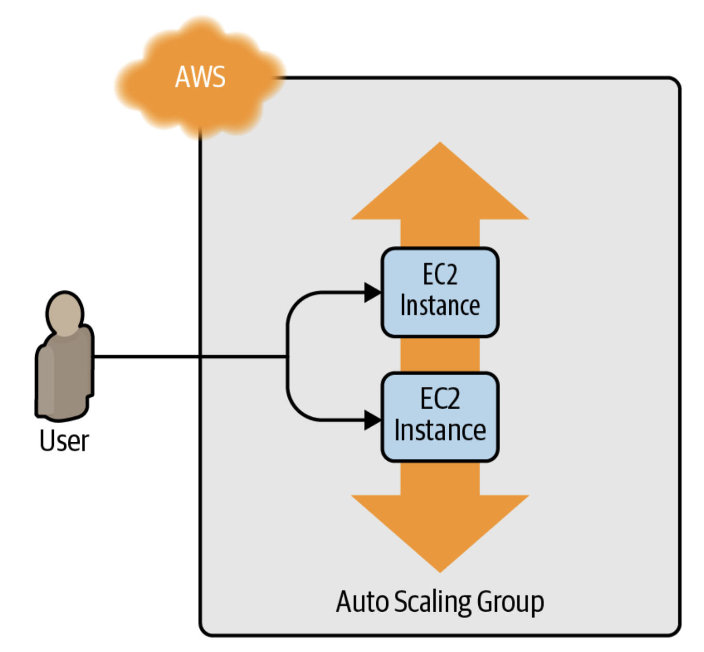

### In this chapter, we will learn terraform commands, deploying a clusters of servers with a load balancer that distributes traffic accross them. 
    - Setting up your AWS account
    - Installing Terraform
    - Deploying a singler server
    - Deploying a single web server
    - Deplyoing a configurable web server
    - Deploying a cluster of web servers
    - Deplyoing a load balancer
    - Cleaning up

## Setting up your AWS Account
1. Create an AWS account
2. Go to IAM and create a user, allowing programmatic access
3. Add the AdministratorAccess to the IAM user
4. Finish creating the user and save the Access Key ID and Secret Access Key (they won't show up again)

## Installing Terraform
on macOS, if you are a Homebrew user, you can run the following:
<pre>brew tap hashicorp/tab 
brew install hashicorp/tab/terraform</pre>

For Terraform to be able to make changes in your AWS account, you will need to set the AWS credentials for the IAM user you created earlier as the environment variables AWS_ACCESS_KEY_ID and AWS_SECRET_ACCESS_KEY. For example, here is how you can do it in a Unix/Linux/macOS terminal:
<pre>export AWS_ACCESS_KEY_ID=(your access key id) 
export AWS_SECRET_ACCESS_KEY=(your secret access key)</pre>

## Deploying a Singler Server
The first step to using Terraform is typically to configure the provider(s) you want to use. Create an empty folder and put a file in it called main.tf that contains the following contents:
<pre> "aws" { 
    region = "us-east-2" 
}</pre>

This is to declare that you are going to utilize AWS aas your provider and that you want to deploy your infrastructure into the `us-east-2` region.

To deploy a single (virtual) server in AWS (EC2), use the `aws_instance` resource in main.tf as fowllows:
<pre>resource "aws_instance" "example" { 
    ami = "ami-0fb653ca2d3203ac1" 
    instance_type = "t2.micro" 
}</pre>

ami stands for "The Amazon Machine Image".
instance_type specifies the type of EC2 instance to run.

In a terminal, go into the folder where you created main.tf and run the `terraform init` command:
<pre>$ terraform init 
 
Initializing the backend... 
 
Initializing provider plugins... 
- Reusing previous version of hashicorp/aws from the dependency lock file 
- Using hashicorp/aws v4.19.0 from the shared cache directory 
 
Terraform has been successfully initialized!</pre>

The init code is to tell Terraform to scan the code, figure out which providers you are using, and download the code for them.

Now that you have the provider code downloaded, run the `terraform plan` command:
<pre>$ terraform plan 
 
(...) 
 
Terraform will perform the following actions: 
 
  # aws_instance.example will be created 
  + resource "aws_instance" "example" { 
      + ami                          = "ami-0fb653ca2d3203ac1" 
      + arn                          = (known after apply) 
      + associate_public_ip_address  = (known after apply) 
      + availability_zone            = (known after apply) 
      + cpu_core_count               = (known after apply) 
      + cpu_threads_per_core         = (known after apply) 
      + get_password_data            = false 
      + host_id                      = (known after apply) 
      + id                           = (known after apply) 
      + instance_state               = (known after apply) 
      + instance_type                = "t2.micro" 
      + ipv6_address_count           = (known after apply) 
      + ipv6_addresses               = (known after apply) 
      + key_name                     = (known after apply) 
      (...) 
  } 
 
Plan: 1 to add, 0 to change, 0 to destroy.</pre>

The `plan` command lets you see what Terraform will do before actually making any changes and it shows that Terraform is planning on creating a single EC2 instance.

To actually create the Instance, run the `terraform apply` command:
<pre>$ terraform apply 
 
(...) 
 
Terraform will perform the following actions: 
 
  # aws_instance.example will be created 
  + resource "aws_instance" "example" { 
      + ami                          = "ami-0fb653ca2d3203ac1" 
      + arn                          = (known after apply) 
      + associate_public_ip_address  = (known after apply) 
      + availability_zone            = (known after apply) 
      + cpu_core_count               = (known after apply) 
      + cpu_threads_per_core         = (known after apply) 
      + get_password_data            = false 
      + host_id                      = (known after apply) 
      + id                           = (known after apply) 
      + instance_state               = (known after apply) 
      + instance_type                = "t2.micro" 
      + ipv6_address_count           = (known after apply) 
      + ipv6_addresses               = (known after apply) 
      + key_name                     = (known after apply) 
      (...) 
  } 
 
Plan: 1 to add, 0 to change, 0 to destroy. 
 
Do you want to perform these actions? 
  Terraform will perform the actions described above. 
  Only 'yes' will be accepted to approve. 
 
  Enter a value:</pre>

  Type `yes` to  deploy the EC2 instance.

  The instance has been created. Now, let's name the instance by adding `tags`.
  <pre>resource "aws_instance" "example" { 
  ami           = "ami-0fb653ca2d3203ac1" 
  instance_type = "t2.micro" 
 
  tags = { 
    Name = "terraform-example" 
  } 
}</pre>

Run `terraform apply` again to see what this would do:
<pre>$ terraform apply 
 
aws_instance.example: Refreshing state... 
(...) 
 
Terraform will perform the following actions: 
 
  # aws_instance.example will be updated in-place 
  ~ resource "aws_instance" "example" { 
        ami                          = "ami-0fb653ca2d3203ac1" 
        availability_zone            = "us-east-2b" 
        instance_state               = "running" 
        (...) 
      + tags                         = { 
          + "Name" = "terraform-example" 
        } 
        (...) 
    } 
 
Plan: 0 to add, 1 to change, 0 to destroy. 
 
Do you want to perform these actions? 
  Terraform will perform the actions described above. 
  Only 'yes' will be accepted to approve. 
 
  Enter a value:</pre>

You can find that Terraform keeps track of the current state and figure out the differences itself, which is an advantage of declarative language. The code above shows that it is trying to add the Name tag into the current instance. Type `yes` to confirm the apply.

## Deploying a Single Web Server
Let's try to run a simple web server

<pre>#!/bin/bash 
echo "Hello, World" > index.html 
nohup busybox httpd -f -p 8080 &</pre>

This runs a simple web server that returns the text "Hellok, World", utilizing a tool called `busybox`.

How do we get the EC2 instance to run this script? We can insert the script above into your terraform by setting the `user_data` argument.

<pre>resource "aws_instance" "example" { 
  ami                    = "ami-0fb653ca2d3203ac1" 
  instance_type          = "t2.micro" 
 
  user_data = <<-EOF 
              #!/bin/bash 
              echo "Hello, World" > index.html 
              nohup busybox httpd -f -p 8080 & 
              EOF 
 
  user_data_replace_on_change = true 
 
  tags = { 
    Name = "terraform-example" 
  } 
}</pre>

* The `<<-EOF` and `EOF` are Terraform’s heredoc syntax, which allows you to create multiline strings without having to insert \n characters all over the place.
* The `user_data_replace_on_change` parameter is set to `true` so that when you change the `user_data` parameter and run `apply`, Terraform will terminate the original instance and launch a totally new one.

You need to do one more thing before this web server works. By default, AWS does not allow any incoming or outgoing traffic from an EC2 Instance. To allow the EC2 Instance to receive traffic on port 8080, you need to create a security group:
<pre>resource "aws_security_group" "instance" { 
  name = "terraform-example-instance" 
 
  ingress { 
    from_port   = 8080 
    to_port     = 8080 
    protocol    = "tcp" 
    cidr_blocks = ["0.0.0.0/0"] 
  } 
}</pre>

Simply creating a security group isn’t enough; you need to tell the EC2 Instance to actually use it by passing the ID of the security group into the `vpc_security​_group_ids` argument of the `aws_instance` resource.

In order to do so, we need to learn the reference expression in Terraform.
`<PROVIDER>_<TYPE>.<NAME>.<ATTRIBUTE>`
`PROVIDER` is the name of the provider (e.g., aws), `TYPE` is the type of resource (e.g., security_group), `NAME` is the name of that resource (e.g., the security group is named "instance"), and `ATTRIBUTE` is either one of the arguments of that resource

You can use this security group ID in the `vpc_security_group_ids` argument of the `aws_instance` as follows:
<pre>resource "aws_instance" "example" { 
  ami                    = "ami-0fb653ca2d3203ac1" 
  instance_type          = "t2.micro" 
  vpc_security_group_ids = [aws_security_group.instance.id] 
 
  user_data = <<-EOF 
              #!/bin/bash 
              echo "Hello, World" > index.html 
              nohup busybox httpd -f -p 8080 & 
              EOF 
 
  user_data_replace_on_change = true 
 
  tags = { 
    Name = "terraform-example" 
  } 
}</pre>

If you run the apply command, you’ll see that Terraform wants to create a security group and replace the EC2 Instance with a new one that has the new user data.

Type `yes` to confirm the apply. 
By running the code below, you will be able to find that the web server running in AWS.
`$ curl http://<EC2_INSTANCE_PUBLIC_IP>:8080`

## Deploying a Configurable Web Server
You might have noticed that the web server code has the port 8080 duplicated in both the security group and the User Data configuration. This violates the Don’t Repeat Yourself (DRY) principle. In order to make your code more DRY and more configuratble, Terraform allows you to define input variables.
<pre>variable "NAME" { 
    [CONFIG ...] 
}</pre>

The body of the variable declaration can contain the following optional parameters:

`description`
It’s always a good idea to use this parameter to document how a variable is used. Your teammates will be able to see this description not only while reading the code but also when running the plan or apply commands (you’ll see an example of this shortly).

`default`
There are a number of ways to provide a value for the variable, including passing it in at the command line (using the -var option), via a file (using the -var-file option), or via an environment variable (Terraform looks for environment variables of the name TF_VAR_<variable_name>). If no value is passed in, the variable will fall back to this default value. If there is no default value, Terraform will interactively prompt the user for one.

`type`
This allows you to enforce type constraints on the variables a user passes in. Terraform supports a number of type constraints, including string, number, bool, list, map, set, object, tuple, and any. It’s always a good idea to define a type constraint to catch simple errors. If you don’t specify a type, Terraform assumes the type is any.

`validation`
This allows you to define custom validation rules for the input variable that go beyond basic type checks, such as enforcing minimum or maximum values on a number. You’ll see an example of validations in Chapter 8.

`sensitive`
If you set this parameter to true on an input variable, Terraform will not log it when you run plan or apply. You should use this on any secrets you pass into your Terraform code via variables: e.g., passwords, API keys, etc. I’ll talk more about secrets in Chapter 6.

Utilizing the input variable, we are able to create one that stores the port number:
<pre>variable "server_port" { 
  description = "The port the server will use for HTTP requests" 
  type        = number 
  default = 8080
}</pre>

To use the value from the variable, we can utilize a new type of expression called a variable reference as following:
`var.<VARIALBE_NAME>`
For example:
<pre>resource "aws_security_group" "instance" { 
  name = "terraform-example-instance" 
 
  ingress { 
    from_port   = var.server_port 
    to_port     = var.server_port 
    protocol    = "tcp" 
    cidr_blocks = ["0.0.0.0/0"] 
  } 
}</pre>

Below is an example for how you can use var.server_port inside of the User Data string:
<pre>  user_data = <<-EOF 
              #!/bin/bash 
              echo "Hello, World" > index.html 
              nohup busybox httpd -f -p ${var.server_port} & 
              EOF</pre>

In addition to input variables, Terraform also allows you to define output variables by using the following syntax:
<pre>output "<NAME>" { 
  value = <VALUE> 
  [CONFIG ...] 
}</pre>

The NAME is the name of the output variable, and VALUE can be any Terraform expression that you would like to output. The CONFIG can contain the following optional parameters:

`description`
It’s always a good idea to use this parameter to document what type of data is contained in the output variable.

`sensitive`
Set this parameter to true to instruct Terraform not to log this output at the end of plan or apply. This is useful if the output variable contains secrets such as passwords or private keys. Note that if your output variable references an input variable or resource attribute marked with sensitive = true, you are required to mark the output variable with sensitive = true as well to indicate you are intentionally outputting a secret.

`depends_on`
Normally, Terraform automatically figures out your dependency graph based on the references within your code, but in rare situations, you have to give it extra hints. For example, perhaps you have an output variable that returns the IP address of a server, but that IP won’t be accessible until a security group (firewall) is properly configured for that server. In that case, you may explicitly tell Terraform there is a dependency between the IP address output variable and the security group resource using depends_on.

For example, instead of having to manually poke around the EC2 console to find the IP address of your server, you can provide the IP address as an output variable:

</pre>output "public_ip" { 
  value       = aws_instance.example.public_ip 
  description = "The public IP address of the web server" 
}</pre>

Once you apply, the result show as below:
<pre>$ terraform apply 
 
(...) 
 
aws_security_group.instance: Refreshing state... [id=sg-078ccb4f9533d2c1a] 
aws_instance.example: Refreshing state... [id=i-028cad2d4e6bddec6] 
 
Apply complete! Resources: 0 added, 0 changed, 0 destroyed. 
 
Outputs: 
 
public_ip = "54.174.13.5"</pre>

Additionally, `terraform output` command can also show you the outputs of the variables. 

## Deploying a Cluster of Web Servers
Running a single server can cause users not being able to access your site, due to a crash or overloading. To avoid the failure, running a cluster of servers adjusting up and down based on the traffic can be a solution.

In this example, let's run a cluster of servers in Terraform by creating an ASG (auto scaling group) in AWS.

The first step is to create a launch configuration, which specifics how to configure each EC2 instance in ASG.
<pre>resource "aws_launch_configuration" "example" { 
  image_id        = "ami-0fb653ca2d3203ac1" 
  instance_type   = "t2.micro" 
  security_groups = [aws_security_group.instance.id] 
 
  user_data = <<-EOF 
              #!/bin/bash 
              echo "Hello, World" > index.html 
              nohup busybox httpd -f -p ${var.server_port} & 
              EOF 
  # Required when using a launch configuration with an auto scaling group. 
  lifecycle { 
    create_before_destroy = true 
}</pre>

Now, you can create the ASG itself using the `aws_autuscaling_group` resource:
<pre>resource "aws_autoscaling_group" "example" { 
  launch_configuration = aws_launch_configuration.example.name 
 
  min_size = 2 
  max_size = 10 
 
  tag { 
    key                 = "Name" 
    value               = "terraform-asg-example" 
    propagate_at_launch = true 
  } 
}</pre>

Note that the launch configurations are immutable, so if you change any parameter of your launch configuration, Terraform will try to replace it. However, since your ASG now has a reference to the old resource, it won't be able to delete it. Setting `create_before_destry` (lifecycle setting) to true will solve the problem.

There is also one other parameter that you need to add to your ASG to make it work: `subnet_ids`, which specifies to the ASG into which VPC subnets the EC2 instances should be deployed. By deploying instances across multiple subnets, it is ensured that the service can keep running even if some of the datacenters have an outage. 

Instead of hardcoding the subnets, it is better to utilize data sources to get the list of subnets, which represents a piece of read-only information that is fetched from the provider. 
Syntax for using a data source:
<pre>data "<PROVIDER>_<TYPE>" "<NAME>" { 
  [CONFIG ...] 
}</pre>
`PROVIDER` is the name of a provider. `TYPE` is the type of data source you want to use. `NAME` is an identifier you can use throughout the Terraform code to refer to this data source. `CONFIG` consists of one or more arguments that are specific to that data source. Below is an example.
<pre>data "aws_vpc" "default" { 
    default = true 
}</pre>

To get the data out of a data source, you use the following attribute reference syntax:
`data.<PROVIDER>_<TYPE>.<NAME>.<ATTRIBUTE>`
`data.aws_vpc.default.id`

To look up the subnets you can combine them as below.
<pre>data "aws_subnets" "default" { 
    filter { 
    name = "vpc-id" 
    values = [data.aws_vpc.default.id] 
    } 
}</pre>

Finally, you can utilize it to configure the ASG as below.
<pre>resource "aws_autoscaling_group" "example" { 
  launch_configuration = aws_launch_configuration.example.name 
  vpc_zone_identifier  = data.aws_subnets.default.ids 
 
  min_size = 2 
  max_size = 10 
 
  tag { 
    key                 = "Name" 
    value               = "terraform-asg-example" 
    propagate_at_launch = true 
  } 
}</pre>