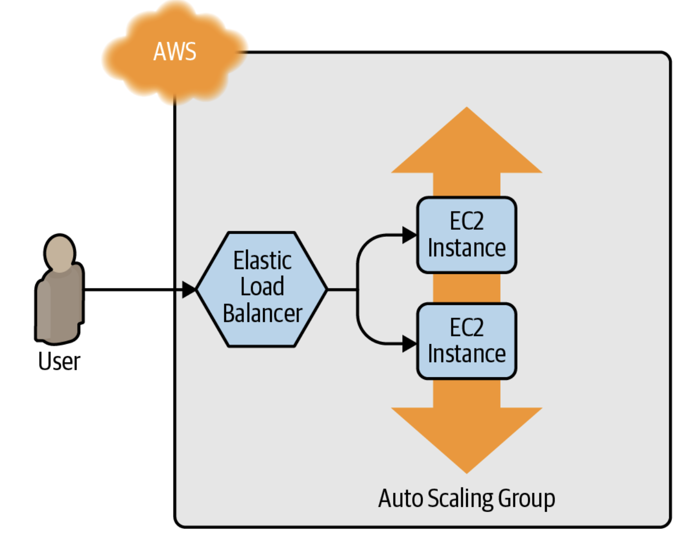
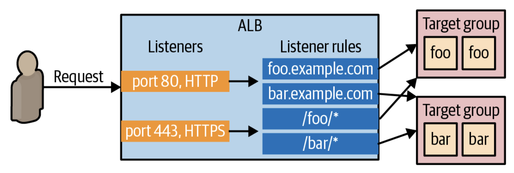

### 이번 챕터에서는 테라폼 커맨드에 대해 배워봅시다. 클러스터 서버들을 배포하여 트래픽을 분산시켜주는 로드발란서를 배포해봅시다.
- AWS 계정 셋업하기
- 테라폼 설치하기
- 단일 서버 배포하기
- 단일 웹서버 배포하기
- 구성가능한 웹서버 배포하기
- 웹서버 클러스터 배포하기
- 로드발란서 배포하기
- 클린업하기

## AWS 계정 셋업하기
1. AWS 계정을 만듭니다
2. IAM으로 가서 유저를 생성합니다. 프로그래매틱 엑세스를 허용해주세요
3. AdministratorAccess를 추가해 줍니다
4. 유저 생성하는 것을 마치고 Access Key 와 Secret Access Key를 저장합니다

## 테라폼 설치하기
맥 운영체제에서는 Homebrew를 사용하여 설치합니다.
<pre>brew tap hashicorp/tab 
brew install hashicorp/tab/terraform</pre>
테라폼이 생성한 AWS 계정을 활용하여 프로비저닝 하기위해서는 생성한 IAM 유저에 대한 엑세스키와 시크릿키를 선언해줘야 합니다. 하단과 같이 선언합니다.
<pre>export AWS_ACCESS_KEY_ID=(your access key id) 
export AWS_SECRET_ACCESS_KEY=(your secret access key)</pre>

## 단일서버 배포하기
테라폼의 첫 시작은 클라우드 프로바이더를 구성해줍니다. 빈 폴더를 생성하여 main.tf 파일을 생성하여 하단 코드를 작성해줍니다.
<pre> "aws" { 
    region = "us-east-2" 
}</pre>
이 코드는 AWS 클라우드 서비스를 활용한다는 것은 선언하고 인프라를 'us-east-2' 지역에 배포하는 것을 뜻합니다.

단일 서버를 배포하기 위하여 하단 처럼 EC2 리소스를 생성해줍니다.
<pre>resource "aws_instance" "example" { 
    ami = "ami-0fb653ca2d3203ac1" 
    instance_type = "t2.micro" 
}</pre>
ami는 "The Amazon Machine Image"를 뜻합니다.
instance_type은 EC2의 인스턴스 타입을 설정해줍니다.

터미널로 들어가 main.tf 파일이 있는 곳에서 'terraform init' 커맨드를 실행시켜줍니다.
<pre>$ terraform init 
 
Initializing the backend... 
 
Initializing provider plugins... 
- Reusing previous version of hashicorp/aws from the dependency lock file 
- Using hashicorp/aws v4.19.0 from the shared cache directory 
 
Terraform has been successfully initialized!</pre>

init 코드는 테라폼에 코드를 스캔하고 어떤 클라우드 프로바이더를 사용하는지 찾아 관련 코드들을 다운받습니다.
프로바이더 코드 다운이 되면 'terraform plan' 커맨드를 실행시켜줍니다.
<pre>$ terraform plan 
 
(...) 
 
Terraform will perform the following actions: 
 
  # aws_instance.example will be created 
  + resource "aws_instance" "example" { 
      + ami                          = "ami-0fb653ca2d3203ac1" 
      + arn                          = (known after apply) 
      + associate_public_ip_address  = (known after apply) 
      + availability_zone            = (known after apply) 
      + cpu_core_count               = (known after apply) 
      + cpu_threads_per_core         = (known after apply) 
      + get_password_data            = false 
      + host_id                      = (known after apply) 
      + id                           = (known after apply) 
      + instance_state               = (known after apply) 
      + instance_type                = "t2.micro" 
      + ipv6_address_count           = (known after apply) 
      + ipv6_addresses               = (known after apply) 
      + key_name                     = (known after apply) 
      (...) 
  } 
 
Plan: 1 to add, 0 to change, 0 to destroy.</pre>

'plan' 커맨드는 테라폼이 어떤 변경할 건지 실제 적용하기 전에 계획들을 보여줍니다.
EC2를 생성에 대한 계획을 보여주는 것을 확인할 수 있습니다.
이를 적용하기 위하여 'terraform apply' 커맨드를 실행합니다.
<pre>$ terraform apply 
 
(...) 
 
Terraform will perform the following actions: 
 
  # aws_instance.example will be created 
  + resource "aws_instance" "example" { 
      + ami                          = "ami-0fb653ca2d3203ac1" 
      + arn                          = (known after apply) 
      + associate_public_ip_address  = (known after apply) 
      + availability_zone            = (known after apply) 
      + cpu_core_count               = (known after apply) 
      + cpu_threads_per_core         = (known after apply) 
      + get_password_data            = false 
      + host_id                      = (known after apply) 
      + id                           = (known after apply) 
      + instance_state               = (known after apply) 
      + instance_type                = "t2.micro" 
      + ipv6_address_count           = (known after apply) 
      + ipv6_addresses               = (known after apply) 
      + key_name                     = (known after apply) 
      (...) 
  } 
 
Plan: 1 to add, 0 to change, 0 to destroy. 
 
Do you want to perform these actions? 
  Terraform will perform the actions described above. 
  Only 'yes' will be accepted to approve. 
 
  Enter a value:</pre>

`yes`를 타입하여 EC2 인스턴스를 배포합니다.
이제 인스턴스가 생성이 되었습니다. 'tag'를 추가하여 이 인스턴스에 이름을 붙여줍니다.
<pre>resource "aws_instance" "example" { 
  ami           = "ami-0fb653ca2d3203ac1" 
  instance_type = "t2.micro" 
 
  tags = { 
    Name = "terraform-example" 
  } 
}</pre>

'terraform apply' 커맨드를 실행시켜 어떤것이 적용되는지 확인합니다.
<pre>$ terraform apply 
 
aws_instance.example: Refreshing state... 
(...) 
 
Terraform will perform the following actions: 
 
  # aws_instance.example will be updated in-place 
  ~ resource "aws_instance" "example" { 
        ami                          = "ami-0fb653ca2d3203ac1" 
        availability_zone            = "us-east-2b" 
        instance_state               = "running" 
        (...) 
      + tags                         = { 
          + "Name" = "terraform-example" 
        } 
        (...) 
    } 
 
Plan: 0 to add, 1 to change, 0 to destroy. 
 
Do you want to perform these actions? 
  Terraform will perform the actions described above. 
  Only 'yes' will be accepted to approve. 
 
  Enter a value:</pre>
현재 스테이트를 추적하여 새로 적용시키려는 부분과 어떤 차이가 있는지 확인하는 것을 볼 수가 있습니다. 선언형 언어의 장점 중 하나이죠. 'yes'를 타입하여 'tag'를 추가해 이름을 추가한느 것을 적용시킵니다.

## 단일 웹서버 배포하기
단일 웹서버를 시작시켜 봅시다.
<pre>#!/bin/bash 
echo "Hello, World" > index.html 
nohup busybox httpd -f -p 8080 &</pre>
위의 코드는 busybox를 활용하여 심플 웹서버를 시작시키고 "Hello, World"를 출력합니다.
어떻게 해야 방금 생성한 EC2가 이 스크립트를 실행시킬 수 있게 할까요? 위의 스크립트를 'user_data' 인자에 설정해주면 됩니다. 

<pre>resource "aws_instance" "example" { 
  ami                    = "ami-0fb653ca2d3203ac1" 
  instance_type          = "t2.micro" 
 
  user_data = <<-EOF 
              #!/bin/bash 
              echo "Hello, World" > index.html 
              nohup busybox httpd -f -p 8080 & 
              EOF 
 
  user_data_replace_on_change = true 
 
  tags = { 
    Name = "terraform-example" 
  } 
}</pre>

* '<<-EOF'와 'EOF' 스크립트는 멀티 라인 스크립트를 작성할때 /n 작성 필요가 없어 유용합니다.
* 'user_data_replace_on_change' 매개변수가 'true'로 설정되면 'user_data' 매개변수를 변경하고 'apply'를 적용시킬때 테라폼은 원래의 인스턴스를 파괴하고 완전히 새로운 인스턴스를 생성합니다.

웹서버를 시작시키기 위해서 한가지 더 적용시켜야 하는데요. AWS는 기본적으로 incoming & outgoing 트래픽을 EC2가 받을 수 없게 설정되어 있습니다. 이를 허용하기 위해서 보안 그룹을 생성하여 8080 포트를 열어줍시다.
<pre>resource "aws_security_group" "instance" { 
  name = "terraform-example-instance" 
 
  ingress { 
    from_port   = 8080 
    to_port     = 8080 
    protocol    = "tcp" 
    cidr_blocks = ["0.0.0.0/0"] 
  } 
}</pre>

보안 그룹을 생성한다고 간단하게 적용되는 것이 아닙니다. EC2 인스턴스가 이를 활용할 수 있도록 적용시켜줘야합니다. EC2 인스턴스 테라폼 코드에 'vpc_security_group_ids' 인자를 추가해 적용시켜줍니다.
이를 하기 위해서는 테라폼의 참조 표현에 대해 알아합니다. '<PROVIDER>_<TYEP>.<NAME>.<ATTRIBUTE>' 'PROVIDER' 는 클라우드 프로바이더의 명칭이며, 'NAME'은 해당 리소스의 명칭이며, 'ATTRIBUTE'은 해당 리소스의 인자입니다.
이 보안그룹의 ID를 'vpc_security_group_ids' 인자에 사용할 수 있습니다.
<pre>resource "aws_instance" "example" { 
  ami                    = "ami-0fb653ca2d3203ac1" 
  instance_type          = "t2.micro" 
  vpc_security_group_ids = [aws_security_group.instance.id] 
 
  user_data = <<-EOF 
              #!/bin/bash 
              echo "Hello, World" > index.html 
              nohup busybox httpd -f -p 8080 & 
              EOF 
 
  user_data_replace_on_change = true 
 
  tags = { 
    Name = "terraform-example" 
  } 
}</pre>

이들을 테라폼에 적용 실행시키면 테라폼이 보안그룹과 새로운 user data를 적용하여 EC2 인스턴스를 대체하려고하는 것을 확인할 수 있습니다. 
'yes'를 타입하면 적용이 완료됩니다.
하단의 코드를 실행시켜 웹서버가 잘 시작이 되었는지 확인합니다. 
'$ curl http://<EC2_INSTANCE_PUBLIC_IP>:8080'

## 구성가능한 웹서버 배포하기
웹 서버 코드에는 보안 그룹과 사용자 데이터 구성 모두에서 중복 입력된 포트 8080이 있음을 알 수 있습니다. 이는 DRY(Don't Repeat Yourself) 원칙에 위배됩니다. 코드를 보다 DRY하고 구성 가능하게 만들기 위해 Terraform을 사용하면 입력 변수를 선언할 수 있습니다.
<pre>variable "NAME" { 
    [CONFIG ...] 
}</pre>

변수 선언의 본문에는 다음 선택적 매개변수가 포함될 수 있습니다.
'descriptoin'
이 매개변수를 사용하여 변수 사용 방법을 문서화합니다. 팀원은 코드를 읽는 동안뿐만 아니라 계획 또는 적용 명령을 실행할 때도 이 설명을 볼 수 있습니다.

'default'
변수에 값을 전달합니다. 값이 전달되지 않으면 변수는 이 기본값으로 폴백됩니다. 기본값이 선 경우 Terraform은 사용자에게 기본값을 묻는 메시지를 표시합니다.

'type'
사용자가 변수에 타입을 제약합니다. 선언되지 않으면 어느 타입이든 받습니다.

'validation'
입력 변수에 대한 유효성 검사 규칙을 정의할 수 있습니다.

'sensitive'
입력 변수에서 이 매개변수를 true로 설정하면 plan 또는 apply 할 때 Terraform이 이를 출력하지 않습니다. 변수(예: 암호, API 키 등)를 통해 Terraform 코드에 전달하는 모든 secret에 이것을 사용합니다.

입력변수를 사용하여 포트를 값을 전달해봅시다.
<pre>variable "server_port" { 
  description = "The port the server will use for HTTP requests" 
  type        = number 
  default = 8080
}</pre>

이 변수의 값을 사용하기 위해 변수참조 표현을 살펴봅시다.
`var.<VARIALBE_NAME>`
예:
<pre>resource "aws_security_group" "instance" { 
  name = "terraform-example-instance" 
 
  ingress { 
    from_port   = var.server_port 
    to_port     = var.server_port 
    protocol    = "tcp" 
    cidr_blocks = ["0.0.0.0/0"] 
  } 
}</pre>

사용 예를 살펴봅니다.
<pre>  user_data = <<-EOF 
              #!/bin/bash 
              echo "Hello, World" > index.html 
              nohup busybox httpd -f -p ${var.server_port} & 
              EOF</pre>

입력변수 외 출력변수도 테라폼에서 정의할 수 있습니다.
<pre>output "<NAME>" { 
  value = <VALUE> 
  [CONFIG ...] 
}</pre>

NAME은 출력 변수의 이름이고 VALUE는 출력하려는 ​​모든 Terraform 표현식이 될 수 있습니다. CONFIG는 다음 매개변수를 포함할 수 있습니다.

'description'
위와 같습니다.

'sensitive'
위와 같습니다.

'depends_on'
일반적으로 Terraform은 코드 내의 참조를 기반으로 종속성 그래프를 자동으로 파악하지만 드물게 추가 힌트를 제공해야 합니다. 예를 들어 서버의 IP 주소를 반환하는 출력 변수가 있지만 해당 서버에 대해 보안 그룹이 올바르게 구성될 때까지 해당 IP에 액세스할 수 없습니다. 이 경우 depends_on을 사용하여 IP 주소 출력 변수와 보안 그룹 리소스 간에 종속성이 있음을 Terraform에 명시적으로 알릴 수 있습니다.

예를들어 EC2 콘솔에 IP 주소를 찾기보단 출력변수를 활용하여 IP 주소를 제공할 수 있습니다.
</pre>output "public_ip" { 
  value       = aws_instance.example.public_ip 
  description = "The public IP address of the web server" 
}</pre>

이를 적용시키면 결과가 하단같이 나옵니다.
<pre>$ terraform apply 
 
(...) 
 
aws_security_group.instance: Refreshing state... [id=sg-078ccb4f9533d2c1a] 
aws_instance.example: Refreshing state... [id=i-028cad2d4e6bddec6] 
 
Apply complete! Resources: 0 added, 0 changed, 0 destroyed. 
 
Outputs: 
 
public_ip = "54.174.13.5"</pre>

추가적으로 'terraform output' 커맨드를 실행하면 출력값을 보여줍니다.

## 웹 서버의 클러스터 배포하기
단일 서버로 구축하면 서버 과부하 시 유저들이 사이트 사용에 장애를 경험할 수 있습니다. 이를 방지하기 위하여 서버 클러스터를 운영하여 트래픽 양에 따라 서버를 스케일하는 것이 하나의 솔루션이 될 수 있습니다. 
AWS의 ASG(오토 스케일링 그룹)을 활요아형 테라폼으로 서버 클러스터를 띄워봅시다.

시작구성을 생성해봅시다. 이는 ASG에서 EC2를 어떻게 구성할지 정의합니다.
<pre>resource "aws_launch_configuration" "example" { 
  image_id        = "ami-0fb653ca2d3203ac1" 
  instance_type   = "t2.micro" 
  security_groups = [aws_security_group.instance.id] 
 
  user_data = <<-EOF 
              #!/bin/bash 
              echo "Hello, World" > index.html 
              nohup busybox httpd -f -p ${var.server_port} & 
              EOF 
  # Required when using a launch configuration with an auto scaling group. 
  lifecycle { 
    create_before_destroy = true 
}</pre>

다음으로 'aws_autoscaling_group' 리소스를 활용하여 ASG를 생성해봅시다.
<pre>resource "aws_autoscaling_group" "example" { 
  launch_configuration = aws_launch_configuration.example.name 
 
  min_size = 2 
  max_size = 10 
 
  tag { 
    key                 = "Name" 
    value               = "terraform-asg-example" 
    propagate_at_launch = true 
  } 
}</pre>

시작구성은 불변성을 갖고있습니다. 그러므로 시작구성의 매개변수를 변경을 하면 테라폼을 이를 대체하려고 할것입니다. 하지만 ASG는 기존의 리소스를 참조하기 때문에 삭제하는 것이 불가능합니다. 'create_before_destroy' 를 true로 세팅하면 이 문제를 해결할 수 있습니다.

ASG 를 구성하기 위해서 'subnet_ids' 매개변수도 설정을 해줘야합니다. 이는 어떤 VPC subnet에 EC2 인스턴스가 배포되어야하는지를 설정해줍니다. 많은 subnet에 인스턴스를 배포하면 몇몇의 데이터센터가 다운되어도 서비스가 원활하게 활성화될 수 있습니다.

subnet을 하드코딩하는 것보다 data source를 활용하여 subnet의 리스트를 저장합시다. data source는 read-only 정보를 갖고있으며 프로바이더로부터 가저옵니다.
<pre>data "<PROVIDER>_<TYPE>" "<NAME>" { 
  [CONFIG ...] 
}</pre>
'PROVIDER' 는 클라우드 프로바이더의 명칭이며, 'TYPE'은 data source의 타입입니다. 'NAME'는 테라폼에서 이 data source를 참조할 수 있는 참조명이며, 'CONFIG'는 이 data source의 인자들로 구성됩니다.
<pre>data "aws_vpc" "default" { 
    default = true 
}</pre>

이 data source로 부터 데이터를 받으려면 다음의 속성참조 syntax를 참고합니다.
`data.<PROVIDER>_<TYPE>.<NAME>.<ATTRIBUTE>`
`data.aws_vpc.default.id`

이를 활용하여 subnet을 정보를 가저옵니다.

마지막으로 이를 활용하여 ASG를 구성합니다.
<pre>resource "aws_autoscaling_group" "example" { 
  launch_configuration = aws_launch_configuration.example.name 
  vpc_zone_identifier  = data.aws_subnets.default.ids 
 
  min_size = 2 
  max_size = 10 
 
  tag { 
    key                 = "Name" 
    value               = "terraform-asg-example" 
    propagate_at_launch = true 
  } 
}</pre>

## 로드발란서 배포하기
다양한 서버가 있지만 한개의 IP 주소를 엔드 유저에게 사용하게 할 수 있는 방법은 로드발란서를 배포하여 트래픽을 분산시키고 로드발란서의 IP 주소를 할당시켜 줄 수 있습니다. 

AWS는 세 타입의 로드발란서를 제공합니다.

- Application Load Balancer (ALB)
HTTP 트래픽에 제일 적합한 로드발란서입니다. 어플리케이션 단에서 운영됩니다.

- Network Load Balancer (NLB)
TCP, UDP, 그리고 TLS 트래픽에 제일 적합합니다. 스케일에 유용하며 ALB보다 빠릅니다. 트랜스포트 단에서 운영됩니다.

- Classic Load Balancer (CLB)
ALB와 NLB 이전에 사용되었던 로드발란서입니다. 위의 모든 트래픽에 사용되었으나 피처 수가 적습니다. 어플리케이션 트랜스포트 두 단 모두에서 운영될 수 있습니다. 

요즈음의 대부분 어플리케이션은 ALB 혹은 NLB 로드발란서를 사용합니다. 심플한 웹서버 운영을 위해선 ALB로도 충분합니다. ALB는 몇개의 요소로 구성되어있습니다.

*Listener*
포트와 프로토콜을 듣습니다.

*Listener Rule*
 리스너에 들어오는 요청들을 받아 적절한 타겟그룹으로 보내줍니다.

*Target Groups*
 로드발란서로 들어오는 요청들을 받는 서버들입니다. 서버의 상태도 체크를 해줘 안정적인 서버에만 요청들을 보내줍니다.

테라폼을 활용하여 ALB를 구축해봅시다.

<pre>resource "aws_lb" "example" { 
  name               = "terraform-asg-example" 
  load_balancer_type = "application" 
  subnets            = data.aws_subnets.default.ids 
}</pre>
subnets 매개변수는 디폴트 VPC의 모든 subnets을 사용하는 것을 구성합니다. AWS가 많은 양의 트래픽들을 다양한 데이터센터에 분산시켜 서버들의 과부하를 방지하고 자동으로 서버들을 스케일해줍니다. 

다음은 리스너를 정의해봅시다.

<pre>resource "aws_lb_listener" "http" { 
  load_balancer_arn = aws_lb.example.arn 
  port              = 80 
  protocol          = "HTTP" 
 
  # By default, return a simple 404 page 
  default_action { 
    type = "fixed-response" 
 
    fixed_response { 
      content_type = "text/plain" 
      message_body = "404: page not found" 
      status_code  = 404 
    } 
  } 
}</pre>
위의 리스너는 기본 HTTP 포트로 구성되어있습니다. 리스너 룰과 매칭이 되지 않으면 기본 404 에러 페이지를 보여줍니다.

모든 AWS 리소스들은 보안그룹이 설정되어있지 않으면 들어오고 나가는 트래픽이 있을 수 없습니다. 보안그룹을 설정하여 기본 포트로 요청들을 로드발란서가 HTTP 위에 받을 수 있도록 해줍니다. 또한 요청들을 내보낼 수 있게 하여 로드발란서가 안정성 체크도 해줄 수 있도록 해줍니다.

<pre>resource "aws_security_group" "alb" { 
  name = "terraform-example-alb" 
 
  # Allow inbound HTTP requests 
  ingress { 
    from_port   = 80 
    to_port     = 80 
    protocol    = "tcp" 
    cidr_blocks = ["0.0.0.0/0"] 
  } 
 
  # Allow all outbound requests 
  egress { 
    from_port   = 0 
    to_port     = 0 
    protocol    = "-1" 
    cidr_blocks = ["0.0.0.0/0"] 
  } 
}</pre>
위의 보안그룹을 사용할 수 있게 aws_lb 리소스에 설정해줍니다.

<pre>resource "aws_lb" "example" { 
  name               = "terraform-asg-example" 
  load_balancer_type = "application" 
  subnets            = data.aws_subnets.default.ids 
  security_groups    = [aws_security_group.alb.id] 
}</pre>

다음으로 타겟그룹을 생성합니다.

</pre>resource "aws_lb_target_group" "asg" { 
  name     = "terraform-asg-example" 
  port     = var.server_port 
  protocol = "HTTP" 
  vpc_id   = data.aws_vpc.default.id 
 
  health_check { 
    path                = "/" 
    protocol            = "HTTP" 
    matcher             = "200" 
    interval            = 15 
    timeout             = 3 
    healthy_threshold   = 2 
    unhealthy_threshold = 2 
  } 
}</pre>

타겟그룹은 생성된 인스턴스들의 상태를 matcher 구성 기준으로 주기적으로 점검하여 과부하된 인스턴스들을 파악합니다. 불안정한 인스턴스에 대한 트래픽을 최소화하여 사용자들의 불편함을 최소화합니다.

타겟그룹이 어떤 EC2에게 요청을 보내야 할까요? aws_autoscaling_group 리소스에서 target_group_arns를 ALB 타겟그룹으로 설정해줍니다.

<pre>resource "aws_autoscaling_group" "example" { 
  launch_configuration = aws_launch_configuration.example.name 
  vpc_zone_identifier  = data.aws_subnets.default.ids 
 
  target_group_arns = [aws_lb_target_group.asg.arn] 
  health_check_type = "ELB" 
 
  min_size = 2 
  max_size = 10 
 
  tag { 
    key                 = "Name" 
    value               = "terraform-asg-example" 
    propagate_at_launch = true 
  } 
}</pre>

상태체크 (health_check_type)를 ELB로 설정하여 ASG가 타겟그룹의 상태체크를 하게하여 자동으로 불안정한 인스턴스들이 대체될 수 있도록 설정해줍니다.

마지막으로, aws_lb_listener_rule 리스너 룰 리소스를 생성하여 이 세 요소들을 엮어줍니다.

<pre>resource "aws_lb_listener_rule" "asg" { 
  listener_arn = aws_lb_listener.http.arn 
  priority     = 100 
 
  condition { 
    path_pattern { 
      values = ["*"] 
    } 
  } 
 
  action { 
    type             = "forward" 
    target_group_arn = aws_lb_target_group.asg.arn 
  } 
}</pre>

앞의 코드는 ASG가 포함된 대상 그룹에 대한 모든 경로와 일치하는 요청을 보내는 리스너 규칙을 추가합니다.

로드 밸런서를 배포하기 전에 마지막으로 해야 할 일이 있습니다. 이전에 가지고 있던 단일 EC2 인스턴스의 이전 public_ip 출력을 ALB의 DNS 이름을 표시하는 출력으로 교체합니다.

<pre>output "alb_dns_name" { 
  value       = aws_lb.example.dns_name 
  description = "The domain name of the load balancer" 
}</pre>

terraform apply를 실행하고 plan 출력을 읽습니다. 원래 단일 EC2 인스턴스가 제거되고 그 자리에 Terraform이 시작 구성, ASG, ALB 및 보안 그룹을 생성하는 것을 볼 수 있습니다. plan이 좋아 보인다면 yes를 입력하여 적용합니다. 적용이 완료되면 alb_dns_name 출력이 표시되어야 합니다.

Outputs:
alb_dns_name = "terraform-asg-example-123.us-east-2.elb.amazonaws.com"
로드발란서가 잘 배포되었는지 확인하기 위하여 alb_dns_name 을 테스트 해봅시다.

$ curl http://<alb_dns_name>
Hello, World
출력이 잘 되는 것을 볼 수 있습니다. ALB는 트래픽을 EC2 인스턴스로 라우팅합니다. URL에 액세스할 때마다 요청을 처리하기 위해 다른 인스턴스를 선택합니다. 이제 완벽하게 작동하는 웹 서버 클러스터가 생겼습니다.

콘솔로 들어가 인스턴스 한개를 파괴하며 위의 요청을 보내봅시다. 이와 상관없이 요청이 잘 받아지는 것을 볼 수 있는데 이는 ALB가 감지하고 다른 인스턴스로 라우팅을 하기 때문입니다. 또 한 ASG는 현재 활성 인스턴스가 1개인 것을 확인하여 자동으로 추가 인스턴스를 실행시킵니다. 

Cleanup
마지막으로 추가 비용이 드는 것을 방지하기 위해 terraform destroy로 실험했던 리소스들을 삭제시킵니다.

terraform destroy