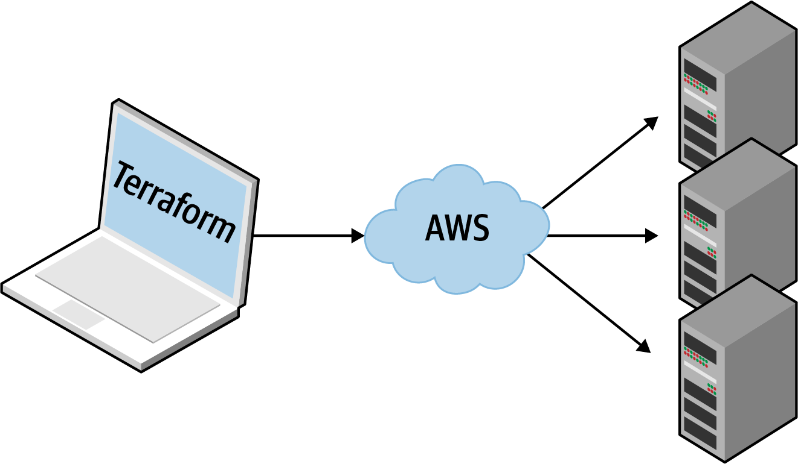

# How Does Terraform Compare to Other IaC Tools?


IaC 도구들은 모두 크게 다르지 않고 어떤 도구를 써도 같은 목표를 달성할 수 있을 것 처럼 보인다.  


아래 항목을 비교해보면서 적절한 도구를 찾아보자  

- Configuration management versus provisioning
- Mutable infrastructure versus immutable infrastructure
- Procedural language versus declarative language
- General-purpose language versus domain-specific language
- Master versus masterless
- Agent versus agentless
- Paid versus free offering
- Large community versus small community
- Mature versus cutting-edge
- Use of multiple tools together

---

## Configuration management versus provisioning
configuration management 도구가 어느정도 provisioning을 수행할 수 있고 반대도 그렇다.  

서버 탬플릿 도구를 사용하는 경우 대부분의 구성 관리 요구사항은 충족된다.  
그러므로 서버 템플릿 도구를 사용하지 않는다면 configuration management도구와 provisioning 도구를 함께 사용하는게 좋다.  

자주 사용되는 조합으로는 Terraform을 provisioning tool로 Ansible을 configuration management tool로 사용한다.  

# Mutable Infrastructure Versus Immutable Infrastructure
Configuration management tool은 기본적으로 mutable infrastructure이다.
- 이미 존재하는 서버를 업데이트

이 경우 업데이트를 반복할 수록 서버들은 조금씩 달라지고 문제가 발생했을 때 되돌리기 어렵다.  

provisioning tool은 변화에 대한 배포를 완전히 새로운 서버에 수행한다.
- 기존 서버를 제거하고 새로운 서버 생성

이러한 접근법은 버그를 줄이고 소프트웨어가 무엇을 하는지 이해하기 쉽게 한다.  


## Procedural language versus declarative language
Chef나 Ansible은 절차형 언어로 표현된다.
- 명확하게, 단계별로 최종 상태를 어떻게 달성하는지

Terraform, CloudFormation 등은 선언형 언어로 표현된다.
- 상태에 대해 작성하면 IaC tool은 스스로 이 상태를 만들지 구성한다.

### example

#### 1. 10개의 서버를 구성하라
**Ansible**
```
- ec2:
    count: 10
    image: ami-0fb653ca2d3203ac1
    instance_type: t2.micro

```
**Terraform**
```
resource "aws_instance" "example" {
  count         = 10
  ami           = "ami-0fb653ca2d3203ac1"
  instance_type = "t2.micro"
}

```

아주 비슷한 형태를 보인다.

#### 2. 트래픽 증가로 서버를 15개로 scale out
**Ansible**

```
- ec2:
    count: 5
    image: ami-0fb653ca2d3203ac1
    instance_type: t2.micro

```

**Terraform**
```
resource "aws_instance" "example" {
  count         = 15
  ami           = "ami-0fb653ca2d3203ac1"
  instance_type = "t2.micro"
}

```
절차형 언어는 그 다음 행동을 지정해줘야 하지만 선언형 언어는 단순히 상태를 변화시키면 된다.

#### 3. 서버 이미지 업데이트 후 배포
**Ansible**
이전에 배포한 10개의 서버와 5개의 서버를 새로 작성한 뒤 배포해야 한다.
**Terraform**
동일한 구성 파일의 상태만 변경하면 된다.

결과적으로 절차형 언어는 아래 두 가지 이유의 문제가 있다.
- 인프라의 상태를 완벽하게 나타내지 못한다
- 재사용에 한계가 있다.


## General-Purpose Language Versus Domain-Specific Language

GPL과 DSL의 차이를 명확히 나누기 어렵다.
- 별도로 분류하기 보다는 mental model에 가깝다고 생각하는게 좋다

기본적으로는 DSL은 하나의 특정 도메인에서 동작하도록 설계되었고 GP은 광범위하게 사용될 수 있다는 것이다.

DSL은 GPL에 비해 몇 가지 장점이 있다.
- Easier to learn
  - 특정 도메인에만 사용되기 때문에 간결해서 배우기 쉬움
- Clearer and more concise
  - 특정 목적을 위해 설계되었기 때문에 명확하고 간결해서 이해하기 쉬움
- More uniform
  - 수행할 수 있는 작업에 제한이 있어 균일하고 예측 가능함
    - 따라서 이해하기 쉬움

GPL은 DLS에 비해 몇 가지 장점이 있다.
- Possibly no need to learn anything new
  - 이미 알고 있는 언어가 지원된다면 바로 해볼 수 있음
- Bigger ecosystem and more mature tooling
  - 큰 커뮤니티와 더 성숙한 도구를 가지고 있음
- More power
  - 강력한 기능을 더 많이 제공함
    - 테스트, 코드재사용, 추상화

## Master Versus Masterless
마스터 서버는 몇 가지 장점이 있다.
1. 인프라 상태를 확인할 수 있음
2. 백그라운드에서 계속 실행되며 구성을 적용하여 우발적인 서버 변경을 막을 수 있음

그러나 몇 가지 단점이 있다.
- Extra infrastructure
- Maintenance
- Security

즉, 관리 요소가 하나 더 생긴다는 것이다.  

masterless는 마스터 서버가 없거나 이미 존재하는 인프라의 일부를 사용한다.

## Agent Versus Agentless
Agent는 각 서버의 백그라운드에서 실행되며 최신 구성 관리 업데이트 설치를 담당한다.

아래의 단점이 있다.
- Bootstrapping
  - 일부 도구를 제외하고는 서버에 agent를 설치하는 특수한 절차가 있음
- Maintenance
  - Agent update
  - Synchronized with master server
  - Monitoring
- Security

Ansible, CloudFormation, Terraform 등은 agent를 설치할 필요가 없거나, 필요하지만 이미 설치되어 있다.
- Terraform은 필요한 agent를 cloud platform에서 제공해준다.




## Paid Versus Free Offering

무료 버전이 너무 제한적이어서 실제 프로덕션 사용에 영향이 있다면 유료 제품을 고려해야할 수 있다.

유료제품은 그만한 가치가 있지만, 사용자의 통제하에 있지 않으며 폐업하거나 인수되어 가격에 변동이 생길 수 있다.

Terraform은 글쓴이 경험상 유료 버전 없이도 프로덕션에서 문제 없이 사용할 수 있었다.


## Large Community Versus Small Community
Terraform과 Ansible은 폭팔적인 성장을 경험하고 있으며 대규모의 활동적인 커뮤니티를 보유하고 있다.

## Mature Versus Cutting Edge

release된 시간이나 version 만으로 성숙도를 판단할 수 없지만 몇 가지 추세는 파악할 수 있다.  
그런 점에서 Terraform은 아직 완전 성숙한 기술은 아니지만 이 책을 포함한 학습 리소스가 많이 나왔으며 계속 성숙해지고 있다.

## Use of Multiple Tools Together
### Provisioning plus configuration management
Ansible과 Terraform을 함께 구성하여 사용할 수 있다.
- 단점으로는 Ansible을 사용하기 때문에 많은 절차적 코드를 작성하므로 코드베이스, 인프라 및 팀이 성장함에 따라 유지관리가 더 어려워질 수 있다.  


### Provisioning plus server templating
Terraform과 packer를 사용하여 앱을 VM으로 배포할 수 있다.
- VM을 구축하는데 시간이 더 소모된다.
- 복잡한 배포 전략을 구현하기가 힘들다.


### Provisioning plus server templating plus orchestration

Terraform과 Docker 및 kubernetes를 사용한다.
- docker image가 빠르게 빌드 및 배포 가능한 장점
- 실행할 추가 인프라가 많아지므로 복잡성이 추가된다.  


> (Packer는 왜 계속 나오지?)
