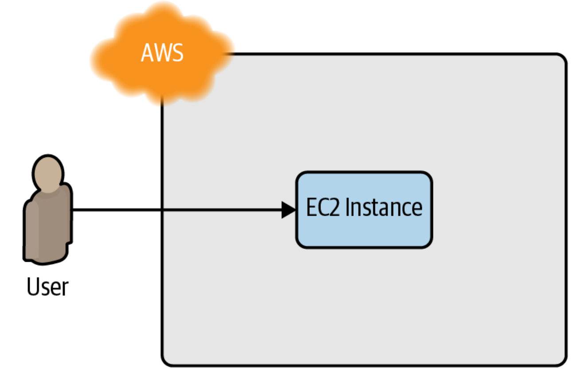

# Setting up your AWS account  

root user를 그대로 사용하는 것은 좋지 않다.
- IAM에서 유저를 생성해서 사용할 것
    - AdministratorAccess 권한 추가

> 해당 책의 예시들은 모두 Default VPC 내부에서 진행된다.  
> AWS의 모든 리소스는 VPC 내부에 배포되고 특정 VPC를 명시하지 않으면 Default VPC에 배포된다.


# Installing Terraform
OS의 package manager를 사용하는게 가장 쉽다.  

mac에서는 Homebrew  
```
$ brew tap hashicorp/tap
$ brew install hashicorp/tap/terraform
```

OR  

[Terraform home page](https://www.terraform.io/)  

Terraform을 생성한 AWS 계정으로 사용 가능하게 하려면 AWS credential을 환경변수로 export 해야 한다.  

```
$ export AWS_ACCESS_KEY_ID=(your access key id)
$ export AWS_SECRET_ACCESS_KEY=(your secret access key)
```  

또는 `$HOME/.aws/credentials` 경로에 crednetial file을 생성해도 된다.  
- `aws configure` 명령어로 생성 가능  


# Deploying a Single Server

HCL로 작성된 .tf 확장자 파일을 생성하여 인프라에 대해 작성하면 된다.  

먼저 어떤 provider를 사용할지 정의한다.

```
# AWS provider 사용
## us-east-2 리전 사용
provider "aws" {
  region = "us-east-2"
}
```
AWS는 여러 지역으로 나눠져있고 각 지역은 Availability Zone이라는 독립된 데이터센터로 나눠져있다.
- `us-east-2a`
- `us-east-2b`


provider가 생성할 수 있는 resource의 종류는 다양하며 일반적인 형태는 아래와 같다.
```
resource "<PROVIDER>_<TYPE>" "<NAME>" {
  [CONFIG ...]
}

```
- PROVIDER: 사용하고자 하는 provider 이름 (e.g. `aws`)
- TYPE: 생성하고자 하는 resource 이름 (e.g. `instance`)
- NAME: resource identifier (e.g. `my_instance`)
- CONFIG: 1개 이상의 resource arguments


위 형식대로 aws EC2 instance를 생성한다고 하면 아래와 같다.
```
resource "aws_instance" "example" {
  ami           = "ami-0ab04b3ccbadfae1f"
  instance_type = "t2.micro"
}
```

- ami: EC2 instance를 실행하기 위한 Amazon Machine Image
    - [market place](https://aws.amazon.com/marketplace/search/results?searchTerms=ami)
- instance_type: 실행할 EC2 instance type
    - [EC2 instance types](https://aws.amazon.com/ko/ec2/instance-types/)


> Terraform은 다양한 provider를 제공하고, 이들이 제공하는 모든 resource를 기억할 수 없다.
> 그러므로, 필요할 때 마다 [Terraform 공식 문서](https://registry.terraform.io/browse/providers)를 참고하자

`main.tf` 파일을 생성했으면 `terraform init` command를 수행하자 
```
$ terraform init

Initializing the backend...

Initializing provider plugins...
- Reusing previous version of hashicorp/aws from the dependency lock file
- Using hashicorp/aws v4.19.0 from the shared cache directory

Terraform has been successfully initialized!
```

Terraform을 처음 실행할 때는 어떤 provider를 사용할 것인지 지정하고 provider를 위한 코드를 다운로드 해야한다. 
- 기본 설정으로는 `.terraform` 폴더에 provider 코드가 다운로드된다.  
    - `.terraform.lock.hcl`

Provider가 코드를 다운로드하면 `terraform plan` 명령어를 실행한다.  

```
$ terraform plan

(...)

Terraform will perform the following actions:

  # aws_instance.example will be created
  + resource "aws_instance" "example" {
      + ami                          = "ami-0ab04b3ccbadfae1f"
      + arn                          = (known after apply)
      + associate_public_ip_address  = (known after apply)
      + availability_zone            = (known after apply)
      + cpu_core_count               = (known after apply)
      + cpu_threads_per_core         = (known after apply)
      + get_password_data            = false
      + host_id                      = (known after apply)
      + id                           = (known after apply)
      + instance_state               = (known after apply)
      + instance_type                = "t2.micro"
      + ipv6_address_count           = (known after apply)
      + ipv6_addresses               = (known after apply)
      + key_name                     = (known after apply)
      (...)
  }

Plan: 1 to add, 0 to change, 0 to destroy.

```

`plan` 명령어는 Terraform이 변경 사항을 적용하기 전에 어떤 작업을 수행하는지 확인할 수 있다.  
- `diff` 명령어와 비슷하다.  
    - `+`: Add
    - `-`: Delete
    - `~`: Modify


Terraform plan을 확인 후 실제로 instance를 생성하기 위해서는 `terraform apply` 명령어를 수행한다.

```
$ terraform apply

(...)

Terraform will perform the following actions:

  # aws_instance.example will be created
  + resource "aws_instance" "example" {
      + ami                          = "ami-0ab04b3ccbadfae1f"
      + arn                          = (known after apply)
      + associate_public_ip_address  = (known after apply)
      + availability_zone            = (known after apply)
      + cpu_core_count               = (known after apply)
      + cpu_threads_per_core         = (known after apply)
      + get_password_data            = false
      + host_id                      = (known after apply)
      + id                           = (known after apply)
      + instance_state               = (known after apply)
      + instance_type                = "t2.micro"
      + ipv6_address_count           = (known after apply)
      + ipv6_addresses               = (known after apply)
      + key_name                     = (known after apply)
      (...)
  }

Plan: 1 to add, 0 to change, 0 to destroy.

Do you want to perform these actions?
  Terraform will perform the actions described above.
  Only 'yes' will be accepted to approve.

  Enter a value:

```

생성한 instance에 tag를 추가하는 등 기존에 생성한 리소스에 변경사항을 적용하면 Terraform은 변경사항에 대해 추적할 수 있다.  


```
resource "aws_instance" "example" {
  ami           = "ami-0ab04b3ccbadfae1f"
  instance_type = "t2.micro"
  tags = {
    Name = "terraform-example"
  } 
}
```
```
$ terraform apply
  aws_instance.example: Refreshing state...
  (...)
  Terraform will perform the following actions:
    # aws_instance.example will be updated in-place
    ~ resource "aws_instance" "example" {
    (...) 
     + tags
            + "Name" = "terraform-example"
    
  }
  Plan: 0 to add, 1 to change, 0 to destroy.
  Do you want to perform these actions?
    Terraform will perform the actions described above.
    Only 'yes' will be accepted to approve.
    Enter a value:
```

이러한 변경사항들을 git과 같은 version control 도구로 관리할 수 있다.  
> 이때, `.terraform`, `*.tfstate`, `*.tfstate.backup` 과 같은 상태 파일은 `.gitignore`에 추가해야한다.  


# Deploying a single web server 

위와 같은 간단한 웹 서버를 구성해본다.  

웹 프레임워크가 아닌 단순 `Hello, World`만을 반환하는 웹 서버를 구성한다.  

```
#!/bin/bash
echo "Hello, World" > index.html
nohup busybox httpd -f -p 8080 &
```
index.html 파일 생성 및 ubuntu 기본 프로그램인 busybox 실행으로 구현한다.  

> nohup 란?
> no hang up의 약자로 프로세스를 데몬 형태의 백그라운드로 실행할 수 있는 명령어  
> `&` 만을 사용하면 터미널 세션이 끊기면 백그라운드 작업도 종료된다.

해당 스크립트는 Packer와 같은 Server Templating Tool을 사용할 수 있겠지만, User Data configuration을 사용하면 간단하게 적용 가능하다.  

```
resource "aws_instance" "example" {
  ami                    = "ami-0ab04b3ccbadfae1f"
  instance_type          = "t2.micro"
  user_data = <<-EOF
              #!/bin/bash
              echo "Hello, World" > index.html
              nohup busybox httpd -f -p 8080 &
              EOF
  user_data_replace_on_change = true
  tags = {
    Name = "terraform-example"
  } 
}
```
- `user_data_replace_on_chnage`: `user_data` parameter를 변경하고 `apply`를 수행하면 Terraform은 기존 instance를 제거하고 새롭게 생성한다.  
  - Terraform은 update를 기본으로 동작하지만 User Data는 first boot에서만 수행 가능하다.  

외부 트래픽이 instance에 접근할 수 있도록 security group을 생성하고 적용해야 한다.  

```terraform
resource "aws_security_group" "instance" {
  name = "terraform-example-instance"
  ingress {
    from_port   = 8080
    to_port     = 8080
    protocol    = "tcp"
    cidr_blocks = ["0.0.0.0/0"]
  } 
}
```

> [CIDR block 이란?](https://ko.wikipedia.org/wiki/CIDR)
> CIDR(Classless Inter-Domain Routing)는 클래스 없는 도메인 간 라우팅 기법으로 1993년 도입되기 시작한, 최신의 IP 주소 할당 방법이다.  
> CIDR 블록이라 불리는 그룹에 포함된 여러 IP 주소는 이진 표기를 하였을 때 동일한 일련의 초기 비트를 가진다
> 여기서는 허용할 ip에 대해 정의한다.  

생성한 security group을 ec2 instance에 적용하기 위해서는 security gruop id를 ec2 instance `vpc_security_group_ids` argument에 전달해야 한다.  

Terraform에서는 생성한 모든 resource에 대한 반환값을 가지며 이러한 반환값을 사용하기 위해서는 아래와 같은 resource attribute reference를 사용하면 된다.  

```
<PROVIDER>_<TYPE>.<NAME>.<ATTRIBUTE>
```
security group 같은 경우에는 아래와 같다. 
```
aws_security_group.instance.id
```

이 값을 aws_instance에 전달하면 된다.
```terraform
resource "aws_instance" "example" {
  ami                    = "ami-0ab04b3ccbadfae1f"
  instance_type          = "t2.micro"
  vpc_security_group_ids = [aws_security_group.instance.id]
  user_data = <<-EOF
              #!/bin/bash
              echo "Hello, World" > index.html
              nohup busybox httpd -f -p 8080 &
              EOF
  user_data_replace_on_change = true
  tags = {
    Name = "terraform-example"
  } 
}
```  

만약 한 리소스를 다른 리소스에서 참조한다면 implicit dependency를 생성하게 되고 Terraform은 이러한 의존성을 그래프로 나타내고 리소스를 생성해야 하는 순서를 자동으로 결정한다.  
- 그러므로 해당 Terraform 파일을 처음부터 적용하면 security group을 먼저 생성한다.  

`terraform apply`로 리소스 적용하면 잘 생성된다.
> 잘 되네요~!
```
❯ curl http://ec2-15-164-98-213.ap-northeast-2.compute.amazonaws.com:8080
Hello, World
```

`terraform destroy`로 정리하자  

# Deploying a configurable web server 
# Deploying a cluster of web servers 
# Deploying a load balancer
# Cleaning up


# Words
- perspective: 관점, 원근법
- admittedly: 확실히, 명백히

