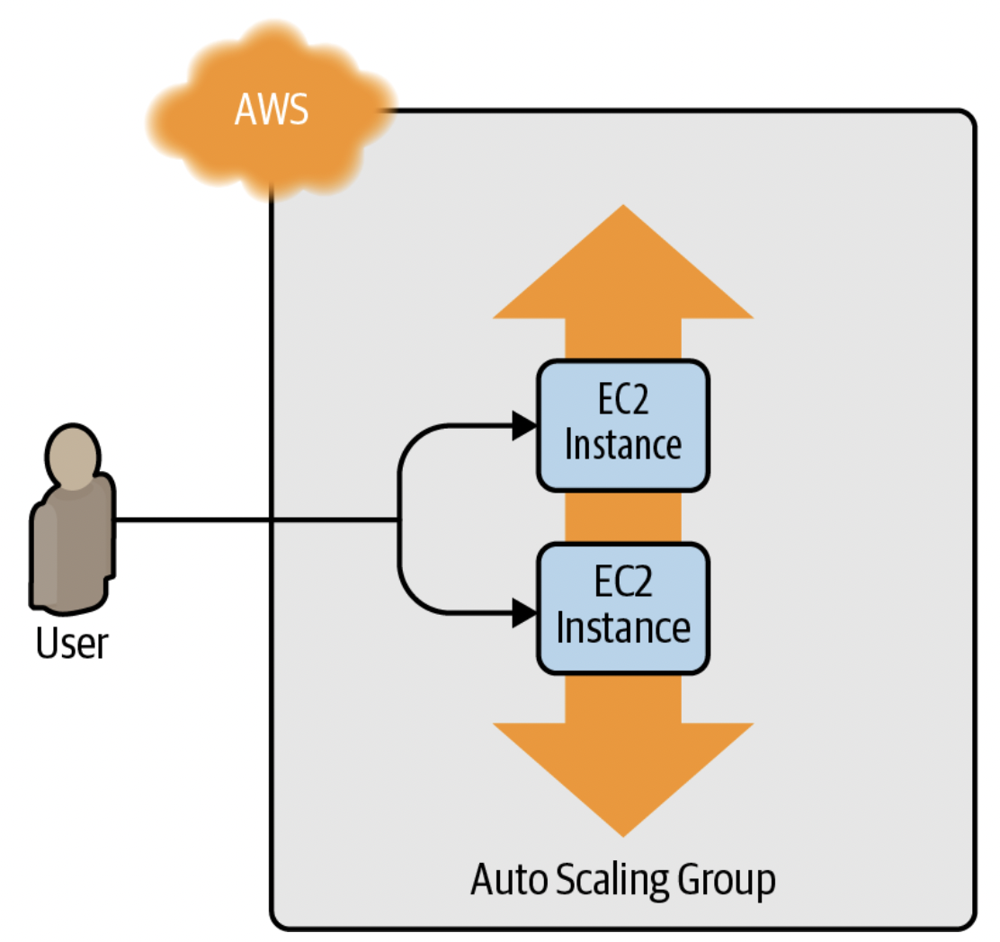
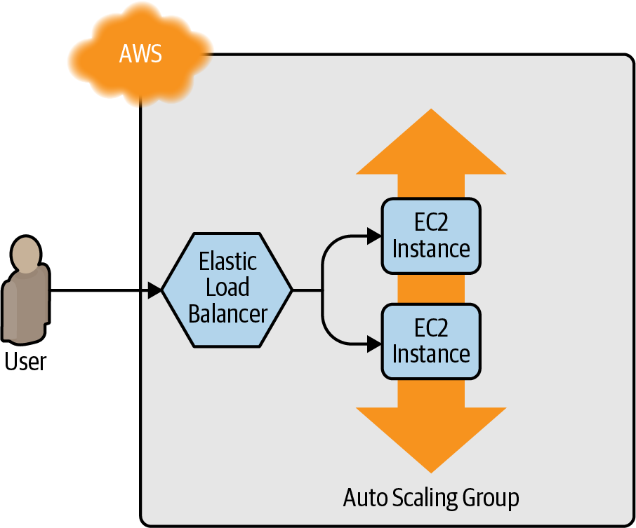
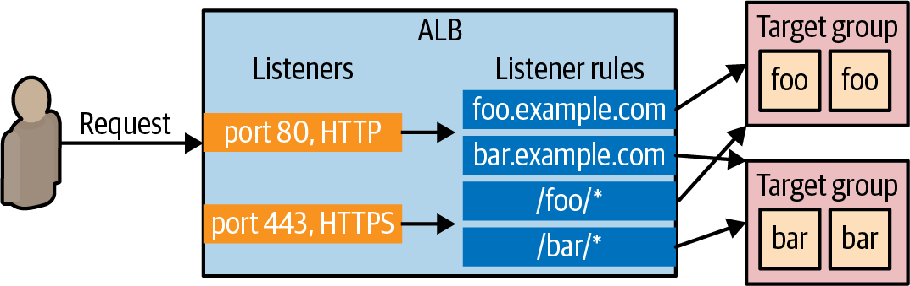

# Setting up your AWS account  

root user를 그대로 사용하는 것은 좋지 않다.
- IAM에서 유저를 생성해서 사용할 것
    - AdministratorAccess 권한 추가

> 해당 책의 예시들은 모두 Default VPC 내부에서 진행된다.  
> AWS의 모든 리소스는 VPC 내부에 배포되고 특정 VPC를 명시하지 않으면 Default VPC에 배포된다.


# Installing Terraform
OS의 package manager를 사용하는게 가장 쉽다.  

mac에서는 Homebrew  
```
$ brew tap hashicorp/tap
$ brew install hashicorp/tap/terraform
```

OR  

[Terraform home page](https://www.terraform.io/)  

Terraform을 생성한 AWS 계정으로 사용 가능하게 하려면 AWS credential을 환경변수로 export 해야 한다.  

```
$ export AWS_ACCESS_KEY_ID=(your access key id)
$ export AWS_SECRET_ACCESS_KEY=(your secret access key)
```  

또는 `$HOME/.aws/credentials` 경로에 crednetial file을 생성해도 된다.  
- `aws configure` 명령어로 생성 가능  


# Deploying a Single Server

HCL로 작성된 .tf 확장자 파일을 생성하여 인프라에 대해 작성하면 된다.  

먼저 어떤 provider를 사용할지 정의한다.

```terraform
# AWS provider 사용
## us-east-2 리전 사용
provider "aws" {
  region = "us-east-2"
}
```
AWS는 여러 지역으로 나눠져있고 각 지역은 Availability Zone이라는 독립된 데이터센터로 나눠져있다.
- `us-east-2a`
- `us-east-2b`


provider가 생성할 수 있는 resource의 종류는 다양하며 일반적인 형태는 아래와 같다.
```terraform
resource "<PROVIDER>_<TYPE>" "<NAME>" {
  [CONFIG ...]
}

```
- PROVIDER: 사용하고자 하는 provider 이름 (e.g. `aws`)
- TYPE: 생성하고자 하는 resource 이름 (e.g. `instance`)
- NAME: resource identifier (e.g. `my_instance`)
- CONFIG: 1개 이상의 resource arguments


위 형식대로 aws EC2 instance를 생성한다고 하면 아래와 같다.
```terraform
resource "aws_instance" "example" {
  ami           = "ami-0ab04b3ccbadfae1f"
  instance_type = "t2.micro"
}
```

- ami: EC2 instance를 실행하기 위한 Amazon Machine Image
    - [market place](https://aws.amazon.com/marketplace/search/results?searchTerms=ami)
- instance_type: 실행할 EC2 instance type
    - [EC2 instance types](https://aws.amazon.com/ko/ec2/instance-types/)


> Terraform은 다양한 provider를 제공하고, 이들이 제공하는 모든 resource를 기억할 수 없다.
> 그러므로, 필요할 때 마다 [Terraform 공식 문서](https://registry.terraform.io/browse/providers)를 참고하자

`main.tf` 파일을 생성했으면 `terraform init` command를 수행하자 
```
$ terraform init

Initializing the backend...

Initializing provider plugins...
- Reusing previous version of hashicorp/aws from the dependency lock file
- Using hashicorp/aws v4.19.0 from the shared cache directory

Terraform has been successfully initialized!
```

Terraform을 처음 실행할 때는 어떤 provider를 사용할 것인지 지정하고 provider를 위한 코드를 다운로드 해야한다. 
- 기본 설정으로는 `.terraform` 폴더에 provider 코드가 다운로드된다.  
    - `.terraform.lock.hcl`

Provider가 코드를 다운로드하면 `terraform plan` 명령어를 실행한다.  

```
$ terraform plan

(...)

Terraform will perform the following actions:

  # aws_instance.example will be created
  + resource "aws_instance" "example" {
      + ami                          = "ami-0ab04b3ccbadfae1f"
      + arn                          = (known after apply)
      + associate_public_ip_address  = (known after apply)
      + availability_zone            = (known after apply)
      + cpu_core_count               = (known after apply)
      + cpu_threads_per_core         = (known after apply)
      + get_password_data            = false
      + host_id                      = (known after apply)
      + id                           = (known after apply)
      + instance_state               = (known after apply)
      + instance_type                = "t2.micro"
      + ipv6_address_count           = (known after apply)
      + ipv6_addresses               = (known after apply)
      + key_name                     = (known after apply)
      (...)
  }

Plan: 1 to add, 0 to change, 0 to destroy.

```

`plan` 명령어는 Terraform이 변경 사항을 적용하기 전에 어떤 작업을 수행하는지 확인할 수 있다.  
- `diff` 명령어와 비슷하다.  
    - `+`: Add
    - `-`: Delete
    - `~`: Modify


Terraform plan을 확인 후 실제로 instance를 생성하기 위해서는 `terraform apply` 명령어를 수행한다.

```
$ terraform apply

(...)

Terraform will perform the following actions:

  # aws_instance.example will be created
  + resource "aws_instance" "example" {
      + ami                          = "ami-0ab04b3ccbadfae1f"
      + arn                          = (known after apply)
      + associate_public_ip_address  = (known after apply)
      + availability_zone            = (known after apply)
      + cpu_core_count               = (known after apply)
      + cpu_threads_per_core         = (known after apply)
      + get_password_data            = false
      + host_id                      = (known after apply)
      + id                           = (known after apply)
      + instance_state               = (known after apply)
      + instance_type                = "t2.micro"
      + ipv6_address_count           = (known after apply)
      + ipv6_addresses               = (known after apply)
      + key_name                     = (known after apply)
      (...)
  }

Plan: 1 to add, 0 to change, 0 to destroy.

Do you want to perform these actions?
  Terraform will perform the actions described above.
  Only 'yes' will be accepted to approve.

  Enter a value:

```

생성한 instance에 tag를 추가하는 등 기존에 생성한 리소스에 변경사항을 적용하면 Terraform은 변경사항에 대해 추적할 수 있다.  


```terraform
resource "aws_instance" "example" {
  ami           = "ami-0ab04b3ccbadfae1f"
  instance_type = "t2.micro"
  tags = {
    Name = "terraform-example"
  } 
}
```
```
$ terraform apply
  aws_instance.example: Refreshing state...
  (...)
  Terraform will perform the following actions:
    # aws_instance.example will be updated in-place
    ~ resource "aws_instance" "example" {
    (...) 
     + tags
            + "Name" = "terraform-example"
    
  }
  Plan: 0 to add, 1 to change, 0 to destroy.
  Do you want to perform these actions?
    Terraform will perform the actions described above.
    Only 'yes' will be accepted to approve.
    Enter a value:
```

이러한 변경사항들을 git과 같은 version control 도구로 관리할 수 있다.  
> 이때, `.terraform`, `*.tfstate`, `*.tfstate.backup` 과 같은 상태 파일은 `.gitignore`에 추가해야한다.  


# Deploying a single web server 

위와 같은 간단한 웹 서버를 구성해본다.  

웹 프레임워크가 아닌 단순 `Hello, World`만을 반환하는 웹 서버를 구성한다.  

```
#!/bin/bash
echo "Hello, World" > index.html
nohup busybox httpd -f -p 8080 &
```
index.html 파일 생성 및 ubuntu 기본 프로그램인 busybox 실행으로 구현한다.  

> nohup 란?
> no hang up의 약자로 프로세스를 데몬 형태의 백그라운드로 실행할 수 있는 명령어  
> `&` 만을 사용하면 터미널 세션이 끊기면 백그라운드 작업도 종료된다.

해당 스크립트는 Packer와 같은 Server Templating Tool을 사용할 수 있겠지만, User Data configuration을 사용하면 간단하게 적용 가능하다.  

```terraform
resource "aws_instance" "example" {
  ami                    = "ami-0ab04b3ccbadfae1f"
  instance_type          = "t2.micro"
  user_data = <<-EOF
              #!/bin/bash
              echo "Hello, World" > index.html
              nohup busybox httpd -f -p 8080 &
              EOF
  user_data_replace_on_change = true
  tags = {
    Name = "terraform-example"
  } 
}
```
- `user_data_replace_on_chnage`: `user_data` parameter를 변경하고 `apply`를 수행하면 Terraform은 기존 instance를 제거하고 새롭게 생성한다.  
  - Terraform은 update를 기본으로 동작하지만 User Data는 first boot에서만 수행 가능하다.  

외부 트래픽이 instance에 접근할 수 있도록 security group을 생성하고 적용해야 한다.  

```terraform
resource "aws_security_group" "instance" {
  name = "terraform-example-instance"
  ingress {
    from_port   = 8080
    to_port     = 8080
    protocol    = "tcp"
    cidr_blocks = ["0.0.0.0/0"]
  } 
}
```

> [CIDR block 이란?](https://ko.wikipedia.org/wiki/CIDR)
> CIDR(Classless Inter-Domain Routing)는 클래스 없는 도메인 간 라우팅 기법으로 1993년 도입되기 시작한, 최신의 IP 주소 할당 방법이다.  
> CIDR 블록이라 불리는 그룹에 포함된 여러 IP 주소는 이진 표기를 하였을 때 동일한 일련의 초기 비트를 가진다
> 여기서는 허용할 ip에 대해 정의한다.  

생성한 security group을 ec2 instance에 적용하기 위해서는 security gruop id를 ec2 instance `vpc_security_group_ids` argument에 전달해야 한다.  

Terraform에서는 생성한 모든 resource에 대한 반환값을 가지며 이러한 반환값을 사용하기 위해서는 아래와 같은 resource attribute reference를 사용하면 된다.  

```
<PROVIDER>_<TYPE>.<NAME>.<ATTRIBUTE>
```
security group 같은 경우에는 아래와 같다. 
```
aws_security_group.instance.id
```

이 값을 aws_instance에 전달하면 된다.
```terraform
resource "aws_instance" "example" {
  ami                    = "ami-0ab04b3ccbadfae1f"
  instance_type          = "t2.micro"
  vpc_security_group_ids = [aws_security_group.instance.id]
  user_data = <<-EOF
              #!/bin/bash
              echo "Hello, World" > index.html
              nohup busybox httpd -f -p 8080 &
              EOF
  user_data_replace_on_change = true
  tags = {
    Name = "terraform-example"
  } 
}
```  

만약 한 리소스를 다른 리소스에서 참조한다면 implicit dependency를 생성하게 되고 Terraform은 이러한 의존성을 그래프로 나타내고 리소스를 생성해야 하는 순서를 자동으로 결정한다.  
- 그러므로 해당 Terraform 파일을 처음부터 적용하면 security group을 먼저 생성한다.  

`terraform apply`로 리소스 적용하면 잘 생성된다.
> 잘 되네요~!
```
❯ curl http://ec2-15-164-98-213.ap-northeast-2.compute.amazonaws.com:8080
Hello, World
```

`terraform destroy`로 정리하자  

# Deploying a Configurable Web Server

### Input variable
코드의 재사용성을 증가시키기 위해서 Terraform은 variable를 제공한다.  

```terraform
variable "NAME" {
  [CONFIG ...]
}
```
여기에 추가적으로 optional parameter를 제공한다.
- description: variable에 대한 document
- default: variable은 `-var`와 같이 command line에서  값을 전달할 수 있으며, 값이 전달되지 않았을 때 기본값을 지정할 수 있다.
- type: 허용되는 값의 타입을 지정할 수 있다.
    - string, number, bool, list, map, set, object, tuple, any
- validation: 사용자가 정의할 수 있는 variable validation
- sensitive: true로 지정할 경우 plan이나 apply에서 log를 생성하지 않는다.
    - secret과 같은 민감한 데이터를 다룰때 유용하다.


복잡한 형태의 variable도 구성할 수 있다.
```terraform
variable "object_example" {
  description = "An example of a structural type in Terraform"
  type        = object({
    name    = string
    age     = number
    tags    = list(string)
    enabled = bool
  })

  default = {
    name    = "value1"
    age     = 42
    tags    = ["a", "b", "c"]
    enabled = true
  }
}
```

서버 구성 시 port 번호를 재사용 하기 위해 variable을 사용할 수 있다.
```terraform
variable "server_port" {
  description = "The port the server will use for HTTP requests"
  type        = number
}
```
default 값이 없으므로 apply 수행 시 해당 variable을 요구하는 메세지가 나올 것이다.  

또는 `-var` 옵션으로 값을 전달할 수 있다.
```
$ terraform plan -var "server_port=8080"
```

마지막으로 환경변수로도 값을 전달할 수 있으며 그 형태는 `TF_VAR_<name>` 이다.  

```
$ export TF_VAR_server_port=8080
$ terraform plan
```

이렇게 command line에서 값을 전달하기 싫다면 variable box 내부에 default를 추가하면 된다.  
```terraform
variable "server_port" {
  description = "The port the server will use for HTTP requests"
  type        = number
  default     = 8080
}
```


전달된 값은 `var.<VARIABLE_NAME>` 과 같은 형태로 사용 가능하다.  
```terraform
resource "aws_security_group" "instance" {
  name = "terraform-example-instance"

  ingress {
    from_port   = var.server_port
    to_port     = var.server_port
    protocol    = "tcp"
    cidr_blocks = ["0.0.0.0/0"]
  }
}
```

또한 string literal에서도 `"${...}"`와 같은 형태로 variable을 사용 가능하다.  
```terraform
  user_data = <<-EOF
              #!/bin/bash
              echo "Hello, World" > index.html
              nohup busybox httpd -f -p ${var.server_port} &
              EOF
```


### Output variable
Terraform은 output variable도 제공한다.
```terraform
output "<NAME>" {
  value = <VALUE>
  [CONFIG ...]
}
```
input valiable처럼 몇 가지 optional parameter를 제공한다.
- description
- sensitive
- depends_on: 기본적으로 Terraform은 dependency graph를 통해 의존성을 판단하지만 가끔 추가적인 힌트를 줘야하는 경우가 있다.
    - IP address를 사용해야 하지만 security group이 생성되지 않아서 접근이 불가능한 경우 security group을 `depends_on`에 추가해서 해결 가능하다. 


output variable은 우리의 상황에서는 ip등을 전달하여 aws console에 접근하지 않아도 public ip를 제공받을 수 있도록 구성할 수 있다.  

```terraform
output "public_ip" {
  value       = aws_instance.example.public_ip
  description = "The public IP address of the web server"
}
```
```
$ terraform apply

(...)

aws_security_group.instance: Refreshing state... [id=sg-078ccb4f9533d2c1a]
aws_instance.example: Refreshing state... [id=i-028cad2d4e6bddec6]

Apply complete! Resources: 0 added, 0 changed, 0 destroyed.

Outputs:

public_ip = "54.174.13.5"
```

또한 apply으로 변경사항을 적용하기 전 `terraform output`으로 값을 확인할 수 있다.
```
$ terraform output
public_ip = "54.174.13.5"
```

특정한 variable을 보고 싶다면 `<OUTPUT_NAME>`을 parameter로 전달하면 된다.
```
$ terraform output public_ip
"54.174.13.5"
```


# Deploying a Cluster of Web Servers
single server는 시작하기에는 좋지만 실제로는 SPOF가 될 것이다.  
- 서버가 죽거나
- 대량의 트래픽이 몰리거나

이러한 문제를 해결하기 위해서는 cluster를 구성하여 scale을 트래픽에 따라 조절해야 한다.

cluster를 수동으로 관리하는 것은 매우 힘들지만 AWS에서는 Auto Scaling Group이라는 리소스를 제공함으로써 자동으로 cluster의 scale을 조절해준다.



### Launch configuration
ASG를 구성하기 전 먼저 launch configuration을 생성해야 한다.  
Launch configuration은 ASG에서 각 instance를 어떻게 구성할 지 지정하는 것이다.  

`aws_launch_configuration`은 `aws_instance` resource와 거의 유사한 parameter를 가지고 있다.  
- `tag` 지원 안함
- `user_data_replace_on_cahnge` 지원 안함
- `ami` -> `image_id`
- `vpc_security_group_ids` -> `security_groups`


```terraform
resource "aws_launch_configuration" "example" {
  image_id        = "ami-0fb653ca2d3203ac1"
  instance_type   = "t2.micro"
  security_groups = [aws_security_group.instance.id]

  user_data = <<-EOF
              #!/bin/bash
              echo "Hello, World" > index.html
              nohup busybox httpd -f -p ${var.server_port} &
              EOF
}
```

### ASG
```terraform
resource "aws_autoscaling_group" "example" {
  launch_configuration = aws_launch_configuration.example.name

  min_size = 2
  max_size = 10

  tag {
    key                 = "Name"
    value               = "terraform-asg-example"
    propagate_at_launch = true
  }
}
```
- 2 ~ 10개의 EC2 instance 실행

위 구성에서 ASG가 launch configuration name을 참조하고 있는데 여기서 문제가 발생한다.  

launch configuration은 불변한 속성을 가지고 있으며 어떤 parameter라도 변경되면 Terraform은 기존 launch configuration을 제거하고 새롭게 생성할것이다.  

그러나 ASG가 기존의 launch configuration을 참조하고 있으므로 Terraform은 기존 launch configuration을 제거할 수 없다.  

이러한 문제를 해결하기 위해서는 lifecycle setting을 사용하면 된다.  

Terraform의 모든 resource는 몇가지의 lifecycle setting을 제공한다. 
- resource의 생성, 수정, 제거

가장 유용한 lifecycle setting은 `create_before_destroy` 이다.  
이를 true로 지정하면 Terraform은 resource를 교체하는 순서를 변경한다.
- 생성 후 교체  
```terraform
resource "aws_launch_configuration" "example" {
  image_id        = "ami-0fb653ca2d3203ac1"
  instance_type   = "t2.micro"
  security_groups = [aws_security_group.instance.id]

  user_data = <<-EOF
              #!/bin/bash
              echo "Hello, World" > index.html
              nohup busybox httpd -f -p ${var.server_port} &
              EOF

  # Required when using a launch configuration with an auto scaling group.
  lifecycle {
    create_before_destroy = true
  }
}
```

### Data source
추가적으로, ASG에 `subnet_ids` parameter를 전달하여 격리된 AWS AZ에 EC2 instance를 배포하도록 구성해야 한다.  

서브넷 목록을 하드코딩하면 유지 관리가 힘드므로 data source를 사용하여 AWS에서 서브넷 목록을 가져올 수 있다.  

data source는 Terraform의 provider가 가져오는 일기 전용 정보이다.  


```terraform
data "<PROVIDER>_<TYPE>" "<NAME>" {
  [CONFIG ...]
}
```
- CONFIG는 각 data source마다 특정한 parameter를 전달할 수 있다.
    - `aws_vpc`는 default를 true로 지정하여 기본 VPC 값을 가져올 수 있다.
```terraform
data "aws_vpc" "default" {
  default = true
}
```

data source를 참조하려면 `data.<PROVIDER>_<TYPE>.<NAME>.<ATTRIBUTE>`와 같은 형태로 사용하면 된다.  
- 위 경우 `data.aws_vpc.default.id`

VPC data source를 통해 subnet list를 가져온다.
```terraform
data "aws_subnets" "default" {
  filter {
    name   = "vpc-id"
    values = [data.aws_vpc.default.id]
  }
}
```

위 data source를 사용하면 아래와 같다.
```terraform
resource "aws_autoscaling_group" "example" {
  launch_configuration = aws_launch_configuration.example.name
  vpc_zone_identifier  = data.aws_subnets.default.ids

  min_size = 2
  max_size = 10

  tag {
    key                 = "Name"
    value               = "terraform-asg-example"
    propagate_at_launch = true
  }
}
```

# Deploying a Load Balancer
이제 cluster를 구성했지만 각각의 instance들이 고유한 IP를 가지고 있으므로 사용자가 한 IP 만을 통해 서버에 접근하려면 load balancer를 배포해야 한다.  



AWS는 3가지 load balancer를 제공한다.
- Application Load Balancer
    - HTTP, HTTPS 트래픽을 로드벨런싱 하기 가장 적합
    - Application layer에서 동작한다.
- Network Load Balancer
    - TCP, UDP, TLS 트래픽을 로드밸런싱 하기 가장 적합
    - ALB보다 빠르게 스케일 조절 가능
    - Transport layer에서 동작
- Classic Load Balancer
    - LEGACY
    - HTTP, HTTPS, TCP, TLS 트래픽을 처리할 수 있다.
        - ALB, NLB보다 적은 기능 제공
        - 7, 4 layer에서 모두 동작

우리 예시에서는 극한의 성능이 요구되지 않으므로 ALB가 적합하다.


ALB는 아래와 같은 구조로 구성되어있다.   

- Listener
    - 통신을 받을 특정한 port와 protocol
- Listener rule
    - Listener로부터 오는 요청을 받아서 target group에게 전달하기 위해 특정한 경로로 전송해주는 규칙
- Target groups
    - Load balancer로부터 요청을 전달받을 1개 이상의 서버 묶음
    - Health check도 포함됨


### Loadbalancer
```terraform
resource "aws_lb" "example" {
  name               = "terraform-asg-example"
  load_balancer_type = "application"
  subnets            = data.aws_subnets.default.ids
}
```
- subnets에는 default VPC에서 가져온 subnet을 참조한다.  
- AWS load balancer는 단일 서버가 아닌 별도의 서브넷에서 실행할 수 있는 여러 서버로 구성된다.
- 확장성과 고가용성이 보장된다.

### Listener
```terraform
resource "aws_lb_listener" "http" {
  load_balancer_arn = aws_lb.example.arn
  port              = 80
  protocol          = "HTTP"

  # By default, return a simple 404 page
  default_action {
    type = "fixed-response"

    fixed_response {
      content_type = "text/plain"
      message_body = "404: page not found"
      status_code  = 404
    }
  }
}
```
- 80 port로 오는 HTTP protocol 요청을 처리
- 매칭되는 rule이 없으면 404 page 반환

### Security group

기본적으로 모든 AWS resource는 들어오고 나가는 모든 트래픽을 허용하지 않는다.  
따라서, 이를 허용해줄 security group을 구성하고 적용해야 한다.  

```terraform
resource "aws_security_group" "alb" {
  name = "terraform-example-alb"

  # Allow inbound HTTP requests
  ingress {
    from_port   = 80
    to_port     = 80
    protocol    = "tcp"
    cidr_blocks = ["0.0.0.0/0"]
  }

  # Allow all outbound requests
  egress {
    from_port   = 0
    to_port     = 0
    protocol    = "-1"
    cidr_blocks = ["0.0.0.0/0"]
  }
}
```
```terraform
resource "aws_lb" "example" {
  name               = "terraform-asg-example"
  load_balancer_type = "application"
  subnets            = data.aws_subnets.default.ids
  security_groups    = [aws_security_group.alb.id]
}
```


### Target group

ASG가 사용할 target group 구성
```terraform
resource "aws_lb_target_group" "asg" {
  name     = "terraform-asg-example"
  port     = var.server_port
  protocol = "HTTP"
  vpc_id   = data.aws_vpc.default.id

  health_check {
    path                = "/"
    protocol            = "HTTP"
    matcher             = "200"
    interval            = 15
    timeout             = 3
    healthy_threshold   = 2
    unhealthy_threshold = 2
  }
}
```
- 주기적으로 HTTP 요청을 보내서 health check를 수행한다.


이제 target group이 요청을 전달할 EC2 instance를 연결해줘야 한다.  
`aws_lb_target_group_attachment`를 사용하여 정적인 instance 목록을 전달할 수 있지만 ASG는 주기적으로 instance를 생성 및 제거하므로 `aws_autoscaling_group`에서 `target_group_arns`를 추가하여  first-class integration를 수행한다.  

```terraform
resource "aws_autoscaling_group" "example" {
  launch_configuration = aws_launch_configuration.example.name
  vpc_zone_identifier  = data.aws_subnets.default.ids

  target_group_arns = [aws_lb_target_group.asg.arn]
  health_check_type = "ELB"

  min_size = 2
  max_size = 10

  tag {
    key                 = "Name"
    value               = "terraform-asg-example"
    propagate_at_launch = true
  }
}
```
- `health_check_type`을 기본값인 `EC2`에서 `ELB`로 변경해야 한다.  

### Listener rule
마지막으로 모든 resource들을 listener rule로 묶어준다.  

```terraform
resource "aws_lb_listener_rule" "asg" {
  listener_arn = aws_lb_listener.http.arn
  priority     = 100

  condition {
    path_pattern {
      values = ["*"]
    }
  }

  action {
    type             = "forward"
    target_group_arn = aws_lb_target_group.asg.arn
  }
}
```

이제 output으로 사용하던 `public_ip`를 ALB의 DNS로 변경해야 한다.  
```terraform
output "alb_dns_name" {
  value       = aws_lb.example.dns_name
  description = "The domain name of the load balancer"
}
```


# Words
- perspective: 관점, 원근법
- admittedly: 확실히, 명백히
