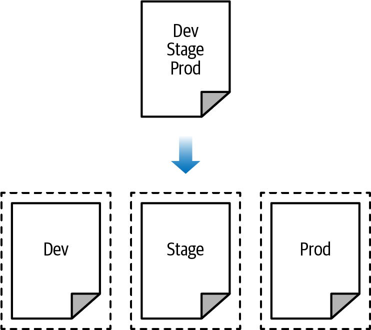
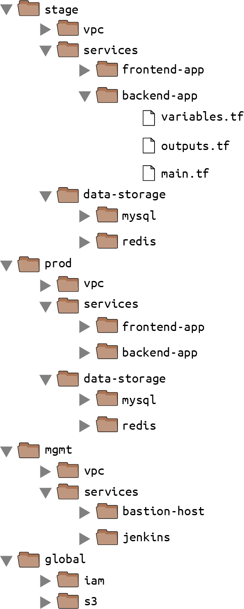
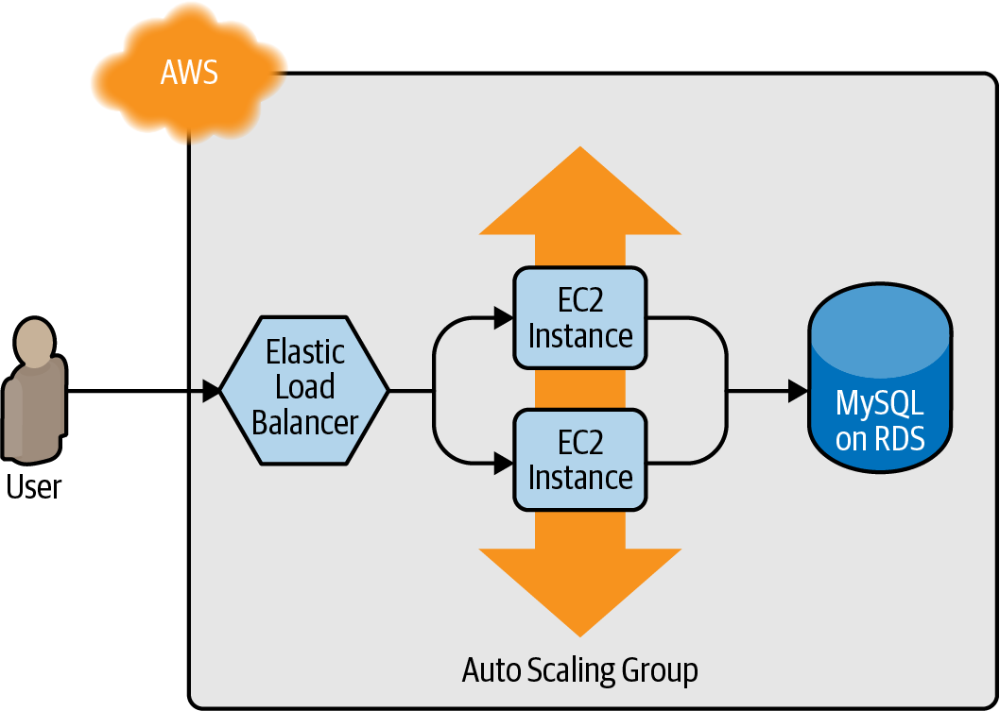
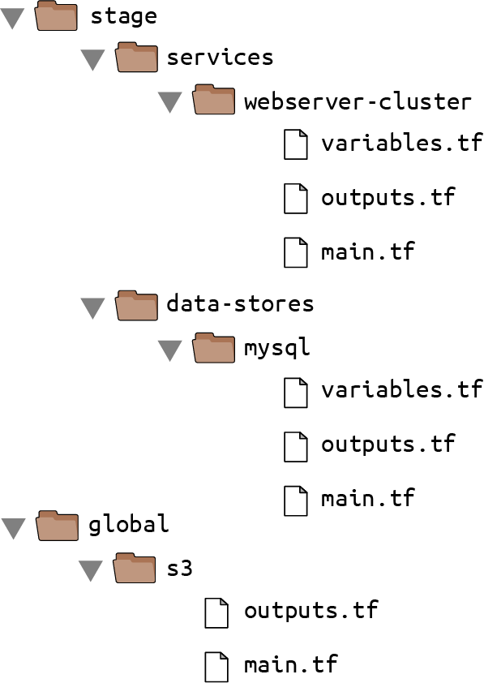
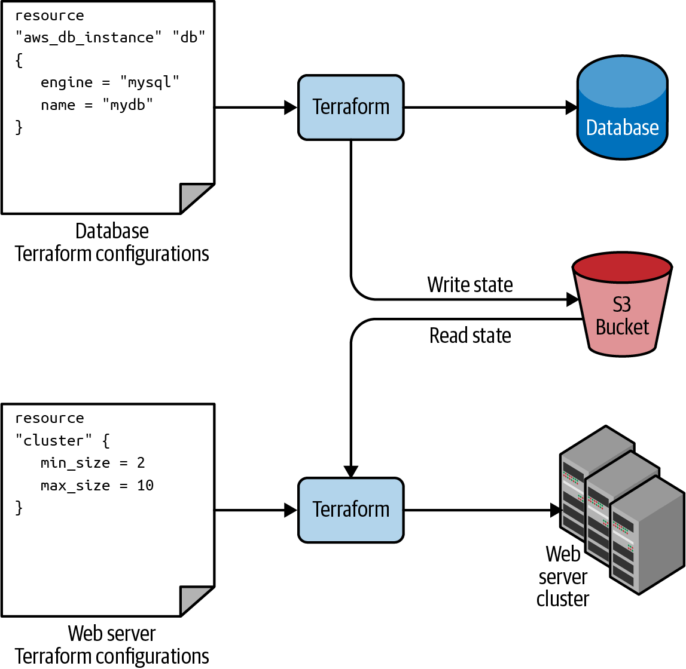

# How to Manage Terraform State
테라폼이 상태를 관리하는 방법

# What is Terraform state?
Terraform은 실행하면 `terraform.tfstate` 파일을 생성한다.  
- JSON format으로 구성된 Terraform resource mapping record다.  

이후, Terraform을 실행하면 AWS의 상태를 가져와서 해당 파일과 비교하고 차이점을 출력한다.  
- `terraform plan`이 이 동작을 수행한다.  

Terraform을 혼자서만 쓴다면 local에서 state가 관리되지만 team 단위로 활용한다면 몇 가지 문제점이 있다.  
- Shared storage for state files
    - 모든 팀원들이 같은 state file에 접근해야한다.
    - 이것은 state file이 공용 공간에 보관되야 한다는걸 의미한다.
- Locking state files
    - 두 명 이상의 팀원이 같은 state file을 수정하고 Terraform을 실행하면 conflict가 발생하며 데이터 유실 및 state file 손상이 있을 수 있다.
- Isolating state files
    - Test나 staging 환경을 구성할 때 production 환경을 깨지 않도록 확실히 해야한다.  
    - State file을 어떻게 isolating할 것인가?


# Shared storage for state files 
Terraform code는 version control에서 관리해야하지만, Terraform state는 version control에서 관리하면 안된다.  

- Manual error
    - Terrafom을 실행하기 전이나 Terraform이 상태를 변경 후에 state를 업데이트하는걸 잊을 수 있다.
    - 팀의 누군가가 최신화되지 않은 상태 파일로 Terraform을 실행하여 인프라를 초기화하거나 중복되게 하는건 시간문제다.
- Locking
    - 대부분의 version control system은 locking을 제공하지 않는다.
- Secrets
    - 모든 Terraform state는 plain text로 저장되며 이는 보안 문제로 이어진다.
    - 예를 들어 `aws_db_instance`를 생성하면 state file에 username과 password를 저장하고 이는 노출될 수 있다.

위와 같은 문제점을 해결하기 위해 state를 shared storage에서 관리하는 것이 좋다.  

Terraform은 state를 저장하고 가져올 방법을 정하는 backend가 있다.  
기본값은 local disk이며 remote backend를 사용하면 공유 공간에 state를 저장할 수 있도록 한다.  
- S3, Azure Storage, GCS, HashiCorp's Terraform Cloud, Terraform Enterprise

Remote backend는 위 세 가지 문제를 해결한다. 
- Mannual error
    - Terraform이 자동으로 state를 가져오고 업데이트한다.
- Locking
    - 대부분의 remote backend는 locking을 지원한다.
    - `terraform apply -lock-timeout=<TIME>`
- Secrets
    - 대부분의 remote backend는 state file의 보안을 지원한다.
        - ex) AWS의 IAM
    - State file이 로컬에 저장되지 않는다.  


S3를 remote backend로 사용기 위해서는 bucket 생성 후 `main.tf`에서 provider와 state를 구성해주면 된다. 

```terraform
provider "aws" {
    region = "us-east-2"
}

resource "aws_s3_bucket" "terraform_state" {
    bucket = "terraform-up-and-running-state"

    # Prevent accidental deletion of this S3 bucket
    lifecycle {
        prevent_destroy = true
    } 
}
```
- prevent_destroy: resource에 해당 옵션을 true로 두면 해당 리소스를 제거하는 모든 Terraform 동작은 error를 발생시킨다.  

추가로 bucket을 보호하기 위한 몇가지 동작을 수행한다.

### 1. Versioning
```terraform
# Enable versioning so you can see the full revision history of your
# state files
resource "aws_s3_bucket_versioning" "enabled" {
  bucket = aws_s3_bucket.terraform_state.id
  versioning_configuration {
    status = "Enabled"
  }
}
```
### 2. Server-Side Encryption
```terraform
# Enable server-side encryption by default
resource "aws_s3_bucket_server_side_encryption_configuration" "default" {
    bucket = aws_s3_bucket.terraform_state.id

    rule {
        apply_server_side_encryption_by_default {
            sse_algorithm = "AES256"
        }
    } 
}

```
### 3. Public Access Block
```terraform
# Explicitly block all public access to the S3 bucket
resource "aws_s3_bucket_public_access_block" "public_access" {
    bucket                  = aws_s3_bucket.terraform_state.id
    block_public_acls       = true
    block_public_policy     = true
    ignore_public_acls      = true
    restrict_public_buckets = true
}
```

Bucket 보호가 끝났으면 locking을 위한 DynamoDB table을 생성한다.  
- 이때, 테이블의 PK는 `LockID`로 지정해야 한다.
```terraform
resource "aws_dynamodb_table" "terraform_locks" {
    name         = "terraform-up-and-running-locks"
    billing_mode = "PAY_PER_REQUEST"
    hash_key     = "LockID"
    attribute {
        name = "LockID"
        type = "S"  
    } 
}
```  

S3와 DynamoDB를 구성한 뒤에는 backend에서 해당 저장소들을 사용하도록 구성해야 한다.  

```terraform
terraform {
  backend "<BACKEND_NAME>" {
    [CONFIG...]
  }
}
```
BACKEND_NAME은 원하는 이름을 지정하면 되고 CONFIG는 한 개 이상의 argument가 존재한다.  

```terraform
terraform {
    backend "s3" {
    # Replace this with your bucket name!
        bucket          = "terraform-up-and-running-state"
        key             = "global/s3/terraform.tfstate"
        region          = "us-east-2"

        # Replace this with your DynamoDB table name!
        dynamodb_table  = "terraform-up-and-running-locks"
        encrypt         = true
    }
}
```
이후 `terraform init`을 수행하면 상태값이 S3에 저장된다.  


# Limitations with Terraform’s backends 
### Chicken and Egg Situation
State를 저장할 S3 Bucket을 Terraform으로 만들기 위해서는 아래 두 단계를 거쳐야 한다.  

1. S3 bucket과 DynamoDB를 만들기 위한 코드 작성 후 local backend에서 배포
2. Terraform 코드에서 생성된 bucket과 DynamoDB를 바라보도록 remote backend configuration 수정후 `terraform init`으로 local state copy

제거하는 경우에도 마찬가지다.  
1. Terraform 코드에서 backend configuration 제거후 `terraform init`으로 state를 로컬로 copy
2. `terrafom destroy`로 S3 bucket과 DynamoDB 제거  

이미 구성되어있는 S3 bucket에 state를 관리한다면 위와 같은 과정은 필요 없을것이고 위와 같은 동작도 모든 Terraform 코드에서 한 번만 수행하면 되기 때문에 큰 문제는 아니라고 생각한다.  

### Backend block variables or reference
`backend` block은 어느 변수값이나 참조를 사용할 수 없다.  
```terraform
# This will NOT work. Variables aren't allowed in a backend configuration.
terraform {
    backend "s3" {
        bucket         = var.bucket
        region         = var.region
        dynamodb_table = var.dynamodb_table
        key            = "example/terraform.tfstate"
        encrypt        = true
    } 
}
```
즉, bucket이나 region 정보 등 모든 값을 수동으로 넣어야 한다는 것이다.  
- 모든 Terrafom module에서 해야된다.
- Module이 많아질수록 어지러워진다.  

Copy and paste가 아닌 command 옵션에서 `-backend-config`로 값을 전달할 수 있긴 하다.  

반복되는 설정값들을 `backend.hcl` 파일로 생성한다.
```hcl
# backend.hcl
bucket         = "terraform-up-and-running-state"
region         = "us-east-2"
dynamodb_table = "terraform-up-and-running-locks"
encrypt        = true
```  

이후 `-backend-config` 옵션으로 설정 파일을 전달하면 된다.  
```
$ terraform init -backend-config=backend.hcl
```

> 이런식으로도 가능하다
```
$ terraform init \
    -backend-config="address=demo.consul.io" \
    -backend-config="path=example_app/terraform_state" \
    -backend-config="scheme=https"
```

[Terragrunt](https://terragrunt.gruntwork.io/)라는 오픈소스를 사용하는 방법도 있다.  
- backend 코드의 반복을 줄여주는 도구  


# state File Isolation

작업을 시작하고 모든 인프라를 한 Terraform 파일에서 관리하고 싶겠지만, 이렇게 하면 모든 상태가 한 파일에 모두 저장된다.  

이렇게 되면 앱의 새 버전을 프로덕션에 배포할 때 프로덕션 앱이 중단될 수 있고, locking을 사용하지 않거나 버그로 인해 전체 프로덕션 환경이 손상될 수 있다.  

state를 분리하여 bulkheads를 구성해야 한다.  



이렇게 환경을 분리함으로써 한 환경에서 발생하는 문제가 다른 환경에 영향을 미치는걸 막을 수 있다.  

## Isolation via workspaces
Terraform workspace는 Terraform state를 분리된 다수의 공간으로 관리할 수 있다.   
기본값은 `default` 라는 이름을 가진 workspace이다.  

`terraform workspace` 명령어를 통해 새로운 workspace를 만들거나 교체할 수 있다.  

아래와 같이 Terraform 코드를 구성해보자 
```terraform
resource "aws_instance" "example" {
  ami           = "ami-0fb653ca2d3203ac1"
  instance_type = "t2.micro"
}

terraform {
  backend "s3" {
    # Replace this with your bucket name!
    bucket         = "terraform-up-and-running-state"
    key            = "workspaces-example/terraform.tfstate"
    region         = "us-east-2"

    # Replace this with your DynamoDB table name!
    dynamodb_table = "terraform-up-and-running-locks"
    encrypt        = true
  }
}

```
```
> terraform init
> terraform apply
```
State는 default workspace에 저장된다.  

아래 명령어를 통해 현재 workspace를 확인할 수 있다.
```
$ terraform workspace show
default
```

`terraform workspace new` 명령을 통해 새로운 workspace를 구성해보자
```
$ terraform workspace new example1
Created and switched to workspace "example1"!
```
이후 `terraform plan`을 실행하면 이미 생성된 EC2가 아닌 새로운 EC2를 구성하려 한다.  

```
$ terraform plan

Terraform will perform the following actions:

  # aws_instance.example will be created
  + resource "aws_instance" "example" {
      + ami                          = "ami-0fb653ca2d3203ac1"
      + instance_type                = "t2.micro"
      (...)
    }

Plan: 1 to add, 0 to change, 0 to destroy.
```
각 workspace는 독립되어있기 때문이다.   
`terrafrom apply`를 통해 배포까지 진행할 수 있다.  


`terraform workspace list`로 workspace 목록을 확인할 수 있고, `terraform workspace select`로 workspace를 선택할 수 있다.
```
$ terraform workspace list
  default
  example1

$ terraform workspace select example1
Switched to workspace "example1".
```
이러한 workspace의 정보는 S3의 `env:` 폴더 내부에 저장된다.
- `example1/workspaces-example/terraform.tfstate`  

이러한 동작은 같은 구성을 가진 환경에 테스트를 해보면서 기존 환경에 영향을 주지 않고 싶을때 편리하다.  

또한 환경에 따라 모듈이 동작하는 방식을 변경할 수 있다.  

```terraform
resource "aws_instance" "example" {
  ami           = "ami-0fb653ca2d3203ac1"
  instance_type = terraform.workspace == "default" ? "t2.medium" : "t2.micro"
}
```

많은 장점이 있지만 몇 가지 단점이 존재한다.  

- 모든 workspace의 state 파일이 같은 backend에 저장된다.  
    - 같은 인증방법을 모든 workspace가 공유해야 한다는 것이다.
    - 이는, 환경을 분리한다는 개념과 어울리지 않는다.
- Workspace는 code나 terminal에서 눈에 잘 보이지 않는다.  
    - 실수가 발생할 가능성이 높아진다.  

위 두 단점을 합치면 workspace는 error가 발생할 가능성이 높아진다.  
가시성이 부족하기 때문에 production 환경에 staging 환경을 배포하거나 그 반대가 될 수 있다. 또한 모든 workspace에서 같은 인증 방식을 사용하고 있기 때문에 더욱 더 그럴 가능성이 높아진다.


## Isolation via file layout
완벽한 환경 분리를 위해서는 아래 동작을 수행해야 한다.  
- 각 환경의 Terraform configuration 파일을 다른 폴더에 저장한다.
- 각 환경마다 다른 backend를 구성한다.  
    - 다른 인증방식을 사용한다.
    - ex) 환경마다 AWS 계정을 나눈다.


환경 분리 이후에 component level에서의 분리도 원할 수 있다.  
- 기본적인 네트워크 구성을 배포하고나면 몇 달에 한 번정도만 변경한다.
- 새 버전의 웹 서버는 하루에 여러 번 배포할 수 있다.
- 동일한 Terraform component에서 VPC component와 웹 서버 component를 관리하는 경우 전체 네트워크가 하루에 여러번 불필요하게 중단 위험에 처하게 될 수 있다. 

그러므로 Terraform 폴더를 환경과 component마다 분리해줘야 한다.  





이와 같은 구성에서 Terrafrom은 파일 이름은 신경쓰지 않지만 협업을 위해 일관된 컨벤션을 통해 variable, output, resource 파일을 구분하는게 좋다.  
- 리소스가 너무 많아져서 `main.tf` 파일이 너무 커지는 경우 `main-xxx.tf` 정도로 파일을 나눌 수는 있겠다.  
    - ex) `main-iam.tf`, `main-s3.tf`

이렇게 파일로 분리하는건 몇 가지 이점이 있다.
- Clear code / env layout
    - 코드를 보고 이해하기 편한 구조로 나뉜다.
    - 어떤 component가 어떤 환경에 배포되는지
- Isolation
    - 각 환경과  omponent를 완벽하게 나눌 수 있따.
    - 만약 실수를 하더라도 문제는 component 까지만 퍼진다.

그러나 이런 장점들도 단점으로 다가올 수 있다.  
- 수많은 폴더들
    - component들을 여러 폴더로 나누는 것은 실수로 전체 인프라를 날려버리는걸 방지할 수 있지만, 한 명령어로 전체 인프라를 생성하는 것도 방해한다.  
    - 각 환경의 component들 마다 `terraform apply`를 수행해야 한다.
    - Terragrunt를 사용하면 해결할 수 있음!  -> `run-all`
- Copy/Paste
    - 환경별로 나누었으므로 다른 환경끼리 중복되는 코드들이 존재할 것이다.
    - Module로 해결할 수 있음!
- Resource depencdncies
    - 코드가 다양한 폴더로 나뉘게 되어서 resource dependencies를 사용하기 힘들어진다.  
    - 한 파일에서 작성한다면 `aws_db_instance.foo.address` 와 같이 reference를 사용할 수 있지만, resource가 다른 폴더에 존재한다면 사용할 수 없다.
    - Terrafgrunt에서는 dependency block을 제공해줌!

# The terraform_remote_state Data Source
읽기 전용 정보인 data source처럼 state를 활용할 때 사용할 수 있는 data source가 또 있다.  

`terraform_remote_state`는 다른 Terraform configuration에 있는 state를 가져올 수 있다.  

## example
Web server cluster와 RDS를 구성한다고 가정한다.  

Web server cluster와 RDS는 다른 구성파일에 작성될 것이다.  
- web server cluster는 RDS보다 주기적으로 배포될 것이고 RDS가 함께 이 리스크를 감수 할 필요는 없기 때문이다.  





첫 번째로 stage 환경을 구성하기 위한 파일을 생성한다.  



### `stage/data-stores/mysql/main.tf`
```terraform
provider "aws" {
  region = "us-east-2"
}

resource "aws_db_instance" "example" {
  identifier_prefix   = "terraform-up-and-running"
  engine              = "mysql"
  allocated_storage   = 10
  instance_class      = "db.t2.micro"
  skip_final_snapshot = true
  db_name             = "example_database"

  # How should we set the username and password?
  username = "???"
  password = "???"
}

```
여기서 username과 password는 직접 넣고싶지 않을 것이다.  

Terraform 외부에서 작성해서 환경변수로 넘겨주는 방법이 있다.
### `stage/data-stores/mysql/variables.tf`
```terraform
variable "db_username" {
  description = "The username for the database"
  type        = string
  sensitive   = true
}

variable "db_password" {
  description = "The password for the database"
  type        = string
  sensitive   = true
}
```

이후 `aws_db_instance`에 이 값을 전달한다.  
### `stage/data-stores/mysql/main.tf`
```terraform
resource "aws_db_instance" "example" {
  identifier_prefix   = "terraform-up-and-running"
  engine              = "mysql"
  allocated_storage   = 10
  instance_class      = "db.t2.micro"
  skip_final_snapshot = true
  db_name             = "example_database"

  username = var.db_username
  password = var.db_password
}
```

Terraform state를 어디서 관리할지도 구성해준다.  

### `stage/data-stores/mysql/terraform.tfstate`
```terraform
terraform {
  backend "s3" {
    # Replace this with your bucket name!
    bucket         = "terraform-up-and-running-state"
    key            = "stage/data-stores/mysql/terraform.tfstate"
    region         = "us-east-2"

    # Replace this with your DynamoDB table name!
    dynamodb_table = "terraform-up-and-running-locks"
    encrypt        = true
  }
}
```

마지막으로 db의 주소와 port를 output에 구성한다.  

### `stage/data-stores/mysql/outputs.tf`
```terraform
output "address" {
  value       = aws_db_instance.example.address
  description = "Connect to the database at this endpoint"
}

output "port" {
  value       = aws_db_instance.example.port
  description = "The port the database is listening on"
}
```

> 환경변수를 Terraform에 전달하기 위해서는 `TF_VAR_<NAME>`의 형태로 작성된 환경변수를 만들어주면 된다.
> - export TF_VAR_db_username="(YOUR_DB_USERNAME)"


RDS의 구성이 완료되었고 web server cluster 코드에서는 RDS의 상태 정보를 `terraform_remote_state`로 활용할 수 있다.
### `stage/services/webserver-cluster/main.tf`
```terraform
data "terraform_remote_state" "db" {
  backend = "s3"

  config = {
    bucket = "(YOUR_BUCKET_NAME)"
    key    = "stage/data-stores/mysql/terraform.tfstate"
    region = "us-east-2"
  }
}
```




Terraform의 모든 data source는 읽기 전용이고 `terraform_remote_state` 또한 같다.  
그러므로, web server cluster는 RDS의 state를 수정할 수 없다.  
- 리스크 없이 RDS의 state를 활용할 수 있다.

모든 RDS의 output은 state파일에 저장되고 `terraform_remote_state`로 사용할 수 있으므로 address와 port를 가져와서 사용할 수 있다.  
- `data.terraform_remote_state.<NAME>.outputs.<ATTRIBUTE>`
```
user_data = <<EOF
#!/bin/bash
echo "Hello, World" >> index.html
echo "${data.terraform_remote_state.db.outputs.address}" >> index.html
echo "${data.terraform_remote_state.db.outputs.port}" >> index.html
nohup busybox httpd -f -p ${var.server_port} &
EOF
```

> 여기서 잠깐, Terraform 코드 내부에서 user data script가 점점 길어지고있다.  
> 코드가 점점 복잡해지고, 다른 언어에 또 다른 언어를 넣어서 사용하는건 코드를 이해하기 더욱 어려워진다.  
> 여기서 Terraform 내장 함수를 사용할 수 있다.  
> `templtaefile(<PATH>, <VARS>)` 함수로 `${...}`를 포함한 파일을 `<PATH>`에 저장해두면 해당 파일에 변수값을 적용할 수 있다.  

### `stage/services/webserver-cluster/user-data.sh`
```
#!/bin/bash

cat > index.html <<EOF
<h1>Hello, World</h1>
<p>DB address: ${db_address}</p>
<p>DB port: ${db_port}</p>
EOF

nohup busybox httpd -f -p ${server_port} &
```
### `stage/services/webserver-cluster/main.tf`
```terraform
resource "aws_launch_configuration" "example" {
  image_id        = "ami-0fb653ca2d3203ac1"
  instance_type   = "t2.micro"
  security_groups = [aws_security_group.instance.id]

  # Render the User Data script as a template
  user_data = templatefile("user-data.sh", {
    server_port = var.server_port
    db_address  = data.terraform_remote_state.db.outputs.address
    db_port     = data.terraform_remote_state.db.outputs.port
  })

  # Required when using a launch configuration with an auto scaling group.
  lifecycle {
    create_before_destroy = true
  }
}

```


- tempted: ~하고싶은
- explicitly: 솔직하게, 명시적으로


