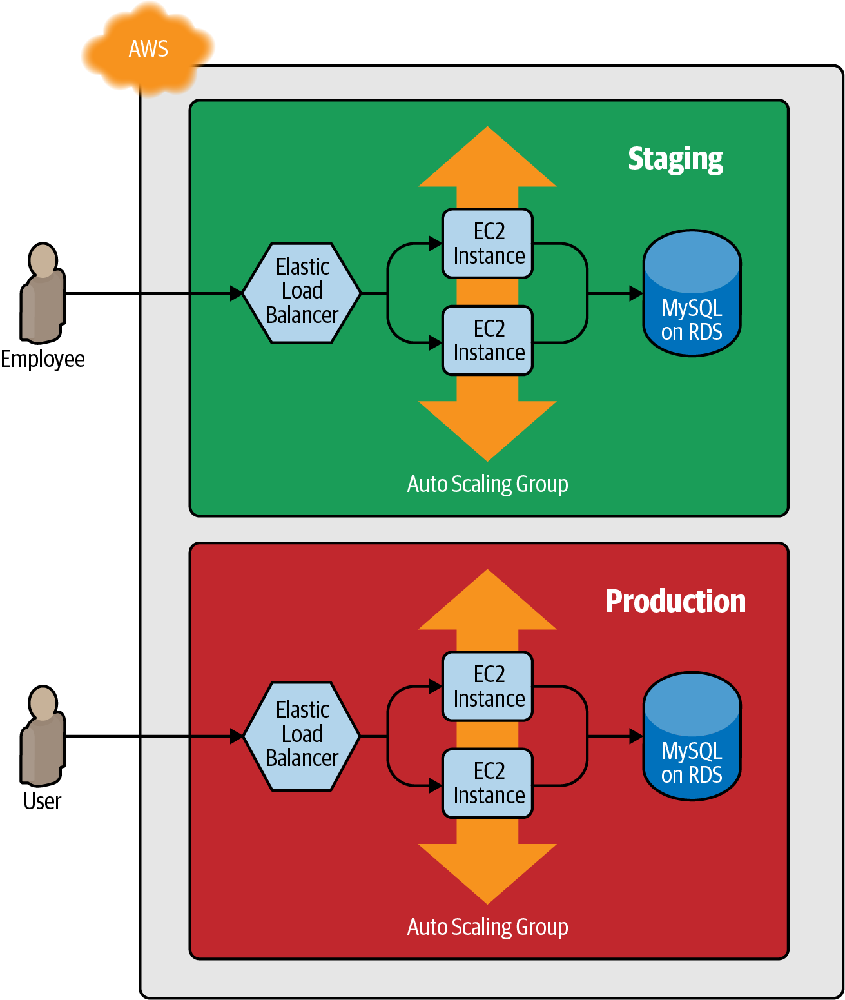
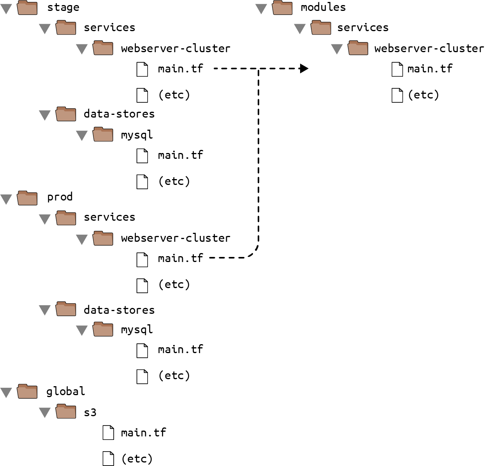
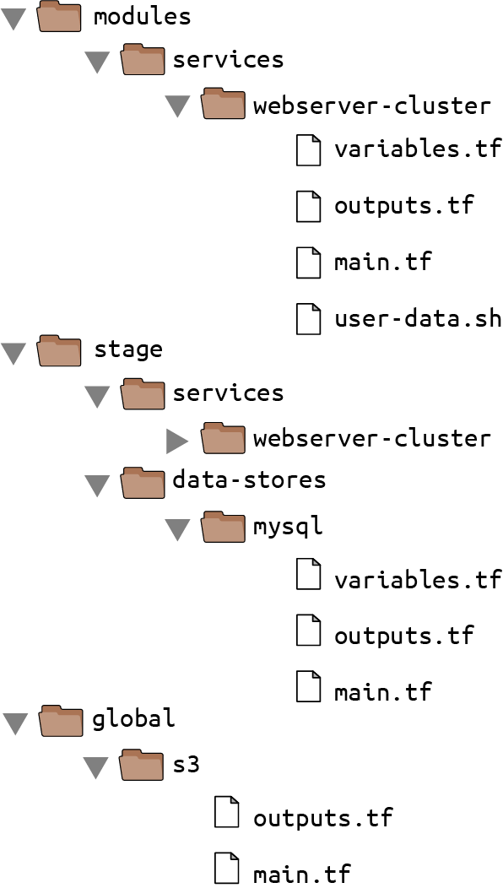
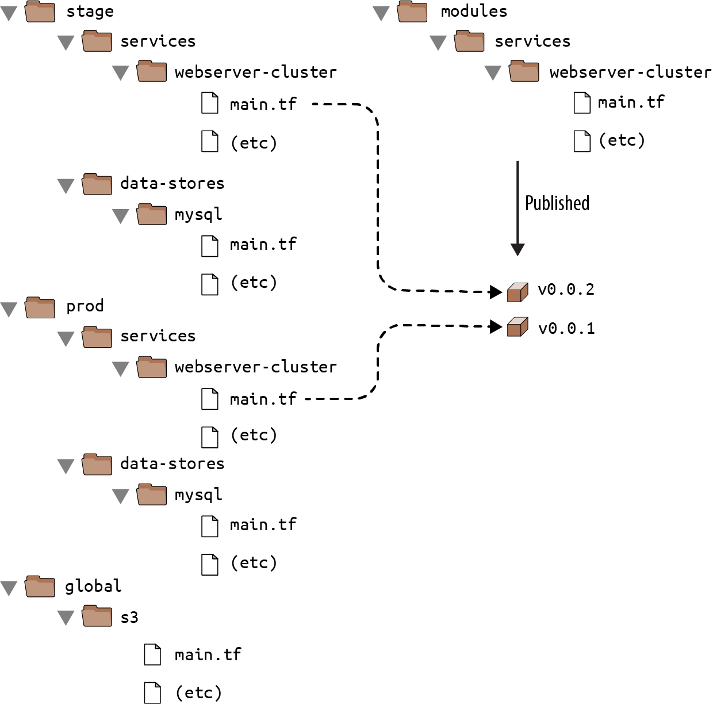
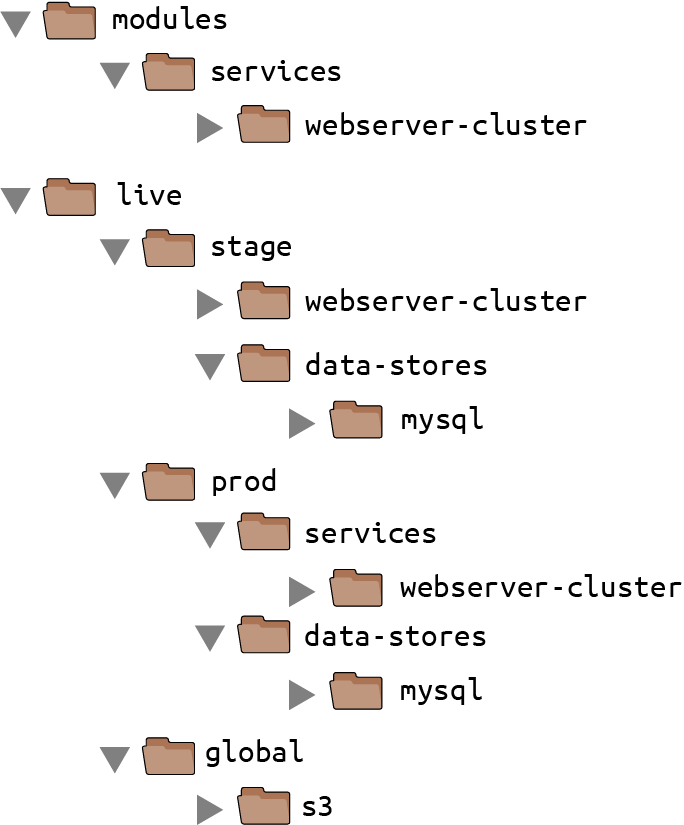

# How to Create Reusable Infrastructure with Terraform Modules


개발을 진행하면서 최소 2개의 환경이 필요하다.  
- testing용 staging 환경
- production 환경

두 환경은 비슷하지만 staging 환경은 비용적으로 조금 더 작은 규모로 구성될 것이다.




이때, 코드를 copy/paste 없이 비슷하게 환경을 구성할 수 있을까?  


Ruby와 같은 일반적인 프로그래밍 언어는 함수를 만들어서 해당 함수를 사용함으로써 코드의 중복을 줄일 수 있다.  

```ruby
# Define the function in one place
def example_function()
  puts "Hello, World"
end

# Use the function in multiple other places
example_function()
```

Terraform에서는 코드를 Terraform module에 넣고 재사용할 수 있다.  




이로써, Terraform으로도 재사용 가능한, 관리에 용이한, 테스트하기 좋은 코드를 작성할 수 있다.  

# Module Basics
어떠한 Terraform configuration file이 들어간 폴더들도 모듈이 될 수 있다.  

기존 코드들을 모듈로 재작성하기 위해 top-level 폴더로 modules를 생성하고 webserver-cluster에 존재하던 모든 파일들을 이동시킨다.  

이때 provider 정의는 모두 제거한다.  
- provider는 반드시 root 모듈에 작성되어야 한다.  




이제 다른 환경에서 해당 모듈을 사용할 수 있다.  

```terraform
module "<NAME>" {
  source = "<SOURCE>"

  [CONFIG ...]
}
```
- NAME: 해당 모듈을 참조할 때 사용할 이름
- SOURCE: 모듈 코드가 존재하는 경로
- CONFIG: 모듈에 전달할 값

예를 들어 stage/services/webserver-cluster에서 webserver-cluster 모듈을 사용하려면 아래와 같이 구성하면 된다.
```terraform
provider "aws" {
  region = "us-east-2"
}

module "webserver_cluster" {
  source = "../../../modules/services/webserver-cluster"
}
``` 
- production에서도 같은 형태로 구성할 수 있다!  

> 모듈을 추가하거나 모듈 내부의 source를 수정하면 `init`명령을 다시 수행해야 한다.  

webserver-cluset 모듈을 실행하기 전 모든 이름들이 하드코딩 되어있는 것을 수정해야 한다.  
- 같은 계정에 해당 모듈을 두 개 이상 배포한다면 conflict error가 발생할 것이다.  

# Module inputs 
일반적인 프로그래밍 언어에서는 함수를 설정 가능하게 하기 위해서는 parameter로 값을 넘겨준다.  

```ruby
# A function with two input parameters
def example_function(param1, param2)
  puts "Hello, #{param1} #{param2}"
end

# Pass two input parameters to the function
example_function("foo", "bar")
```

Terraform에서도 모듈에 값을 전달할 수 있다.  
### modules/services/webserver-cluster/variables.tf

```terraform
variable "cluster_name" {
  description = "The name to use for all the cluster resources"
  type        = string
}

variable "db_remote_state_bucket" {
  description = "The name of the S3 bucket for the database's remote state"
  type        = string
}

variable "db_remote_state_key" {
  description = "The path for the database's remote state in S3"
  type        = string
}
```
variables 파일에 작성된 값을 모듈 main.tf에서 사용할 수 있다. 
- `var.cluster_name`

```terraform
resource "aws_security_group" "alb" {
  name = "${var.cluster_name}-alb"

  ingress {
    from_port   = 80
    to_port     = 80
    protocol    = "tcp"
    cidr_blocks = ["0.0.0.0/0"]
  }

  egress {
    from_port   = 0
    to_port     = 0
    protocol    = "-1"
    cidr_blocks = ["0.0.0.0/0"]
  }
}
```

모듈에 값을 전달하기 위해서는 모듈 선언시 아래와 같이 구성하면 된다.  

```terraform
module "webserver_cluster" {
  source = "../../../modules/services/webserver-cluster"

  cluster_name            = "webservers-stage"
  db_remote_state_bucket  = "(YOUR_BUCKET_NAME)"
  db_remote_state_key     = "stage/data-stores/mysql/terraform.tfstate"
}
```

이름을 변경하는 동작 이외에 비용을 절감하기 위해 크기에 대한 값도 모듈에 전달하고 싶을 수 있다.  
이때는 number type을 전달하면 된다.

```terraform

variable "instance_type" {
  description = "The type of EC2 Instances to run (e.g. t2.micro)"
  type        = string
}

variable "min_size" {
  description = "The minimum number of EC2 Instances in the ASG"
  type        = number
}

variable "max_size" {
  description = "The maximum number of EC2 Instances in the ASG"
  type        = number
}
```


# Module Locals
모듈에 값을 전달하기 위해 variable을 정의하는건 좋지만 변수를 사용해야 하면서도 입력을 제안하지 않고 싶을때는 어떻게 해야하는가? 


예를 들어서 load balancer가 80 port를 HTTP protocol로 바라보고 있다면 아래와 같이 구성될 것이다.  

```terraform
resource "aws_lb_listener" "http" {
  load_balancer_arn = aws_lb.example.arn
  port              = 80
  protocol          = "HTTP"

  # By default, return a simple 404 page
  default_action {
    type = "fixed-response"

    fixed_response {
      content_type = "text/plain"
      message_body = "404: page not found"
      status_code  = 404
    }
  }
}
```
port 번호와 protocol은 여전히 여러 곳에서 사용될 것이다.

security group 또한 같다.
```terraform
resource "aws_security_group" "alb" {
  name = "${var.cluster_name}-alb"

  ingress {
    from_port   = 80
    to_port     = 80
    protocol    = "tcp"
    cidr_blocks = ["0.0.0.0/0"]
  }

  egress {
    from_port   = 0
    to_port     = 0
    protocol    = "-1"
    cidr_blocks = ["0.0.0.0/0"]
  }
}
```
모든 protocol을 의미하는 `-1`과 모든 ip를 의미하는 `0.0.0.0/0`이 계속해서 사용될 것이다.  

이렇게 값들이 이곳 저곳 하드코딩 되어있으면 코드를 읽고 유지하기 힘들어진다.  

이런 값들은 변수로 유지하면서 사용자가 원하면 덮어쓸 수 있게 유지해야 한다.  

이때 local 변수를 사용한다.
```terraform
locals {
  http_port    = 80
  any_port     = 0
  any_protocol = "-1"
  tcp_protocol = "tcp"
  all_ips      = ["0.0.0.0/0"]
}
```

local 변수는 Terraform의 모든 표현식에 이름을 지정할 수 있다. 
- 모듈에서 이 이름을 참조할 수 있다.  
- `local.<NAME>`

정의된 local 변수는 모듈 내부에서만 사용할 수 있으며 다른 모듈에 영향을 미칠 수 없다.  

위 local 변수를 활용하면 security group을 아래와 같이 구성할 수 있다.
```terraform
resource "aws_security_group" "alb" {
  name = "${var.cluster_name}-alb"

  ingress {
    from_port   = local.http_port
    to_port     = local.http_port
    protocol    = local.tcp_protocol
    cidr_blocks = local.all_ips
  }

  egress {
    from_port   = local.any_port
    to_port     = local.any_port
    protocol    = local.any_protocol
    cidr_blocks = local.all_ips
  }
}
```

# Module Outputs
모듈에서 정의한 resource의 값을 참조해야할때 모듈 output을 사용할 수 있다.  

일반적인 프로그래밍 언어에서는 return을 사용한다.
```ruby
# A function that returns a value
def example_function(param1, param2)
  return "Hello, #{param1} #{param2}"
end

# Call the function and get the return value
return_value = example_function("foo", "bar")
```

Terraform에서는 output block을 모듈 내부에 정의하여 모듈 리소스의 값을 모듈 외부로 전달할 수 있다.  

### /modules/services/webserver-cluster/outputs.tf
```terraform
output "asg_name" {
  value       = aws_autoscaling_group.example.name
  description = "The name of the Auto Scaling Group"
}
```

모듈 output을 사용할때는 아래와 같이 할 수 있다.
```terraform
module.<MODULE_NAME>.<OUTPUT_NAME>
```

autoscaling_group_schedule에서 autoscaling_group_name이 필요할 때 아래와 같이 사용할 수 있다.
```terraform
resource "aws_autoscaling_schedule" "scale_out_during_business_hours" {
  scheduled_action_name = "scale-out-during-business-hours"
  min_size              = 2
  max_size              = 10
  desired_capacity      = 10
  recurrence            = "0 9 * * *"

  autoscaling_group_name = module.webserver_cluster.asg_name
}

resource "aws_autoscaling_schedule" "scale_in_at_night" {
  scheduled_action_name = "scale-in-at-night"
  min_size              = 2
  max_size              = 10
  desired_capacity      = 2
  recurrence            = "0 17 * * *"

  autoscaling_group_name = module.webserver_cluster.asg_name
}
```

물론 webserver_cluster 모듈에서는 output block을 정의해줘야 한다.  

### /modules/services/webserver-cluster/outputs.tf
```terraform
output "alb_dns_name" {
  value       = aws_lb.example.dns_name
  description = "The domain name of the load balancer"
}
```

# Moudle Gotchas

모듈을 구성할 때 아래 두 가지를 주의해야 한다.  

- File paths
- Inline blocks

## File paths
`user-data.sh` 파일을 참조할 때 templatefile function을 사용해서 상대 경로를 전달했다.  

일반적으로, Terraform은 해당 작업 디렉터리를 기준으로 상대 경로를 사용하며 Terraform 파일과 같은 경로에 참조하는 파일이 있을때는 정상 동작 했지만, 모듈에서 templatefile function을 사용하는 경우 정상적으로 동작하지 않을 수 있다.  

이 문제를 해결하기 위해서는 path reference를 사용해야 한다.  

Terraform은 아래와 같은 path reference를 제공한다. 
- `path.module`
    - 해당 reference를 호출한 모듈이 정의된 경로 반환
- `path.root`
    - root 모듈의 경로 반환
- `path.cwd`
    - 현재 작업 경로 반환

해당 path reference를 user_data에 활용하면 아래와 같다.  

### modules/services/webserver-cluster/main.tf
모듈 내부에서 파일을 참조하는 상황
```terraform
  user_data = templatefile("${path.module}/user-data.sh", {
    server_port = var.server_port
    db_address  = data.terraform_remote_state.db.outputs.address
    db_port     = data.terraform_remote_state.db.outputs.port
  })
```

## Inline Blocks

일부 Terraform resource는 블록 내부에서 별도의 리소스를 정의할 수 있다.  

```terraform
resource "xxx" "yyy" {
  <NAME> {
    [CONFIG...]
  }
}
```
- NAME: inline block 이름 
    - ex) `ingress`
- CONFIG: 1개 이상의 inline block의 argument
    - ex) `from_prot`, `to_port`


만약 `aws_security_group_resource`를 정의한다면 ingress와 egress를 inline block으로 정의하거나 (ex: `ingress { ... }`) 별도의 리소스인 `aws_security_group_rule`로 정의할 수 있다.  


Inline block과 개별 리소스를 분리해서 사용하려고 하면 충돌이 발생하거나 서로 덮어쓰는 오류가 발생할 수 있다.

따라서 둘 중 하나의 방법을 사용해야 하며, 모듈을 만들 때 항상 별도의 리소스를 사용하는걸 권장한다.  
- 별도의 리소스로 구성하면 어디에나 추가할 수 있다는 장점이 있기에 더 유연하게 구성할 수 있다.  


Inline block으로 aws_security_group을 정의하면 아래와 같다.

### modules/services/webserver-cluster/main.tf
```terraform
resource "aws_security_group" "alb" {
  name = "${var.cluster_name}-alb"

  ingress {
    from_port   = local.http_port
    to_port     = local.http_port
    protocol    = local.tcp_protocol
    cidr_blocks = local.all_ips
  }

  egress {
    from_port   = local.any_port
    to_port     = local.any_port
    protocol    = local.any_protocol
    cidr_blocks = local.all_ips
  }
}
```
이렇게 구성하면 추가적인 ingress, egress를 외부 모듈에서 추가할 수 없다.

이를 좀 더 유연하게 구성하기 위해서는 아래와 같이 별도의 리소스로 정의해야 한다.


```terraform
resource "aws_security_group" "alb" {
  name = "${var.cluster_name}-alb"
}

resource "aws_security_group_rule" "allow_http_inbound" {
  type              = "ingress"
  security_group_id = aws_security_group.alb.id

  from_port   = local.http_port
  to_port     = local.http_port
  protocol    = local.tcp_protocol
  cidr_blocks = local.all_ips
}

resource "aws_security_group_rule" "allow_all_outbound" {
  type              = "egress"
  security_group_id = aws_security_group.alb.id

  from_port   = local.any_port
  to_port     = local.any_port
  protocol    = local.any_protocol
  cidr_blocks = local.all_ips
}
```


위와 같이 구성하면 aws_security_group id를 output variable로 구성하여 추가적인 ingress, egress를 구성할 수 있다.

### modules/services/webserver-cluster/outputs.tf
```terraform
output "alb_security_group_id" {
  value       = aws_security_group.alb.id
  description = "The ID of the Security Group attached to the load balancer"
}
```

### stage/services/webserver-cluster/main.tf
```terraform
module "webserver_cluster" {
  source = "../../../modules/services/webserver-cluster"

  # (parameters hidden for clarity)
}

resource "aws_security_group_rule" "allow_testing_inbound" {
  type              = "ingress"
  security_group_id = module.webserver_cluster.alb_security_group_id

  from_port   = 12345
  to_port     = 12345
  protocol    = "tcp"
  cidr_blocks = ["0.0.0.0/0"]
}
```

Terraform에는 아래와 같은 inline block으로 구성 가능한 리소스가

- aws_security_group and aws_security_group_rule
- aws_route_table and aws_route
- aws_network_acl and aws_network_acl_rule

> 지금까지의 예시에서는 load balancer까지 분리했지만, 네트워크 레벨에서는 완전히 분리되지 않았다. 즉, staging 환경이 production 환경과 통신할 수 있다는 뜻이다.  
> 실제 사용에서는 각 환경을 별도의 VPC에 구성하여 두 가지 리스크를 방지한다.
> 첫 번째는 한 환경이 다른 환경에 영향을 미칠 수 있다는 점이다.
> 두 번째는 공격자가 한 환경의 권한만 취득해도 다른 환경까지 접근 가능하다는 점이다.  


# Module Versioning
staging 환경과 production 환경이 동일한 모듈 폴더를 가리키는 경우 해당 폴더를 변경하면 두 환경에 즉시 영향을 미친다.  

이러한 문제를 해결하기 위해 모듈에 버져닝을 추가해서 각각의 환경에서 별도의 버전을 사용하도록 구성할 수 있다.  

모듈을 사용할 때 `source` parameter에 모듈의 로컬 경로를 입력했다.  
여기에 다른 형태의 모듈 source를 전달하여 버저닝을 구성할 수 있다.
- Git URL
- Mercurial URL
- arbitrary HTTP URL




모듈의 버져닝을 가장 간단하게 구성하는 방법은 Git repository를 나눠서 `source` parameter로 별도의 repository URL을 전달하는 것이다.  
- 이렇게되면 Terraform 코드는 modules와 live repository로 나눠서 구성할 수 있다.  



나눠진 repository에서 module repository에는 git tag를 추가해서 tag별로 버저닝을 할 수 있다.
```sh
$ git tag -a "v0.0.1" -m "First release of webserver-cluster module"
$ git push --follow-tags
```

### live/stage/services/webserver-cluster/main.tf
```terraform
module "webserver_cluster" {
  source = "github.com/foo/modules//services/webserver-cluster?ref=v0.0.1"

  cluster_name           = "webservers-stage"
  db_remote_state_bucket = "(YOUR_BUCKET_NAME)"
  db_remote_state_key    = "stage/data-stores/mysql/terraform.tfstate"

  instance_type = "t2.micro"
  min_size      = 2
  max_size      = 2
}
```
`ref` parameter에는 branch name, commit sha1 hash, git tag 등으로 특정 버전을 가리킬 수 있다.  
- branch name은 항상 최신 commit을 가리키므로 불안정하다.
- commit hash는 친화적이지 않다.
- git tag가 가장 안정적이고 사용하기에 친숙하다.


`MAJOR.MINOR.PATCH` 형태가 가장 유용함!

GitHub가 아닌 private git repositort를 사용하는 경우 모듈 `source` parameter로 별도 인증을 통한 SSH auth를 전달하는것이 좋다.  

```
git@github.com:<OWNER>/<REPO>.git//<PATH>?ref=<VERSION>
```


