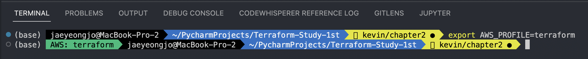

# 챕터2

# 1) AWS 계정 설정하기

root 계정을 쓰는 것은 매우 위험하므로 가능하다면 IAM에서 새로운 사용자를 만든 후에 실습에 필요한 권한만 할당하도록 하자 (이래놓고 바로 AdministratorAccess 줘버렸쥬..?)

terraform 명령어를 실행하게 되면 Provider에 AWS 항목이 있어서 환경 변수로부터 `AWS_ACCESS_KEY_ID` , `AWS_SECRET_ACCESS_KEY` 를 찾게 됨. 이때 책에서 나온 것처럼 매번 `export` 명령어를 사용하기에는 번거로움

이때 회사에서 쓰는 AWS 계정도 있어서 여러 계정을 쉽게 관리하기 위해서 `~/.aws/config` 파일에 프로파일로 등록해놨다. ([참고자료](https://docs.aws.amazon.com/cli/latest/userguide/cli-configure-profiles.html))

```
[default]
aws_access_key_id={주로 쓰는 계정 id}
aws_secret_access_key={주로 쓰는 계정 시크릿 키}

[profile terraform]
aws_access_key_id={테라폼 실습용 개인 계정 id}
aws_secret_access_key={테라폼 실습용 개인 계정 id}
region=ap-northeast-2
output = json
```

아래 명령어를 통해서 VSCode 상에서 `AWS_PROFILE` 환경 변수만 스위칭 하면 쉽게 크레덴셜을 먹일 수 있다. 

```bash
$ nano ~/.aws/config
$ source ~/.aws/config
$ export AWS_PROFILE=terraform
```

실행하면 어떤 AWS 프로파일이 활성화되어 있는지 표시해준다.



# 2) EC2 서버 하나 띄우기

`[main.tf](http://main.tf)` 파일에 아래 내용 작성을 하자

```json
terraform {
  required_providers {
    aws = {
      source  = "hashicorp/aws"
      version = "~> 4.17"
    }
  }

  required_version = ">= 1.2.2"
}

provider "aws" {
  region = "us-east-2"

  # Allow any 2.x version of the AWS provider
#   version = "~> 2.0"
}

resource "aws_instance" "example" {
  ami           = "ami-0c55b159cbfafe1f0"
  instance_type = "t2.micro"

  tags = {
    Name = "terraform-example"
  }
}
```

3가지 명령어를 실행한다. 

```bash
$ terraform init # <- 디렉토리 내에 필요한 Provider 패키지를 찾고 설치하는 명령어
$ terraform plan # <- 코드로 명시한 리소스와 배포되어 있는 리소스를 비교하여서 필요한 작업을 계획하는 명령어
$ terraform apply # <- plan 되어 나온 작업들을 실제로 실행하는 과정
```

<aside>
⚠️ 이때 init 명령어를 칠 때 대충하면 버전이 안 맞는다고 뜬다. terraform 블록 안에는 terraform CLI와 각 Provider들의 버전을 명시할 수 있다. 

`required_version` 은 terraform CLI 명령어의 요구 버전을, `required_providers.aws.version` 은 AWS Provider의 요구 버전을 나타냄

</aside>


AWS 콘솔에 들어가니 EC2 인스턴스가 잘 띄워졌고, 태그도 적절히 먹힌 것을 확인할 수 있다.

### **Q. AWS 태그는 어떤 식으로 활용해 볼 수 있을까?**

 회사에서는 `[main.tf](http://main.tf)` 에서 확인해보니 다음과 같이 AWS region과 태그 기본 세팅을 하는 것을 확인했다. 조금 더 고도화가 된다면 각 팀 혹은 코스트 센터 별로 태그를 붙이는 베스트 프랙티스를 얼핏 들었던 것 같다. 그래야 비용 모니터링 할 때 어떤 팀, 어떤 프로덕트에서 얼마나 쓰는지 그룹핑 하기가 쉽다고 함

```json
provider "aws" {
  region = var.aws_config.region_name

  default_tags {
    tags = {
      Environment = var.environment
      Owner       = "terraform"
    }
  }
}
```

### **Q. Terraform은 기존에 배포했던 것들을 어떻게 알고 있을까?**

위에서 `terraform apply` 명령어를 실행해보니 아래와 같은 아티팩트가 생겼다. 

```bash
.
├── .terraform
│   └── providers
│       └── registry.terraform.io
│           └── hashicorp
│               └── aws
│                   └── 4.45.0
│                       └── darwin_arm64
│                           └── terraform-provider-aws_v4.45.0_x5
├── .terraform.lock.hcl
├── main.tf
├── terraform.tfstate
└── terraform.tfstate.backup
```

이때 terraform.tfstate 파일에 들어가보니까 생성한 각종 리소스들의 arn 정보가 추가되어 있는 것을 볼 수 있다.  그리고 `terraform.tfstate.backup` 파일에는 바로 직전 상태의 파일이 저장되어 있는 것을 볼 수 있었다. 

- terraform.tfstate
    
    ```json
    {
      "version": 4,
      "terraform_version": "1.3.5",
      "serial": 7,
      "lineage": "3dbb173e-81fc-3175-556f-83b34fa1698a",
      "outputs": {},
      "resources": [
        {
          "mode": "managed",
          "type": "aws_instance",
          "name": "example",
          "provider": "provider[\"registry.terraform.io/hashicorp/aws\"]",
          "instances": [
            {
              "schema_version": 1,
              "attributes": {
                "ami": "ami-0c55b159cbfafe1f0",
                "arn": "arn:aws:ec2:us-east-2:915999582461:instance/i-0279644fca93fa62b",
                "associate_public_ip_address": true,
                "availability_zone": "us-east-2c",
                "capacity_reservation_specification": [
                  {
                    "capacity_reservation_preference": "open",
                    "capacity_reservation_target": []
                  }
                ],
                "cpu_core_count": 1,
                "cpu_threads_per_core": 1,
                "credit_specification": [
                  {
                    "cpu_credits": "standard"
                  }
                ],
                "disable_api_stop": false,
                "disable_api_termination": false,
                "ebs_block_device": [],
                "ebs_optimized": false,
                "enclave_options": [
                  {
                    "enabled": false
                  }
                ],
                "ephemeral_block_device": [],
                "get_password_data": false,
                "hibernation": false,
                "host_id": null,
                "host_resource_group_arn": null,
                "iam_instance_profile": "",
                "id": "i-0279644fca93fa62b",
                "instance_initiated_shutdown_behavior": "stop",
                "instance_state": "running",
                "instance_type": "t2.micro",
                "ipv6_address_count": 0,
                "ipv6_addresses": [],
                "key_name": "",
                "launch_template": [],
                "maintenance_options": [
                  {
                    "auto_recovery": "default"
                  }
                ],
                "metadata_options": [
                  {
                    "http_endpoint": "enabled",
                    "http_put_response_hop_limit": 1,
                    "http_tokens": "optional",
                    "instance_metadata_tags": "disabled"
                  }
                ],
                "monitoring": false,
                "network_interface": [],
                "outpost_arn": "",
                "password_data": "",
                "placement_group": "",
                "placement_partition_number": null,
                "primary_network_interface_id": "eni-0e0223bddaf637884",
                "private_dns": "ip-172-31-33-87.us-east-2.compute.internal",
                "private_dns_name_options": [
                  {
                    "enable_resource_name_dns_a_record": false,
                    "enable_resource_name_dns_aaaa_record": false,
                    "hostname_type": "ip-name"
                  }
                ],
                "private_ip": "172.31.33.87",
                "public_dns": "ec2-3-17-208-206.us-east-2.compute.amazonaws.com",
                "public_ip": "3.17.208.206",
                "root_block_device": [
                  {
                    "delete_on_termination": true,
                    "device_name": "/dev/sda1",
                    "encrypted": false,
                    "iops": 100,
                    "kms_key_id": "",
                    "tags": {},
                    "throughput": 0,
                    "volume_id": "vol-02b7ece4b3570f677",
                    "volume_size": 8,
                    "volume_type": "gp2"
                  }
                ],
                "secondary_private_ips": [],
                "security_groups": [
                  "default"
                ],
                "source_dest_check": true,
                "subnet_id": "subnet-00f9fb4a",
                "tags": {
                  "Name": "terraform-example"
                },
                "tags_all": {
                  "Name": "terraform-example"
                },
                "tenancy": "default",
                "timeouts": null,
                "user_data": null,
                "user_data_base64": null,
                "user_data_replace_on_change": false,
                "volume_tags": null,
                "vpc_security_group_ids": [
                  "sg-4600d92f"
                ]
              },
              "sensitive_attributes": [],
              "private": "eyJlMmJmYjczMC1lY2FhLTExZTYtOGY4OC0zNDM2M2JjN2M0YzAiOnsiY3JlYXRlIjo2MDAwMDAwMDAwMDAsImRlbGV0ZSI6MTIwMDAwMDAwMDAwMCwidXBkYXRlIjo2MDAwMDAwMDAwMDB9LCJzY2hlbWFfdmVyc2lvbiI6IjEifQ=="
            }
          ]
        }
      ],
      "check_results": null
    }
    ```
    

### **Q. 회사에서는 어디까지 git에 등록해야 할까**

책에 의하면 `.terraform` , `*.tfstate*` 두가지는 `.gitignore`에 등록하고 `.terraform.lock.hcl` 은 commit을 남기라 되어 있다. 자세한 이유는 챕터 3에서 나온다고 함

회사에서 사용 중인 `.gitignore` 세팅

```bash
# Local .terraform directories
**/.terraform/*
**/.terraform

# .tfstate files
*.tfstate
*.tfstate.*

# Crash log files
crash.log

# Exclude all .tfvars files, which are likely to contain sentitive data, such as
# password, private keys, and other secrets. These should not be part of version
# control as they are data points which are potentially sensitive and subject
# to change depending on the environment.
#
*.tfvars

# Ignore override files as they are usually used to override resources locally and so
# are not checked in
override.tf
override.tf.json
*_override.tf
*_override.tf.json

# Include override files you do wish to add to version control using negated pattern
#
# !example_override.tf

# Include tfplan files to ignore the plan output of command: terraform plan -out=tfplan
# example: *tfplan*

# Ignore CLI configuration files
.terraformrc
terraform.rc
```

### **Q. `terraform.tfstate` 파일을 삭제하고 다시 `terraform apply` 를 실행하면 어떻게 될까?**

파일을 삭제하고 terraform plan, apply를 해보니 기존에 자기가 만들어놨던 것을 인식하지 못하고 새로 만들어버린다. 즉, .tfstate 파일이 terraform이 만들었던 리소스와 현재 코드와의 변경점을 찾는데 핵심적인 파일임. 이거 잃어버리거나 삭제되면 중복 리소스가 생성될 수 있음


**Q. 기존에 만들었던 리소스를 콘솔에서 직접 수정하고 다시 apply를 하면 원래 코드대로 되돌려 놓을까?**

자동으로 만들어졌던 태그와 함께 콘솔 상에서 새로운 태그를 추가해봄


terraform plan을 해보니 .tfstate 파일에 의해 기존에 만들었던 리소스의 상태를 대조하더니, update가 필요한 부분이 있음을 보여줌

```bash
aws_instance.example: Refreshing state... [id=i-02860732c066283d7]

Terraform used the selected providers to generate the following execution plan. Resource actions are indicated with the following symbols:
  ~ update in-place

Terraform will perform the following actions:

  # aws_instance.example will be updated in-place
  ~ resource "aws_instance" "example" {
        id                                   = "i-02860732c066283d7"
      ~ tags                                 = {
          - "manual" = "hi" -> null
            # (1 unchanged element hidden)
        }
      ~ tags_all                             = {
          - "manual" = "hi" -> null
            # (1 unchanged element hidden)
        }
        # (29 unchanged attributes hidden)

        # (7 unchanged blocks hidden)
    }

Plan: 0 to add, 1 to change, 0 to destroy.
```

apply까지 하니 다시 원래 태그로 돌아옴. 챕터1에서 Terraform은 변경사항이 생겼을 때 삭제하고 다시 만든다고 되어 있지만, 변경 사항의 종류에 따라서 기존 리소스를 update하는 것도 존재함을 알게됨.

따라서 terraform으로 만든 리소스는 콘솔 상에서 수동으로 변경해봤자 다음 apply에 모두 원복되므로 한번 코드로 관리를 시작하면 계속 코드로 관리해야 됨을 알 수 있음

# 3) 웹서버 하나 띄우기

```bash
terraform {
  required_providers {
    aws = {
      source  = "hashicorp/aws"
      version = "~> 4.17"
    }
  }

  required_version = ">= 1.2.2"
}

provider "aws" {
  region = "us-east-2"

  # Allow any 2.x version of the AWS provider
#   version = "~> 2.0"
}

resource "aws_instance" "example" {
  ami                    = "ami-0c55b159cbfafe1f0"
  instance_type          = "t2.micro"
  vpc_security_group_ids = [aws_security_group.instance.id]

  user_data = <<-EOF
              #!/bin/bash
              echo "Hello, World" > index.html
              nohup busybox httpd -f -p 8080 &
              EOF

  tags = {
    Name = "terraform-example"
  }
}

resource "aws_security_group" "instance" {

  name = var.security_group_name

  ingress {
    from_port   = 8080
    to_port     = 8080
    protocol    = "tcp"
    cidr_blocks = ["0.0.0.0/0"]
  }
}

variable "security_group_name" {
  description = "The name of the security group"
  type        = string
  default     = "terraform-example-instance"
}

output "public_ip" {
  value       = aws_instance.example.public_ip
  description = "The public IP of the Instance"
}
```

몇가지 세부 기능들이 소개되기 시작함

- 다른 리소스의 값 참조하기 : `{provider}_{resource_type}.{name}.{attribute}` 형태로 다른 리소스를 참조할 수 있음 예를 들면 `aws_security_group.instance.id` 은 instance라는 이름을 가진 security_group의 id 값을 지칭함
- 리소스간 디펜던시 자동 생성 : terraform plan 명령어를 통해서 어떤 리소스를 생성하기 위해 다른 리소스를 참조하는 경우에 미리 만들 필요가 있다. 이러한 참조 디펜던시를 자동으로 생성하며, 필요하다면 graph로 시각화 할 수도 있음. terraform apply 과정에서는 디펜던시 상 병렬로 생성할 수 있는 리소스를 최대한 병렬로 생성해서 시간을 단축함
- `replace` : 변경사항에 따라서 update가 될 수도 있지만, 삭제 후 새로 만들어지는 경우도 있음. 이 경우에서는 위 챕터에서 만든 리소스가 replace 되기 때문에 다운타임이 생기게 됨. 다운타임 없이 배포하는건 챕터 5에 나온다고 하니 기대됨


# 4) 변수 활용해서 웹 서버 띄우기

## Variable

위 예제에서 포트 번호를 security_group과 ec2 리소스 내에 각각 정의해두었음. 따라서 수정 시에 여러 곳을 바꾸어야 하는 문제가 발생함. 이를 해결하는 방법으로 변수 정의를 지원함

- `description` : 변수 설명
- `default` : 기본 값 설정 가능
- `type` : 변수의 타입 강제 가능 (string, int, bool, object, map 등등 거의 대부분을 지원함)

일반적으로 변수들은 [`variables.tf`](http://variables.tf) 이라는 별개의 파일에 모아서 관리하는 것 같다. VSCode의 terraform 확장자를 깔면 아래 사진처럼 해당 프로젝트 내에서 가용한 변수들을 자동 완성해주는 기능이 된다. 


문자열 내에서 변수 값을 쓰기 위해서는 `${var.변수이름}` 형태로 활용해주면 된다. 

따라서 아래와 같이 활용하면 된다. 

```bash
user_data = <<-EOF
              #!/bin/bash
              echo "Hello, World" > index.html
              nohup busybox httpd -f -p ${var.server_port} &
              EOF
```

### **Q. 서로 다른 파일에 동일한 이름의 변수 혹은 리소스가 정의되어 있다면 어떻게 될까?**

바로 `Duplicate output definition` , `Dupliate variable declaration` 이라고 에러가 뜸


## Output

리소스의 생성 후 생기는 여러 값을 output이라는 값으로 저장할 수 있다. 변수처럼 대부분의 output들은 `[outputs.tf](http://outputs.tf)` 이라는 파일에 따로 모아서 관리하는 것으로 보인다. 

output으로 등록해놓으면 apply가 끝난 후에 콘솔에서 출력된다. 이때 `sensitive = true` 로 설정하면 출력을 방지할 수 있다. 계정 정보를 다룰 때 활용하면 유용함

그리고 output은 특히 재활용성을 높인 모듈을 정의할 때 생성된 모듈을 외부에서 액세스 할 수 있는 일종의 public member를 선언하는 느낌으로 받아들여진다. 

아래 명령어를 통해서 생성된 output들의 데이터를 볼 수 있다. 

```bash
$ terraform output
```

이 output 값은 어디에 저장되는교.. 하니 `terraform.tfstate` 에 resources 위쪽에 추가된 것을 볼 수 있다. 즉 필요한 정보들은 모두 다시 tfstate에 저장하는 것이었다. 


### Q. `sensitive = true` 로 설정하면 tfstate 파일에는 어떻게 될까?

```bash
output "public_ip" {
  value       = aws_instance.example.public_ip
  description = "The public IP address of the web server"
  sensitive = true
}
```

sensitive = true 로 바꾼 후에 apply를 해보면 변경사항은 없고, 콘솔에서는 outputs에 아래처럼 뜬다. 


재밌게도 tfstate 파일 자체에는 값이 모두 기록되고 있다. 


콘솔 상에서도 `output` 까지만 치면 sensitive하다고 뜨지만, `output public_ip` 까지 치면 값이 나온다. 

```bash
$ terraform output
public_ip = <sensitive>

$ terraform output public_ip
"3.143.216.42"
```

# 5) ASG 생성하기

어차피 뒷부분에서 모두 Load Balancer를 붙이면서 많이 변경되므로 가장 중요한 data에 대한 항목만 다룸. data로 시작하는 정의는 Provider에서 제공하는 API에 대한 값을 조회하는 기능을 가진다. 

예를 들면 현재 지정한 region의 기본 VPC에서 가용한 subnet들의 id에 배포되도록 하고 싶은데 이를 코드에 하드코딩하기 보다는 apply하는 시점에 AWS API를 호출해서 자동으로 삽입되도록 하는 것이 좋다. 

```bash
data "aws_vpc" "default" {
  default = true
}

data "aws_subnet_ids" "default" {
  vpc_id = data.aws_vpc.default.id
}
```

### Q. data.aws_subnet_ids.default.ids 에는 어떤 값이 있을까?

output에 변수를 연결해서 실제로 어떤 값이 나오는지 확인해보자

```bash
output "subnet_ids" {
  value       = data.aws_subnet_ids.default.ids
  description = "The IDs of the subnets used by the load balancer"
}
```

toset 이라는 집합으로 subnet id들이 조회되는 것을 볼 수 있다. (흥미롭군..!)

```bash
$ terraform apply
subnet_ids = toset([
  "subnet-00f9fb4a",
  "subnet-079a757c",
  "subnet-48c11f21",
])
```

### Q. data의 값은 dynamic하게 연동되는 값일까?

아니다. `terraform.tfstate` 파일 안에 instance 리소스 내에 위의 값이 똑같이 하드코딩되어 있는 것을 볼 수 있다. 즉, apply가 실행되는 시점에 한정해서 값이 자동으로 삽입되는 구조를 띈다.

# 6) 로드 밸런서 붙이기

프로덕션 환경에서 가장 일반적인 구성을 위해서는 로드 밸런서에 ASG를 붙이고, 트래픽에 따라서 ASG 내의 인스턴스가 자동으로 조절된다. 

이때 AWS의 로드 밸런스는 크게 3가지로 구성된다. 

- ALB : HTTP, HTTPS 에 대한 요청을 다루는데 사용되고, Layer 7 계층에서 실행된다. 장점으로는 path 패턴 매칭을 활용할 수 있기 때문에 path에 따라 다른 서비스로 연결시킬 수 있다. (쿠버네티스의 ingress 리소스와 쿵짝이 잘 맞는 느낌)
- NLB : Layer 4 계층에서 작동하며 더 넓은 범위의 로드밸런싱 상황에 적합하다.
- CLB : 클래식이라 신경 안씀

이 예제에서는 간단한 웹 서버이기 때문에 ALB를 사용함


```bash
resource "aws_lb" "example" {

  name               = var.alb_name

  load_balancer_type = "application"
  subnets            = data.aws_subnet_ids.default.ids # LB 서버들이 작동할 서브넷을 지정
  security_groups    = [aws_security_group.alb.id]
}

resource "aws_lb_listener" "http" {
  load_balancer_arn = aws_lb.example.arn # 리스너가 붙을 로드 밸런서 지정
  port              = 80
  protocol          = "HTTP"

  # By default, return a simple 404 page
  default_action {
    type = "fixed-response"

    fixed_response {
      content_type = "text/plain"
      message_body = "404: page not found"
      status_code  = 404
    }
  }
}

resource "aws_lb_target_group" "asg" {

  name = var.alb_name

  port     = var.server_port
  protocol = "HTTP"
  vpc_id   = data.aws_vpc.default.id

  health_check {
    path                = "/"
    protocol            = "HTTP"
    matcher             = "200"
    interval            = 15
    timeout             = 3
    healthy_threshold   = 2
    unhealthy_threshold = 2
  }
}

resource "aws_lb_listener_rule" "asg" {
  listener_arn = aws_lb_listener.http.arn
  priority     = 100

  condition {
    path_pattern {
      values = ["*"]
    }
  }

  action {
    type             = "forward" # 모든 패턴에 대해서 아래 target gorup으로 forward 시킴
    target_group_arn = aws_lb_target_group.asg.arn
  }
}

resource "aws_security_group" "alb" {

  name = var.alb_security_group_name

  # Allow inbound HTTP requests
  ingress {
    from_port   = 80
    to_port     = 80
    protocol    = "tcp"
    cidr_blocks = ["0.0.0.0/0"]
  }

  # Allow all outbound requests
  egress {
    from_port   = 0
    to_port     = 0
    protocol    = "-1"
    cidr_blocks = ["0.0.0.0/0"]
  }
}
```

`[http://dns_name](http://dns_name)` 을 입력하면 Hello Word가 잘 뜸. `http//dns_name/hi` 를 입력하니까 404 뜸 


> 이때 terraform destroy는 프로덕션 환경에서 가능한 절대 쓰지 말라는 당부의 말씀이 있었음