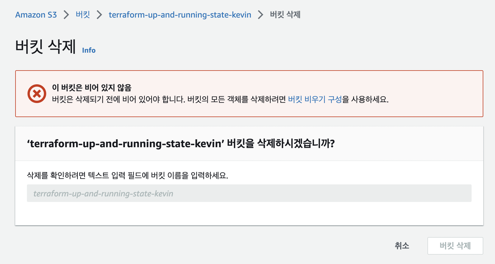

# 챕터3

# 1) What is Terraform State?

`terraform apply` 를 수행하면 terraform.tfstate 파일이 생성되며 JSON Format으로 생성된 모든 리소스가 저장된다. 이때 각 리소스의 id가 함께 저장되기 때문에 다음 apply를 할 때마다 이를 바탕으로 Provider와 비교하게 된다. 

개인 프로젝트에서는 terraform.tfstate 파일을 local 환경에 저장하는 것만으로도 충분하지만 팀 프로젝트에서 활용할 때는 아래와 같은 문제들을 겪게 될 수 있다. 

1. Shared storage for state files : 동일한 tfstate 파일을 팀원들과 공유해야 되므로 shared storage에 저장할 필요가 있음
2. Locking state files : 별도의 Locking 없이 두 명이상이 동시에 apply를 실행하면 race condition에 의해서 tfstate 파일이 손상되거나 중복된 리소스가 생성될 수 있음
3. Isolating state files : 회사에서는 testing, staging, production과 같은 여러 환경을 운영한다. 이때 실수에 의해서 각 환경을 잘못 건드리거나 망가트리는 일을 어떻게 예방할 수 있을까? 

# 2) Shared Storage for State Files

제일 쉽게 생각할 수 있는 shared storage는 Git과 같은 Version Control 툴을 사용하는 것이다. 하지만 terraform의 특성상 아래와 같은 부작용을 지니는데 각 문제는 Terraform의 Remote Backend(S3, GCP Storage, Terraform Cloud 등등) 기능을 통해 해결될 수 있다. 

1. Manual error : Git에서 실수로 pull을 안하고 apply 해버리면 과거 버전이 배포되버리거나 중복된 리소스가 배포될 수 있음 → `plan` , `apply` 명령어 실행시마다 자동으로 최근 state 파일을 가지고 온다
2. Locking : Git에서는 terraform apply 시에 별도의 Locking을 지원하지 않음 → 대부분의 Remote backend가 Locking을 지원한다. `apply` 명령어 실행 시에 Lock을 Acquire한다. 혹은 원하는 lock-timeout을 지정할 수도 있다. 
3. Secrets : terraform state 파일에는 민감한 크레덴셜 정보도 포함될 수 있는데 Git에 plain text로 올라가는 것은 어떤 식으로든 위험이 될 수 있다. → 대부분의 Remote backend가 전송 과정과 저장 암호화를 지원함

> AWS를 사용하고 있다면 S3 + DynamoDB 조합으로 Remote backend를 구성하는 것을 추천함
> 

## Remote Backend용 리소스 생성

```json
provider "aws" {
  region = "us-east-2"
}

resource "aws_s3_bucket" "terraform_state" {
    bucket = "terraform-up-and-running-state-kevin"

    lifecycle {
      prevent_destroy = true
    }

    versioning {
      enabled = true
    }

    server_side_encryption_configuration {
      rule {
        apply_server_side_encryption_by_default {
          sse_algorithm = "AES256"
        }
      }
    }
}

resource "aws_dynamodb_table" "terraform_locks" {
  name           = "terraform-up-and-running-locks"
  billing_mode   = "PAY_PER_REQUEST"
  hash_key       = "LockID"

  attribute {
    name = "LockID"
    type = "S"
  }

  lifecycle {
    prevent_destroy = true
  }
}
```

tfstate 파일을 저장할 S3 bucket과 Locking을 담당할 DynamoDB를 생성해준다. 이때 S3는 버저닝, 서버 사이드 암호화 활성화함

**Q. lifecycle prevent_destroy = true 는 어디까지 막아주는걸까?**

1. 아무것도 안 바꾸고 콘솔에서 삭제 시도 : 내용물을 비우고 삭제하라고 경고해줌. 내용물 비우고 버킷 삭제 시도 : 잘 지워짐
    
    
    

1. resource를 comment 했을 때 apply 재시도 : destory될 것이라고 경고해줌. 
2. resource 이름을 그대로 둔 채로 table 이름만 변경 : **prevent_destroy Error 발생**
    
    
    
3. 동일한 table 이름에 resource 이름만 변경 : 기존에 생성했던 리소스는 전혀 인지하지 못하고 새로 만들려고 함

공식 가이드(**The `lifecycle` Meta-Argument**)에 의하면 이 기능은 어디까지나 configuration에 lifecycle block이 남아 있을 때만 제 기능을 하며 변경 사항에 의해 삭제가 감지될 때 error를 일으키는 것이라고 함

> 결론적으로 terraform 리소스 레퍼런스가 동일하게 유지되어서 이전 tfstate와 현재의 configuration이 매칭되는 리소스에 한해서 recreate가 필요한 변경 분에 대해서만 error를 발생시킴
> 

## Remote Backend 설정

```json
terraform {
  required_providers {
    aws = {
      source  = "hashicorp/aws"
      version = "~> 4.17"
    }
  }

  backend "s3" {
    bucket = "terraform-up-and-running-state-kevin"
    key    = "global/s3/terraform.tfstate"
    region = "us-east-2"
    encrypt = true
    dynamodb_table = "terraform-up-and-running-locks"
  }
  
  required_version = ">= 1.2.2"
}
```

위에서 만들었던 S3와 DynamoDB Table을 백엔드로 설정해줌. `terraform init` 을 다시하고 `apply` 를 하면 Locking 기능이 활성화되는 것을 볼 수 있음

**Q. 동시에 돌릴려고 할 때 진짜로 Locking이 될까?** 

동시에 terraform plan을 실행시켜 봄. 한쪽은 state lock을 Acquiring하는데 실패했다고 뜸. 그리고 누가 Lock을 소유하고 있는지도 표시해줌..!


# 3) Limitations with Terraform’s Backends

Terraform Backend 블록에는 아래와 같은 한계가 있음

1. 최초 한번은 로컬에서 먼저 실행해야 함. 그리고 Remote Backend를 설정한 후에 `terraform init` 을 다시 실행해야 함. 만약 Remote Backend를 해제하고 싶을 때는 분해는 조립의 역순으로 수행하면 됨
2. bucket, region과 같은 값 설정 시에 변수를 설정할 수 없음. 따라서 모듈 파일 내에 terraform 블록마다 모두 동일한 backend 설정 값을 넣어줘야 함. 
    1. 이를 극복하기 위해서 `partial configuration` 이라는 것이 있다. `backend.hcl` 이라는 파일에 Remote Backend 설정 값을 추가하고, `terraform init -backend-config=backend.hcl` 을 수행해서 모든 블록에 자동으로 설정 값을 채워주는 기능임
    2. 다른 방법으로는 Terragrunt 라는 오픈소스 툴을 활용할수도 있음. 챕터 8에서 소개 예정

> Terraform Cloud를 사용하면 유료이긴 하지만 이러한 문제가 쉽게 해결됨..!
> 

# 4) Isolating State Files

Terraform을 사용하다보면 실수로 다른 환경을 건드려버리는 실수가 발생할 수 있다. 따라서 이를 극복하기 위해서는 state 파일들을 격리시켜 관리하는 것이 좋으며 이를 위해서 배의 격벽(bulkheads)과 같은 형태로 관리하는 것이 좋다

격벽을 디자인하는 방법에는 크게 두가지 방식이 있다. 

1. Workspace를 이용하는 방법 (빠르게 사용하기에 좋음)
2. File layout을 이용하는 방법 (실제 프로덕션 환경에서 사용하기에 좋음)

## Isolation via Workspace

- `terraform workspace show` 명령어로 현재 워크스페이스 명을 볼 수 있음
- `terraform workspace list` 명령어로 워크스페이스 목록을 볼 수 있음
- `terraform workspace select <워크스페이스명>` 명령어로 선택할 수 있음
- `terraform workspace new <워크스페이스명>` 명령어로 새로운 워크스페이스를 생성할 수 있음

새로운 워크스페이스를 생성하면 S3에 `env` 라는 새로운 폴더가 생성됨. 즉, 워크스페이스를 변경하는 것은 Terraform remote backend에서 사용할 tfstate 파일의 경로가 저장된 key가 변경되는 것을 의미함

따라서 개발 과정에서 동일한 리소스, 혹은 조금 변경된 리소스를 다시 띄우되, 기존에 배포되어 있는 것을 건드리고 싶지 않을 때 workspace를 별도로 분리하면 새로운 tfstate 파일이 생성되므로 유용함. 

이때 `terraform.workspace` 변수를 활용해서 워크스페이스 별로 리소스 생성을 조절할 수 있음. 

워크스페이스를 활용한 Isolation은 다음과 같은 단점을 가진다. 

1. 모든 파일들이 동일한 Backend에 저장되므로 동일한 인증, Access Control이 적용되므로 완전한 분리라고 볼 수 없다
2. 워크스페이스 자체는 코드로 보기 어렵다. 따라서 유지 보수가 어렵다고 볼 수 있다. (근데 branch 별로 대응되는 workspace를 만들면 관리하거나 비교하는데 딱히 그렇게 어려운 것 같지는 않다고 생각)
3. 실수로 production 워크스페이스에서 `destroy` 명령어를 내려버릴 수 있다. 

## Isolation via File Layout

완전한 isolation을 위해서는 아래 2가지를 해라

1. 각 환경마다 폴더를 만들고 독립된 terraform configuration을 명시해라. 
2. 각 환경마다 독립된 Backend configuration을 명시해라 (AWS account를 분리하거나, S3 버킷을 분리하는 등)
3. 재사용할 모듈들은 별도의 component 폴더로 만들어서 각 환경에서 재활용해라

예시를 들자면 아래와 같이 폴더를 구성할 수 있으며 이때 각 환경 안에 .terraform 폴더도 같이 옮겨놓도록 한다. 

- stage : 테스팅 환경
- prod : 실제 운영 환경
- mgmt(매니지먼트의 줄임말) : bastion host, jenkins 같은걸 담는 공간
- global : S3, IAM 등 모든 것을 담는 공간

이렇게 되면 동일한 인프라 설정을 두 폴더에 각각 명시해야 되므로 반복 작업이 수행되어야 하고 이 때문에 한쪽에만 변경이 적용되는 실수가 발생할 수 있다. 이를 극복하기 위해서 모듈을 활용할 것이다. (하지만 개인적으로는 공감할 수 없음. 모듈을 활용해도 모듈 생성 자체가 변경이 발생하면 코드를 2번 수정해야 되는건 동일함)

그리고 또다른 문제로 발생할 수 있는 부분은 tfstate가 별도로 분리되므로 다른 환경에 있는 state로부터 값을 참조할 수가 없는데 이것은 `terraform_remote_state` 로 해결할 수 있다고 함.

> 케빈의 총평 : Isolation via Workspace가 유용하다고 생각함
- 애초에 var.environment 혹은  terraform.workspace 를 이용해서 한 코드에 바로 동적으로 리소스를 명시하는 것이 서로 다른 2파일을 동시에 수정하지 않아도 되니 실수를 줄이는 길이라고 생각됨
- 그리고 branch에 workspace를 대응해서 각 branch에서 해당되는 workspace로 plan과 apply가 실행되도록 CI/CD를 설정해놓으면 실수로 잘못된 워크스페이스에서 날리는 문제도 어느 정도 해결할 수 있다고 생각함.
> 

# 5) The terraform_remote_state Data Source

마치 AWS의 subnet id 리스트를 받아올 때 썼던 data source처럼 다른 tfstate 파일에 있는 값을 read-only 방식으로만 읽어올 수도 있다. 

RDS를 생성하고 아래와 같이 입력하면 mysql의 terraform state 파일을 가져올 수 있다.

```bash
data "terraform_remote_state" "db" {
  backend = "s3"
  config = {
    bucket = "(your bucket)"
    key    = "stage/data-stores/mysql/terraform.tfstate"
    region = "us-east-2"

  }
}
```

> 하지만 이 방식은 각 모듈마다 tfstate 파일을 따로 관리하게 되므로 terraform apply 한번에 환경 내의 모든 리소스 변경 사항을 볼 수 없다는 한계가 있다고 느껴짐. remote_state의 시연을 위해서 억지로 만든 예시 느낌?
> 

## 번외편 - Secret Backend를 사용하는 법

아래와 같이 password를 지정할 때 코드에 바로 입력하는 것이 아니라 다양한 secret manager를 사용할 수 있다. 

```json
{

  password = data.aws_secretsmanager_secret_version.db_password.secret_string 
}

data "aws_secretsmanager_secret_version" "db_password" {
  secret_id = "mysql-master-password-stage"
}

```

- AWS Secrets Manager
- AWS System Manager Parameter Store (SSM)
- AWS Key Management Service (KMS)
- Google Cloud KMS
- Azure Key Vault
- HashiCorp Vault

혹은 아예 environment로 다루는 방법도 있다. db_password를 variable로 지정하고, 아래와 같이 실행하면 `TF_VAR_` 로 시작하는 환경변수들이 terraform 환경 변수로 주입된다. 

```bash
$ export TF_VAR_db_password="<비밀번호>"
$ terraform apply

```

이때 bash 실행 기록은 로컬에 저장되어 탈취 가능성이 있어서 이를 더 예방하고자 한다면 [pass](https://www.passwordstore.org/) 라고 하는 unix secret manager를 활용해서 명령어로 넘기는 방식도 있다. 

```bash
$ export TF_VAR_db_password=$(pass database-password)
$ terraform apply
```

## 번외편 - file rendering 해서 쓰기

방대한 bash script 등을 terraform 파일 내에 inline으로 관리하려면 꽤나 유지보수가 어려워지고 실수하기도 쉬움. 이를 극복하기 위해서 `file()` 명령어를 쓰면 파일 내 콘텐츠를 string으로 불러올 수 있음

그러나 파일 콘텐츠를 변수화하여 동적으로 생성할 때는 아래와 같은 template 기능이 유용할 수 있음. 우선 파일 내에 변수활 영역은 ${변수명} 과 같이 뚫어놓음

```bash
cat > index.html <<EOF
<h1>Hello, world</h1>
<p>DB address: ${db_address}</p>
<p>DB port : ${db_port}</p>
EOF
```

이후에 아래와 같이 template_file 이라는 data 리소스를 생성하면 동적으로 파일을 생성할 수 있다. 

```bash
data "template_file" "user_data" {
  template = file("user-data.sh"n)

  vars = {
    serveer_port = var.server_port
    db_address   = data.terraform_remote_state.db.outputs.address
    db_port      = data.terraform_remote_state.db.outputs.port 
  }
}
```

> 추후에 ES Cloud에서 user_settings.yaml 파일을 넣는 옵션이 있는데 이를 변수화 할 때 사용하면 좋을 것 같다.
